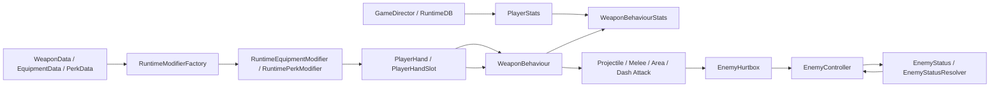
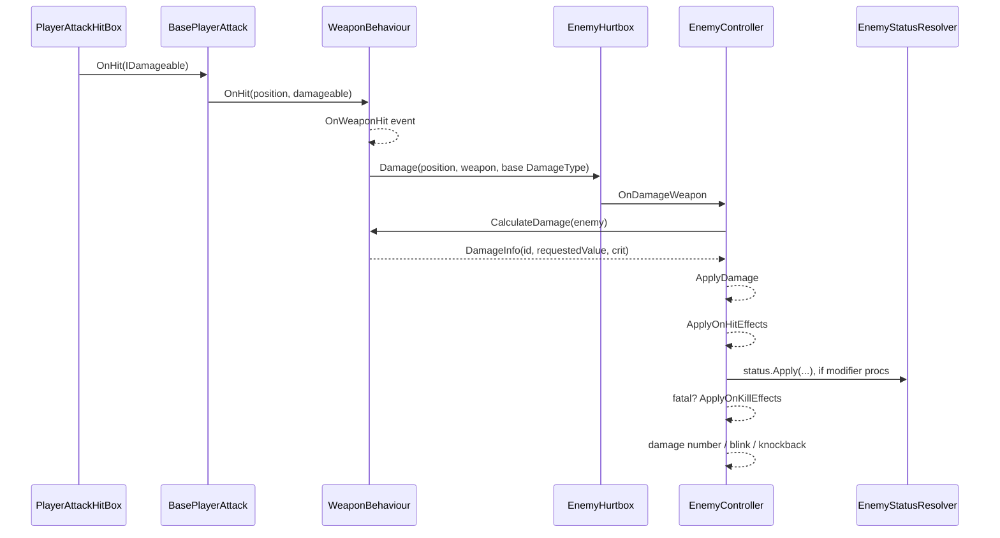
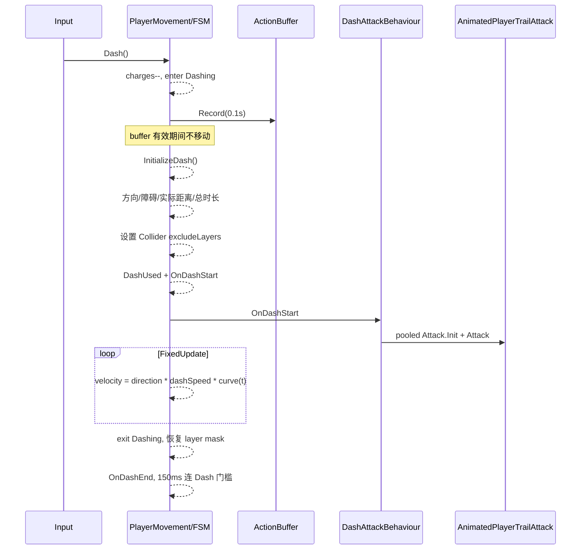
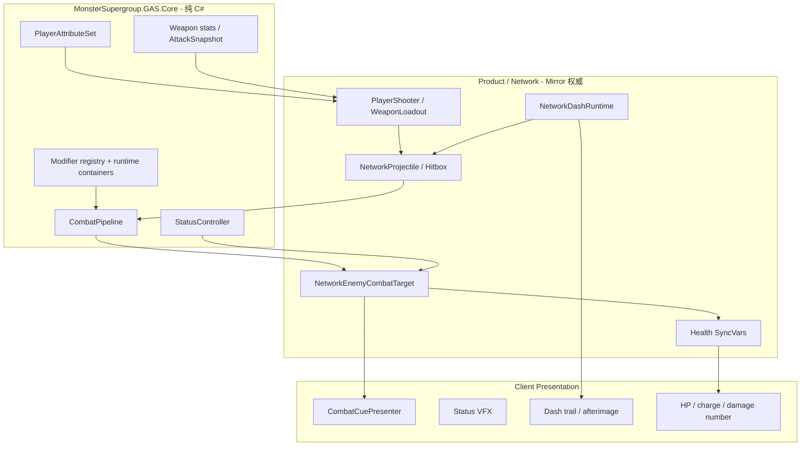

# HellMaiden GAS-like 战斗流程与 MonsterSupergroup 迁移指南

> [!WARNING]
> **联网架构状态更新（2026-08-25）**
>
> 本文对 HellMaiden 原始战斗流程、PlayerStats、Weapon、Modifier、Status 和 Dash 的静态分析仍可作为迁移来源；但其中关于“MonsterSupergroup 当前完成度”和传统 Server-authoritative Mirror 接入的描述，已经被后续实现取代。尤其不要再按本文第 11～15、20.4、22～24 节中的旧 Authority 建议，让 Server 重跑玩家 Attack/Crit/Build 或同步每个 Projectile。
>
> 当前事实来源请依次阅读：[GAS 与联机模块总览](MonsterSupergroup_GAS与联机模块总览.md)、[联机模块详细使用指南](MonsterSupergroup_联机模块详细使用指南.md)、[HellMaiden GAS 合并方案](MonsterSupergroup_HellMaiden_GAS合并方案.md)。当前目标是“Owner Client 即时战斗推演 + Server Canonical World State + Loose Reconciliation”，并继续以现有 `MonsterSupergroup.GAS` 为唯一 Combat Core。
>
> **2026-09-02 补充**：文中后续章节出现的 `WeaponDefinition` / `PlayerHand` 是已删除的中间原型名称，只作为历史迁移思路。正式 Runtime 使用 `WeaponData + NativeGasWeaponDefinition + PlayerBuildRuntime`。

> 审阅日期：2026-08-12
> 审阅方式：对反编译 C#、可读 YAML 资产以及 MonsterSupergroup 当前源码进行静态追踪；未运行 HellMaiden 导出工程。
> 起点：`WeaponBehaviour.cs`。
> 目标：在 MonsterSupergroup 中复刻 HellMaiden 的玩家属性、武器释放、命中结算、燃烧/减速等状态、Dash 与 Dash 攻击，并保留目标项目现有 Mirror 服务器权威边界。

## 0. 路径别名与阅读约定

为避免下文重复超长绝对路径，使用以下别名：

```text
SRC = F:\DecomplieLatest\HellMaiden\ExportedProject\Assets\Scripts\Assembly-CSharp
AST = F:\DecomplieLatest\HellMaiden\ExportedProject\Assets
TGT = F:\UnityStore\MonsterSupergroup\Assets
```

例如：

```text
SRC\AstralShift\HellMaiden\Player\Attacks\WeaponBehaviour.cs
```

就是用户指定的武器行为起点。

本文使用三类标记：

- **原项目事实**：能由当前反编译代码或 YAML 直接证明。
- **兼容选项**：为了做到逐行为复刻，应保留的行为，包括原项目疑似缺陷。
- **推荐实现**：面向 MonsterSupergroup 的稳定实现；可能有意修正原项目缺陷。

## 1. 先纠正术语：HellMaiden 不是标准 GAS

对 `SRC` 下全部 C# 检索以下名称，结果均为 0：

```text
AbilitySystemComponent
AbilitySystem
ActorInfo
AttributeSet
GameplayAbility
GameplayEffect
GameplayTag
GameplayCue
EffectSpec
```

所以 HellMaiden 没有 Unreal GAS，也没有某个 Unity GAS 插件的 ASC/GE 实现。它是一套自研的 **GAS-like 数据驱动战斗系统**，主要由以下模块拼成：



### 1.1 GAS 概念映射表

| GAS 概念 | HellMaiden 实际对象 | 重要差异 |
|---|---|---|
| AbilitySystemComponent / ActorInfo | `GameDirector.Instance`、`PlayerMovement`、`PlayerHandSlot`、`BaseEnemyController` 分担 | 没有统一组件、Owner/Avatar 分离、预测或复制 |
| AttributeSet | `PlayerStats`、`AttackStats`、`WeaponBehaviourStats`、`EnemyStats` | 多数是可序列化普通类，修改通知很少 |
| Ability / AbilitySpec | `WeaponBehaviour` 及具体子类 | 普通武器多在 `Update()` 自动攻击，不是按键激活 Ability |
| GameplayEffect 配置 | `EquipmentDataModifier` / `PerkDataModifier` 及其参数 | 没有 duration policy、tag requirements、execution calculation |
| GameplayEffect 运行时实例 | `RuntimeEquipmentModifier`、`RuntimePerkModifier` | 状态 DOT 另走 `EnemyStatusData`，不是同一种对象 |
| ActiveGameplayEffects | `RuntimeEquipmentModifiers` 各阶段列表；`EnemyStatusResolver.StatusHandler._tracker` | 无统一 Handle/查询/移除 API |
| GameplayTag | `[Flags] EnemyStatusID` | 仅覆盖敌人状态；免疫、精英、近战/远程仍是独立字段/FSM |
| GameplayCue | 状态 VFX prefab、HitEffect、FMOD、伤害数字、`PlayerEffectResolver` | Cue 与效果生命周期没有统一绑定 |
| Gameplay Event | `OnWeaponHit`、`OnWeaponDamage`、`OnDashStart/End`、`GameEvents` | 都是专用 C# delegate |
| Duration GE | `RuntimeShrine.AddTemporary()` 最接近 | 自己用 UniTask 倒计时和对象引用删除 |

本文后面说“GE”时，指的是便于迁移理解的等价层。**原代码在武器命中时不会 new 或 Apply 一个 GameplayEffect。** 实际发生的是：直接伤害使用 `DamageInfo`，OnHit modifier 决定是否创建 `EnemyStatusData`，再交给全局 `EnemyStatusResolver`。

## 2. 总体初始化与一局战斗的所有权

### 2.1 全局初始化

```text
GameDirector.Awake()
  -> GameDirector.Instance = this
  -> RunInitializationSequence()
     -> InitCore()
        -> GameDataManager.Init()
        -> RuntimeDB.Init()
     -> 加载 Addressables / 存档
     -> SceneMaster.LoadFirstScene()
     -> PlayerHand.Init()
```

代码位置：

- `SRC\AstralShift\HellMaiden\GameDirector.cs:72-77`：`Awake()`。
- 同文件 `85-94`：`RunInitializationSequence()`。
- 同文件 `96-109`：`InitCore()`；`103` 调用 `runtimeDB.Init()`。
- 同文件 `127-145`：Addressables/存档加载。
- `SRC\AstralShift\HellMaiden\Combat\Hand\PlayerHand.cs:103-116`：手牌/武器槽初始化。

有对象池的战斗场景还必须执行：

```text
PoolManager.Init()
  -> EnemyStatusResolver.Init()
  -> EquipmentEffectResolver.Init()
```

位置：`SRC\AstralShift\HellMaiden\Scenes\SceneLoaders\PoolLoader.cs:20-25`。状态 VFX 和攻击对象都依赖这个顺序。

### 2.2 Player 初始化与每局重置

```text
PlayerMovement.Start()
  -> PlayerStats.Init()
  -> new ActionBuffer(dashBufferTime)
  -> 缓存 Collider2D 默认 excludeLayers
  -> PlayerEffectResolver.Init()

进入一局：PlayerLoader.LoadAsync()
  -> PlayerMovement.RestartStats()
     -> PlayerStats.Init()
  -> PlayerMovement.RestartPlayer()
  -> PlayerHand.ClearAll()
  -> 可选：装备 signature weapon
  -> 场景显示时 PlayerHand.ActivateWeapons()
```

关键位置：

- `SRC\AstralShift\HellMaiden\Player\PlayerMovement.cs:264-278`。
- 同文件 `287-299`。
- `SRC\AstralShift\HellMaiden\Scenes\SceneLoaders\PlayerLoader.cs:32-64`。

迁移后应把 `PlayerLoader.LoadAsync -> RestartStats` 视为“一局 AttributeSet 初始化”的权威时点。它位于存档和场景初始化之后，比早期 `Start()` 更可靠。

## 3. Player Attribute：字段、数据来源与聚合公式

核心文件：

```text
SRC\AstralShift\HellMaiden\Player\PlayerStats.cs
```

### 3.1 `PlayerStatsValues` 字段

定义于 `PlayerStats.cs:15-48`：

| 分类 | 字段 | 用途 |
|---|---|---|
| 生存 | `HP`, `maxHP` | 当前/最大生命 |
| 生存 | `dmgReduction` | 最终伤害中的平坦减法，名字容易误解为百分比 |
| 生存 | `reviveAmount` | Miracle of Beatrice 复活次数 |
| 移动 | `moveSpeed` | 普通移动速度 |
| Dash | `dashDistance`, `dashSpeed`, `dashCooldown` | Dash 距离、峰值速度、每 charge 恢复时间 |
| Dash | `maxDashCharges`, `dashCharges` | 最大/当前充能 |
| 成长 | `pullArea`, `xpModifier` | 经验拾取半径和经验量倍率 |
| 选择 | `cardsReRollsAmount`, `cardBanishesAmount` | 卡牌重掷/放逐次数 |
| 选择 | `perksRerollsAmount`, `perkBanishesAmount` | Perk 重掷/放逐次数 |

不存在 Player shield、mana、stamina、poise 或 GameplayTag 容器。

### 3.2 Player multiplier 容器

`PlayerStatsMultipliers` 定义于 `PlayerStats.cs:51-99`，包含：

- `HPMultiplier`
- `moveSpeedMultiplier`
- `dashDistanceMultiplier`
- `dashSpeedMultiplier`
- `dashCooldownMultiplier`
- `xpPullRadiusMultiplier`
- `xpAmountMultiplier`
- `receivedDamageMultiplier`
- `currencyMultiplier`
- `extraDashCharges`
- `reviveChancesAmountReceiver`
- `baseAttackStatsMultipliers`
- `attackStatsMultipliers`
- `equipmentStatsMultipliers`

`AttackStatsMultipliers` 位于：

```text
SRC\AstralShift\HellMaiden\Player\Attacks\AttackStatsMultipliers.cs:6-67
```

攻击侧字段包括：

- 基础战斗：damage、critRate、critDamage、speed、size、duration、projectileCount、knockback。
- 条件伤害：pristine、elite、melee、ranged、burn、poison、bleed、statusGeneral、playerFullHealth。
- 玩家受伤：contactDamageReceived、projectileDamageReceived。
- 概率和状态：OnHit/OnKill chance 等装备聚合字段。

### 3.3 当前导出中可恢复的初始数值

基础资产：`AST\MonoBehaviour\BaseStatsDB.asset:15-31`。

| 字段 | YAML 值 |
|---|---:|
| HP / maxHP | 500 / 500 |
| moveSpeed | 4.55 |
| dashDistance | 6 |
| dashSpeed | 40 |
| dashCooldown | 2.5 秒 |
| maxDashCharges / dashCharges | 2 / 2 |
| pullArea | 2 |
| xpModifier | 1 |
| dmgReduction | 0 |
| card rerolls / banishes | 3 / 1 |
| perk rerolls / banishes | 3 / 0 |
| reviveAmount | 0 |

但 `AST\Scenes\Game Scenes\Systems.unity:922994-923084` 的 Player 组件还序列化了一套嵌套 `baseStats`：HP/maxHP 1000、moveSpeed 5、dashSpeed 40、perk banish 1 等。

`PlayerStats.CalculateMetaStats()` 位于 `334-358`，会从 DB 覆盖大部分字段，但不会覆盖：

- `baseStats.dashSpeed`
- `baseStats.perkBanishesAmount`
- `baseStats.reviveAmount`

因此当前导出场景在“无 meta 升级”时实际得到：

- HP/maxHP = 500，而非场景序列化的 1000。
- moveSpeed = 4.55，而非场景序列化的 5。
- dashSpeed = 40，来源实际上是场景嵌套值；DB 中虽然也可见 40，但代码没有读取它。
- perkBanishesAmount = 1，来源是场景嵌套值，而非 DB 的 0。

这是一个重要移植陷阱：直接 `new PlayerStats()` 再只绑定 BaseStatsDB，`dashSpeed` 可能保持默认 0，Dash 总时长计算会除以 0。

### 3.4 Meta 属性来源

相关代码：

- `SRC\Assets\Scripts\AstralShift\HellMaiden\Data\PlayerMetaStatsDatabase.cs:8-25`
- `SRC\Assets\Scripts\AstralShift\HellMaiden\Data\MetaStatDatabaseEntry.cs:8-39`
- `SRC\Assets\Scripts\AstralShift\HellMaiden\Data\MetaProgressionID.cs:3-22`
- `SRC\AstralShift\HellMaiden\Data\GameDataManager.cs:171-188`
- `PlayerStats.cs:360-367`

读取关系是：

```text
GameData.Instance.MetaProgressionSaveData.unlockedLevels[id]
  -> level
  -> MetaStatsDB.entries[id].levels[level - 1].increaseAmmount
```

不是把 1..level 的每一级累加；`increaseAmmount` 应被理解为该等级的最终增量。

`AST\MonoBehaviour\MetaStatsDB.asset` 的主要数据封装在 Odin `SerializedBytes` 中。没有 Odin Serializer 和完全兼容的类型布局，不能直接复用该资产。

### 3.5 Player 数值聚合

`PlayerStats.cs:163-240` 的增删/重算流程：

```text
AddModifier / RemoveModifier
  -> 将运行时 modifier 放入/移出对应列表
  -> Reset 所有 multiplier
  -> 对仍存在的 modifier 逐个 Apply()
  -> 从 baseStats 计算 currentStats
```

主公式位于 `PlayerStats.cs:242-264`：

```text
moveSpeed       = base.moveSpeed    * (1 + moveSpeedMultiplier)
dashDistance    = base.distance     * (1 + dashDistanceMultiplier)
dashSpeed       = base.speed        * (1 + dashSpeedMultiplier)
dashCooldown    = base.cooldown     * (1 + dashCooldownMultiplier)
maxDashCharges  = base.maxCharges   + extraDashCharges
pullArea        = base.pullArea     * (1 + xpPullRadiusMultiplier)
xpModifier      = base.xpModifier   * (1 + xpAmountMultiplier)
dmgReduction    = base.reduction    + receivedDamageMultiplier
reviveAmount    = base.reviveAmount + reviveChancesAmountReceiver
```

`maxHP` 和 `maxDashCharges` 不是完全由统一尾部重算：

- `PlayerMaxHealthPerkModifier.Apply()` 主动调用 `PlayerStats.UpdateMaxHealth()`，见 `PlayerStats.cs:311-321`。
- `PlayerDashExtraChargesPerkModifier.Apply()` 主动调用 `UpdateMaxDashes()`，见 `323-327`。

### 3.6 武器如何实时读取 Player 属性

武器初始化：

```text
WeaponBehaviour.Init(id, stats)
  -> player = GameDirector.Instance.Player
  -> statsBehaviour = new WeaponBehaviourStats(stats, player.PlayerStats)
```

位置：`WeaponBehaviour.cs:96-101`。

武器没有复制 Player 攻击属性，而是持有同一个 `PlayerStats` 引用。`WeaponBehaviourStats.GetStatValue()`（`122-157`）每次计算属性时组合：

```text
WeaponData.BaseStats
× 静态装备层
× 本次 Attack 动态装备层
× Player perk/meta 全局层
```

damage/size/speed/duration/knockback 每层采用特殊 signed multiplier：

```text
m >= 0 : factor = 1 + m
m <  0 : factor = 1 / (1 + abs(m))
```

见 `WeaponBehaviourStats.cs:284-291`。这意味着 -50%（m=-0.5）得到 `1/1.5 = 0.666...`，不是 0.5。复刻时不能用普通 `1+m` 代替。

CritRate、CritDamage、ProjectileCount 是加法叠加，见 `122-157`；投射物数量至少为 1，其余加法结果至少为 0。

## 4. Perk / Equipment：“GE 配置”如何变成运行时 Modifier

### 4.1 Equipment 数据链

```text
EquipmentData
  -> RuntimeEquipmentData.Refresh()
  -> RuntimeModifierFactory.GetRuntimeModifiersFromEquipmentData()
  -> DataModifierResolver 由 modifierID 查找 Type
  -> Activator.CreateInstance()
  -> 反射注入嵌套 Params
  -> RuntimeEquipmentModifier
  -> PlayerHandSlot.AddEquipment()
  -> PlayerHandSlot.AddModifier()
  -> RuntimeEquipmentModifiers 各阶段列表
  -> WeaponBehaviour.UpdateModifiers()
```

关键位置：

- `SRC\AstralShift\HellMaiden\Data\Cards\RuntimeEquipmentData.cs:23-45`
- `SRC\AstralShift\HellMaiden\Combat\Hand\RuntimeModifierFactory.cs:26-83`
- `SRC\AstralShift\HellMaiden\Combat\Hand\PlayerHandSlot.cs:150-215`
- `SRC\AstralShift\HellMaiden\Combat\Hand\RuntimeEquipmentModifiers.cs:7-19`

装备 modifier 按执行阶段分为：

1. `StaticStatModifier`：装备变化时重算。
2. `DynamicStatModifier`：每次武器 `Attack()` 重算。
3. `DynamicOnDamageModifier`：命中特定敌人、计算直接伤害前执行。
4. `OnHitModifier`：直接扣血之后执行。
5. `OnKillModifier`：本次直接伤害判定致死后执行。

### 4.2 Perk 数据链

```text
PerkData
  -> 当前 rarity 的 PerkRarityModifiersData.Modifiers
  -> PerkDataModifier(modifierID + SerializeReference parameters)
  -> RuntimeModifierFactory
  -> RuntimePerkModifier
  -> RuntimePerk.StackModifiers() / TryStack()
  -> PlayerStats.AddModifier()
  -> PlayerStats.EvaluateModifiers()
  -> PlayerHand 更新所有 WeaponBehaviour
```

关键位置：

- `SRC\AstralShift\HellMaiden\Data\Perks\PerkData.cs:10-40`
- `SRC\AstralShift\HellMaiden\Data\Perks\PerkRarityModifiersData.cs:9-39`
- `SRC\AstralShift\HellMaiden\Data\PerkDataModifier.cs:7-53`
- `SRC\AstralShift\HellMaiden\Combat\Hand\RuntimeModifierFactory.cs:86-145`
- `SRC\AstralShift\HellMaiden\Combat\Hand\RuntimePerk.cs:30-126`
- `SRC\AstralShift\HellMaiden\Combat\Hand\PlayerHand.cs:340-358`

永久 Perk 没有统一 duration、period、prediction、tags、application requirements 或 GE handle；删除时依赖原运行时 modifier 对象引用。

### 4.3 临时 Shrine 最接近 Duration GE

`SRC\AstralShift\HellMaiden\Data\Shrines\RuntimeShrine.cs`：

```text
AddTemporary()
  -> Factory 创建 RuntimePerkModifier
  -> PlayerStats.AddModifier()
  -> PlayerEffectResolver.ApplyEffect(modifier.ID)
  -> UniTask 每帧倒计时；暂停时不递减
  -> RemoveTemporaryModifier()
     -> PlayerStats.RemoveModifier()
     -> PlayerEffectResolver.RemoveEffect()
```

位置：`53-67`、`126-157`、`172-200`。

`SRC\AstralShift\HellMaiden\Player\PlayerEffectResolver.cs:12-82` 保存 `modifier ID -> GameObject` 映射，以引用计数打开/关闭临时特效。它只被临时 Shrine 使用，普通 Perk 并不会自动触发该视觉层。

### 4.4 Modifier ID 的兼容性风险

`DataModifierResolver.cs` 扫描带 `[EquipmentModifierType]` / `[PerkModifierType]` 的类型，然后对 `type.AssemblyQualifiedName` 做 FNV-1a 32 位哈希：

- Equipment：`DataModifierResolver.cs:63-155`，哈希调用约在 `95`。
- Perk：同文件约 `238-295`，ID 约在 `246`。
- 算法：`SRC\AstralShift\HellMaiden\Data\DeterministicHash.cs:5-21`。

所以改 namespace、类型名或 asmdef/程序集名都会让旧资产 ID 失配。IL2CPP 还可能裁剪只通过反射访问的 modifier。

**MonsterSupergroup 已经避免了这个问题**：

- `TGT\_Project\GAS\Core\Identity\EquipmentModifierTypeAttribute.cs:8-19` 接收显式 `uint id`。
- `PerkModifierTypeAttribute.cs:8-19` 同理。
- `ModifierRegistry.cs:63-196` 使用显式注册并检查重复 ID/类型。
- `Generated\GeneratedModifierRegistry.g.cs` 生成强引用注册，避免运行时扫描和 IL2CPP 裁剪。

迁移时应保留目标项目的稳定 ID/生成注册表，不应把源项目的 AssemblyQualifiedName 哈希机制复制回来。若要读取源资产，建立一次性的 `legacy uint -> new stable uint` 转换表。

## 5. Weapon 装备、激活与自动释放

### 5.1 WeaponData 到 WeaponBehaviour

`SRC\AstralShift\HellMaiden\Data\Cards\WeaponData.cs` 是 `ScriptableObject/CardData`：

- `WeaponPrefab`：具体武器行为 prefab。
- `baseStats`：`AttackStats`。
- `modifierFlags`：兼容的装备类别。

`AttackStats` 位于 `SRC\AstralShift\HellMaiden\Player\Attacks\AttackStats.cs:8-46`，字段为：

- damage
- critMultiplier
- critRate
- speed
- size
- duration
- projectileCount
- cameraShakeSettings
- knockbackSettings
- damageType

装备调用链：

```text
WeaponData
  -> RuntimeWeaponData
  -> PlayerHandSlot.AddWeapon()
  -> Instantiate(WeaponPrefab, Player.AttacksParent)
  -> WeaponBehaviour.Init(id, BaseStats)
  -> PlayerHandSlot.UpdateWeaponBehaviour()
  -> WeaponBehaviour.UpdateModifiers(slotModifiers)
```

位置：

- `SRC\AstralShift\HellMaiden\Combat\Hand\PlayerHandSlot.cs:68-82`。
- 同文件 `338-343`。
- `WeaponBehaviour.cs:96-101`、`171-177`。

`PlayerHand` 有 4 个 slot，每个 slot 最多 3 件 equipment（`PlayerHand.cs:21-25`）。因此装备 modifier 是按武器槽隔离的；Player Perk/Meta 才是全局层。

### 5.2 普通攻击不是玩家按 Fire

HellMaiden 的大多数普通武器在自己的 `Update()` 里自动检测冷却：

```text
Update()
  -> CheckCooldown()
     -> LastAttackElapsedTime >= 1 / SpeedValue
  -> Attack()
```

基础冷却在 `WeaponBehaviour.cs:131-157`。例如：

- `ProjectileAttackBehaviour.cs:34-65`：自动发射投射物。
- `MeleeAttackBehaviour.cs:41-96`：自动近战。
- `AutoTargetAttackBehaviour.cs:40-129`：自动选屏幕敌人。
- `CirclingAttackBehaviour.cs:66-167`：环绕攻击。
- `PersistentAreaAttackBehaviour.cs:19-45`：常驻区域，命中间隔设为 `1 / SpeedValue`。
- `PlayerBeamAttackBehaviour.cs:36-108`：持续朝瞄准方向。
- `DashAttackBehaviour.cs:11-59`：例外；监听 Dash 事件。
- `SummonAttackBehaviour`：将时序交给召唤物 AI。
- `UltimateAttackWeaponBehaviour`：由 Ultimate controller 手动触发。

输入主要负责瞄准：

```text
PlayerController_HMD
  -> PlayerMovement.SetAimDirection / SetAimPosition
  -> PlayerMovement.attackDirection
  -> 武器读取该方向生成攻击
```

位置：`PlayerController_HMD.cs:162-177`、`PlayerMovement.cs:634-669`。

### 5.3 一次 `Attack()` 的属性语义

`WeaponBehaviour.Attack()` 本身只有：

```text
EvaluateDynamicStatModifiers()
```

见 `WeaponBehaviour.cs:105-108`。具体子类再播放声音、生成一个或多个 pooled attack。

属性求值时点：

- Static：装备增删时，`WeaponBehaviour.UpdateModifiers()` 调 `EvaluateStaticStatModifiers()`，`171-194`。
- Dynamic：每次 `Attack()` 先 Reset，再逐个 Apply，`196-211`。
- DynamicOnDamage：每次命中敌人、直接伤害计算前，`213-227`。
- Player global：`WeaponBehaviourStats` 每次读最终值时组合。

**源项目没有真正的攻击快照。** 投射物持有共享 `WeaponBehaviour` 引用，命中时才调用 `weapon.CalculateDamage()`。如果旧投射物尚未命中，而新一轮 `Attack()` 已重掷 dynamic modifier，旧投射物会读取新一轮共享数值。MonsterSupergroup 的 `AttackSnapshot` 是更稳定、可测试、适合网络权威的设计；若追求逐帧完全兼容，需有意复刻共享可变状态，否则建议保留快照语义。

## 6. Projectile / Hitbox / Explosion 到 WeaponBehaviour.OnHit

### 6.1 投射物生成

`ProjectileAttackBehaviour.cs:43-76`：

```text
Attack()
  -> base.Attack()                         // 动态 modifier
  -> variants.GetOrCreate(ActiveElement)  // 从对象池取表现变体
  -> ProjectileAttack.Init(this)
  -> ProjectileAttack.Attack(direction, speed, hitCount, rotate)
```

单弹沿 `player.attackDirection`；多弹在 `57-64` 以 360° 均匀散射。

`ProjectileAttack.cs:89-104` 初始化方向、速度、最大命中数和持续时间；`130-167` 推进/超时回收。`192-223` 还会把 projectile base speed 乘以武器 `SpeedMultipliersProduct`。

### 6.2 元素变体不是状态本身

`WeaponBehaviour.UpdateModifiers():171-176` 检查当前装备列表：

- 存在 `OnHitPoisonModifier`：`IsPoisonType = true`。
- 存在 `OnHitBurnModifier`：`IsFireType = true`。

`ActiveElement`（`76-90`）按 Fire > Poison > Default 选择攻击 prefab。它只改变表现/预制体，不代表本次 proc 成功，也不改变基础 `DamageType`。同时装备 Burn 和 Poison 时：

- 外观固定使用 Fire。
- 两个 OnHit modifier 仍会各自掷骰并可能同时施加状态。

### 6.3 Hitbox 回调

`BasePlayerAttack.cs:34-65`：

```text
Init(WeaponBehaviour)
  -> hitbox.Init(OnHit)
  -> AttackProgressionScaler.Apply(behaviour)

Collider 命中
  -> BasePlayerAttack.OnHit(IDamageable)
  -> 命中特效
  -> WeaponBehaviour.OnHit(position, damageable)
```

一次性 Hitbox：`PlayerAttackHitBox.cs:15-33`。

- `Collider2D.TryGetComponent<IDamageable>()`。
- 以 `damageable.GetID()` 去重。
- 调用 `_onHit(component)`。

持续 Hitbox：`PlayerAttackOvertimeHitBox.cs:66-170`。

- 进入时立即命中一次。
- 以 ID 跟踪仍在范围内的对象。
- 每隔 `HitInterval` 再触发。

### 6.4 主命中与爆炸命中

`DamageMode.cs` 定义 `MainHit / ExplosionHit / Both / None`。

`ProjectileAttack.OnHit():106-128` 在最终 piercing hit 时按 DamageMode 决定主命中与 HitEffect；`SpawnableHitEffectResolver.cs:23-77` 可给爆炸特效自己的 Hitbox 绑定同一个 `WeaponBehaviour.OnHit()`。

所以 `Both` 不是“主伤害附加一个纯视觉爆炸”，而是可能走两次完整流程：两次条件增伤/暴击/OnHit proc。

## 7. 武器命中 Enemy 的完整结算顺序

### 7.1 从物理碰撞到 EnemyController



精确位置：

1. `SRC\AstralShift\HellMaiden\Player\Attacks\BasePlayerAttack.cs:55-64`。
2. `WeaponBehaviour.cs:160-169`。
3. `SRC\AstralShift\HellMaiden\AI\Enemy\EnemyHurtbox.cs:45-52`。
4. `EnemyController.cs:458-474`：注册 Hurtbox 事件。
5. `EnemyController.cs:838-862`：完整武器伤害入口。
6. `BaseEnemyController.cs:135-158`：扣血与 OnHit。
7. `BaseEnemyController.cs:160-170`：OnKill。

`WeaponBehaviour.OnHit()` 先发布 `OnWeaponHit`，再请求敌人伤害。因此该事件统计的是碰撞命中，不保证敌人最终接受伤害；敌人已死或免疫也可能已经先被计数。

### 7.2 直接伤害计算顺序

`WeaponBehaviour.CalculateDamage()` 位于 `229-244`：

```text
1. EvaluateDynamicOnDamageStatModifiers(enemy)
2. 读取 DamageValue（基础 × static × dynamic × player global，Ceil）
3. 玩家满血：乘 playerFullHealthMultiplier
4. 敌人当前 Health == BaseHealth：乘 pristineDamageMultiplier
5. 敌人有任意状态：乘 statusGeneralMultiplier
6. elite：乘 eliteDamageMultiplier
7. enemyRanged ? rangedDamageMultiplier : meleeDamageMultiplier
8. Random.Range(0,1) <= CritRate 时暴击
9. 暴击伤害 = int(damage * CritMultiplier)，向零截断
10. 发布 OnWeaponDamage(value, critical)
11. new DamageInfo(weaponID, value, critical)
```

条件方法在 `246-276`，暴击在 `278-285`。

`DamageInfo`（`SRC\AstralShift\HellMaiden\Player\Attacks\DamageInfo.cs:3-16`）只有：

- `id`：武器 ID。
- `value`：请求伤害整数。
- `isCritical`。

`DamageType` 不参与敌人抗性运算，只继续传给伤害数字/表现。Fire/Poison 攻击变体也不会改它。

### 7.3 敌人后处理顺序

`EnemyController.Damage():838-862`：

```text
if dead or immune -> return
damageInfo = weapon.CalculateDamage(this)
ApplyDamage(damageInfo)
ApplyOnHitEffects(weapon, damageInfo)
ShowDamageNumbers(...)
fatal = Health <= 0
if fatal:
  RegisterWeaponKill
  RegisterDefeatedEnemy
  ApplyOnKillEffects(weapon)
HurtBlink
ApplyKnockBack(position, weapon, fatal)
```

重要语义：

- 直接扣血发生在 OnHit 状态之前。
- Burn/Slow/Poison/Bleed/Weaken 自己都检查敌人仍存活，所以直接攻击致死后不会再挂这些状态。
- `OnHitLifeStealModifier` 没有相同的存活门槛，致死打击仍可吸血。
- `DamageInfo.value` 是请求伤害，不是实际扣除量；源 `ApplyDamage` 不返回 cap 后结果，因此过量击杀的吸血可按 overkill 请求值计算。
- 有击退的致死攻击可能等击退完成才真正 `Kill()`，但 OnKill modifier 已在前面执行。

Boss 路径在 `SRC\AstralShift\HellMaiden\AI\Boss\BossController.cs:391-418`：会计算直接伤害并跑 OnHit，但该方法没有普通敌人的 OnKill 阶段，且 `ApplyKnockBack()` 为空。

### 7.4 DOT 的旁路

`EnemyController.Damage(int value, DamageType)` 位于 `864-878`，用于 Burn/Poison/Bleed tick：

```text
ApplyDamage(value)
ShowDamageNumbers(...)
if fatal:
  RegisterDefeatedEnemy
  Kill()
```

它绕过：

- 武器条件伤害和暴击。
- Weapon OnHit。
- Weapon OnKill。
- 武器击退。
- 武器击杀归因/武器 ID 统计。

若 MonsterSupergroup 希望 DOT 击杀也触发 OnKill 或归属武器，这是设计升级，不是源行为。

## 8. 燃烧、减速、中毒、流血、虚弱的“GE”实际流程

### 8.1 OnHit 公共掷骰与排序

`SRC\AstralShift\HellMaiden\Combat\Hand\OnHitModifier.cs:21-37`：

```text
effectiveChance = parameters.chance
                * PlayerStats.equipmentStatsMultipliers.OnHitChanceMultiplier

Random.Range(0, 1) < effectiveChance
  -> ApplyEffect(args)
```

源代码不显式 clamp 概率：大于等于 1 等价必触发，小于等于 0 等价不触发。

`BaseEnemyController.ApplyOnHitEffects()` 会按已排序列表顺序执行，并把可变的 `OnHitModifierArgs` 传给下一个 modifier。`OnHitEnemyTypeMorphModifier` 等甚至可以替换 `args.Enemy`，因此顺序不是纯表现细节。

排序规则在 `OnHitModifierPriorityComparer.cs:9-29`：

1. `GetSortPriority()` 升序。
2. 相同 sort priority 时，`GetRollPriority()` 降序。

### 8.2 状态 ID、状态数据和注册链

`SRC\AstralShift\HellMaiden\AI\Enemy\EnemyStatusID.cs:5-15` 是 `[Flags]`：

| ID | 值 | 实现情况 |
|---|---:|---|
| None | 0 | 无状态 |
| Slow | 1 | 已实现 |
| Burn | 2 | 已实现 |
| Poison | 4 | 已实现 |
| Bleed | 8 | 已实现 |
| Weaken | 0x10 | 已实现 |
| Fragile | 0x20 | 仅枚举；当前检索不到对应 handler/OnHit 实现 |

`EnemyStatus` 以 bit mask 实现 `HasStatus/HasAnyStatus`。一次状态施加实际链路：

```text
OnHitXxxModifier.ApplyEffect()
  -> enemy.status.Apply(statusId, power, durationOrHits, interval, priority)
  -> new EnemyStatusData(...)
  -> EnemyStatus.Apply(data) 按 ID 分发
  -> EnemyStatusResolver.Instance.RegisterXxx(enemy, data)
  -> 对应 StatusHandler.Register()
```

`EnemyStatusData.cs:5-27` 字段：

- `power`：DOT 每 tick 伤害，或 Slow/Weaken 最终倍率。
- `startTime`。
- `currentDuration`。
- `totalDuration`。
- `hitInterval`。
- `priority`。

### 8.3 五种状态的精确公式

| 状态 | OnHit 文件 | power / 数值公式 | duration 语义 |
|---|---|---|---|
| Burn | `Combat\Hand\OnHitBurnModifier.cs:31-38` | `int(weapon.DamageValue * damageMultiplier * burnFactor)`；只有 burn bonus > 0 才令 `burnFactor=1+bonus`，否则为 1 | `numberOfHits` 次，每次间隔 `hitIntervalDuration` |
| Slow | `OnHitSlowModifier.cs:29-35` | `enemy.stats.SpeedMultiplier = speedMultiplier`，是最终覆盖值，不是增量 | `duration` 秒 |
| Poison | `OnHitPoisonModifier.cs:34-42` | `int(min(200, enemy.BaseHealth) * damageMultiplier * poisonFactor)` | `numberOfHits` 次，每次间隔 `hitIntervalDuration` |
| Bleed | `OnHitBleedModifier.cs:31-39` | `int(damageValue * bleedFactor)`；来源是装备的平坦值而非武器伤害 | `numberOfHits` 次，每次间隔 `hitIntervalDuration` |
| Weaken | `OnHitWeakenModifier.cs:29-35` | `enemy.stats.DamageMultiplier = damageMultiplier`，是最终覆盖值 | `duration` 秒 |

Burn 的几个常被误读之处：

- 使用 `Weapon.DamageValue`，不是刚才直击的 `DamageInfo.value`。
- 因而不继承该次暴击。
- 也不继承在 `DamageValue` 之后才施加的 pristine/status/elite/melee/ranged/player-full-health 条件倍率。
- 负的 burn bonus 不按 signed formula 生效，而是直接忽略。

Poison 的源代码疑似有笔误：`OnHitPoisonModifier.cs:39` 判断的是 `burnDamageMultiplier > 0`，真正相乘的却是 `poisonDamageMultiplier`。所以只有毒伤加成、没有燃烧加成时，毒伤加成会被忽略。

Bleed 把 `GetRollPriority()` 传给状态 resolver；Burn/Poison/Slow/Weaken 没传，priority 默认为 0。

Life Steal 不是状态：`OnHitLifeStealModifier.cs:28-31` 直接治疗：

```text
ceil(DamageInfo.requestedValue * dealtDamageToHealthMultiplier)
```

它可吃暴击，也可能吃过量伤害请求值。

### 8.4 StatusResolver 叠层规则

`EnemyStatusResolver.Init()` 位于 `298-345`：

| 状态 | 最大实例数 | StackMode | 应用/移除 |
|---|---:|---|---|
| Slow | 1 | HighestPriority | 覆盖 `SpeedMultiplier`；移除恢复 1 |
| Weaken | 1 | HighestPriority | 覆盖 `DamageMultiplier`；移除恢复 1 |
| Burn | 1 | HighestPriority | tick 调 `Damage(value, Fire)` |
| Poison | 1 | HighestPriority | tick 调 `Damage(value, Poison)` |
| Bleed | 10 | Add | 每层独立 tick `Damage(value, Bleed)` |

`StatusHandler.Register()` 在 `67-119`：

- 首个状态为该敌人从对象池取得 VFX，挂到配置 pivot。
- Add：未满 maxStacks 才加入。
- Replace：清空再加入。
- HighestPriority：新 priority 大于等于当前值才替换。

但 HighestPriority 的源实现会执行：

```text
data.startTime = oldData.startTime;
list[0] = data;
```

也就是替换 power/duration 时保留旧起始时间。由于大多数状态 priority 都是默认 0，任意新 0 都可以替换旧 0，却不完整刷新生命周期。这一点往往造成“重新上 Burn/Slow 后很快消失”。

### 8.5 DOT 的时间含义

`EnemyStatusResolver.StatusHandler.Update():130-181`：

- 对有 `_onTick` 的 Burn/Poison/Bleed，`totalDuration` 实际是 **tick 次数**，而非秒。
- 当 `currentTime - startTime >= hitInterval` 时 tick 一次，`currentDuration += 1`，并把 `startTime` 重置为当前时间。
- 一帧最多补一次 tick。若卡顿 2 秒而间隔 0.25 秒，源实现不会补齐 8 次。
- Slow/Weaken 没有 `_onTick`，此时 `totalDuration` 才是真正的秒数。

因此在目标实现中不要把 `numberOfHits` 误命名成 duration seconds。

### 8.6 ConsumeStack 的真实行为

`StatusHandler.ConsumeStack():183-199`：

- 对 DOT，将当前该状态的每一个实例立即各 tick 一次。
- 随后 `value.Clear()`，删除全部实例、VFX 和状态 bit。

所以源 `StatusStackConsumeChanceModifier` 的“ConsumeStack”实际是“引爆并清空该状态全部层”，不是只消耗一层。

### 8.7 状态 Cue/VFX

首次注册状态时，resolver：

1. 从 `PoolManager` 取得 VFX。
2. 挂到敌人的状态 pivot。
3. 播放 `EffectAnim`。
4. 以首次数据的 `totalDuration` 调整 Animator speed。
5. 最后一层结束时归还对象池。

场景配置可见于：

```text
AST\Scenes\Game Scenes\Circle 1 - Limbo\Level_Limbo.unity:2872-2884
```

关联 prefab：

- `AST\GameObject\SlowDownEffect.prefab`
- `AST\GameObject\Burn_Enimies.prefab`
- `AST\GameObject\Poison_Enemies.prefab`
- `AST\GameObject\Bleed_Enimies.prefab`
- `AST\GameObject\Weaken_As.prefab`

表现层必须通过 status add/remove/refresh 事件驱动；不要让 VFX 自己决定权威状态是否存在。

## 9. Dash：输入、FSM、位移、无敌与 Dash Weapon

### 9.1 输入入口

HellMaiden 使用 Rewired，不是 Unity Input System：

```text
InputHandler actionId 14 / RightTrigger / Dash
  -> PlayerController_HMD.RightTrigger(data)
  -> if !InBusyState && data.GetButton()
  -> GameDirector.Instance.Player.Dash()
```

位置：

- `SRC\AstralShift\Control\InputHandler.cs:124-126`：action ID 14 注册 just pressed / pressed / released。
- `SRC\AstralShift\HellMaiden\Controllers\PlayerController_HMD.cs:180-185`。

导出场景的 Rewired 配置还将键盘 Space 映射到该 Dash action。迁移时需要保留的是“Dash 动作语义”，不需要为了一个 action 把 Rewired 引入 MonsterSupergroup；目标已经安装 Input System 1.19，可用 InputAction 或现有输入适配层。

### 9.2 FSM 转移

`PlayerMovement.Awake():207-262` 建立状态：Moving、Dashing、Hurt、Dead、Stunned、GivingUp、Knockback。

与 Dash 有关的转移：

```text
Moving -> Dashing
Dashing -> Moving
Hurt -> Dashing
```

没有：

```text
Dashing -> Hurt
Dashing -> Stunned
Dashing -> Knockback
Dashing -> Dead
```

这会形成 Dash 期间的事实中断免疫。

### 9.3 一次 Dash 的时序



精确代码：

- `PlayerMovement.Dash():423-429`：charge > 0 且 `_allowDash` 才请求转移。
- `OnEnterDashing():447-452`：立刻扣 1 charge，记录 buffer，尚未移动。
- `InitializeDash():454-500`：取方向，RaycastAll，按 edge/obstacle 裁剪实际距离。
- `SetDashParameters():502-514`：计算时长、音频、`DashUsed`、`OnDashStart`、启动回充。
- `GetDashTotalTime():516-531`：对 dash curve 积分，`time = distance / (peakSpeed * curveIntegral)`。
- `SetDashLayerMask():533-543`：改变两个 collider 的 `excludeLayers`。
- `OnFixedUpdateDashing():545-566`：buffer 失效后初始化并按曲线写 `Rigidbody2D.linearVelocity`。
- `OnExitDashing():573-579`：恢复 mask/移动速度，发 `OnDashEnd`。
- `ApplyDashChargeCooldown():581-586`：UniTask.Delay 后 `dashCharges++`。
- `ApplyConsecutiveDashCooldown():588-593`：Dash 结束后 150ms 才允许下一次。

`ActionBuffer` 位于 `SRC\AstralShift\Helpers\ActionBuffer.cs:5-28`。默认 `dashBufferTime` 是 0.1 秒。实际方向在 buffer 结束后才读取，所以这 0.1 秒内改变移动输入会改变 Dash 方向。

输入端同时订阅 just pressed / pressed / released，而 Controller 使用 `data.GetButton()`。因此按住 Dash 时，150ms 门槛重新开放且还有 charge 的情况下，存在继续请求下一次 Dash 的可能。目标需明确选择“按住连续 Dash”还是 Input System `Press Only`；推荐先以原游戏实机手感验证，再把选择写成测试。

### 9.4 Dash 的“无敌”不是 IsInvulnerable

Dash 没有调用 `PlayerMovement.SetInvulnerable(true)`，`IsInvulnerable` 仍可能是 false。源项目通过两件事产生事实无敌：

1. `_hitboxCollider` 和 `_obstacleCollider` 临时把 `excludeLayers` 改成 `dashExclusionLayerMask`。
2. FSM 没有从 Dashing 到 Hurt/Stunned/Knockback 的转移。

所以移植时只复制速度曲线、不复制 collider layer/mask 和状态转移限制，会导致 Dash 期间仍被敌人碰撞伤害。注意免疫从 `OnEnterDashing()` 扣 charge 时已经开始，包含随后约 0.1 秒尚未移动的 buffer；所有经 `PlayerMovement.Damage()` 请求 Hurt 的伤害、Stun、Knockback 和 Dead 转移都会被拒绝，并不只限于 contact damage。推荐在目标中表达为显式 `DashState` 权威标志：

```text
CanReceiveDamage = false
CanBeInterrupted = false
```

并让 Buffering 与 Dashing 两个阶段都设置同一 immunity，让统一 Damage/Stun/Knockback 入口、公开 `IsInvulnerable` 查询和实际结算一致。碰撞过滤只是辅助，不能在联网项目中成为唯一权威判定。若产品希望 buffer 可受伤，那是有意改变手感，必须作为兼容开关测试。

### 9.5 Dash 充能回充的源行为

源代码在 Dash 初始化时直接启动一个无 cancellation token 的延迟任务：

```text
await Delay(current dashCooldown)
dashCharges++
```

没有 clamp 到 `maxDashCharges`，场景重置/对象销毁/属性变更也不会取消旧任务。因此旧任务可能跨局回充，或令 charge 超上限。

推荐目标实现使用一个权威 recharge 队列/时间戳集合：

- 每次消费记录一个 `readyAt`。
- server tick 恢复已到期 charge。
- `charges = min(charges, maxCharges)`。
- Reset/Respawn 时明确清空或重建队列。
- maxCharges 下降时立即 clamp。

### 9.6 DashAttackBehaviour

`SRC\AstralShift\HellMaiden\Player\Attacks\DashAttackBehaviour.cs`：

- `Init():11-20` 订阅 `player.OnDashStart += Attack`。
- `Attack():55-59` 每次 Dash 无条件从 variant pool 取攻击并执行；`GetCooldown() = 1` 并未参与这里的门槛。
- `Dispose():43-53` 归还攻击并取消订阅。

`AnimatedPlayerTrailAttack.cs:86-126` 在 OnDashStart 后读取：

- `Player.CurrentPosition`
- 已裁剪的实际 `DashDistance`
- `DashDirection`
- `TotalDashTime`

然后预计算 trail 端点、方向、长度和动画速度。这就是 `OnDashStart` 必须在 Dash 参数计算完成后发布的原因。

命中时 `AnimatedPlayerTrailAttack.cs:128-150` 取敌人与整条 trail 最近的位置作为伤害来源点，再调用普通 `_behaviour.OnHit()`。因此：

```text
Dash trail hit
  -> WeaponBehaviour.OnHit
  -> EnemyController.Damage
  -> direct damage / crit
  -> OnHit Burn / Slow / Poison / Bleed / Weaken
  -> OnKill
```

Dash 攻击不是一条特殊伤害旁路，能够正常触发燃烧、减速等装备效果。

`PlayerHandSlot.ActivateWeapon():84-92` 会再次调用 `WeaponBehaviour.Init()`。`DashAttackBehaviour.Init()` 每次都会添加 delegate，而没有在 Init 前先去重。若生命周期未严格执行 Dispose，可能重复订阅，单次 Dash 生成多个 trail；目标实现应使用幂等订阅或 `OnEnable/OnDisable` 对称绑定。

Ovid trail 的 `AnimatedPlayerTrailAttack.Init()` 还会把 Dash 向量的 Y 分量乘 `1.41`，用于等距视角下的几何修正；`PlayerAttack_Ovid_Dash.prefab` 使用持续 Hitbox，导出配置可见默认命中间隔约 0.5 秒。是否保留 Y×1.41 必须依据 MonsterSupergroup 的相机投影和单位缩放决定，不能当作通用物理公式。

动画时点与 OnDashStart 不同：`OnLateUpdateDashing()` 从进入 Dashing 的第一帧就调用 `PlayerAnimator.Dash()`，所以 0.1 秒 buffer 内已经播放 Dash animation；FMOD、PlayerVFX 和 DashAttack trail 则等 `SetDashParameters()/OnDashStart` 后才开始。目标若完全兼容，应发布 `DashEntered/BufferingStarted` 启动 animation，再由 `DashStarted` 启动 audio/VFX/trail。

`OnDashEnd` 会停止 PlayerVFX 的 Dash 粒子并恢复 Shield collision，但不会强制终止 `AnimatedPlayerTrailAttack`；trail 按自己的 animation/attack completion 回调归还对象池。目标的 server hit volume 可以按权威 duration 统一收束，但要将其标成有意的生命周期设计，并在异常取消时单独清理。

`ShieldAttackBehaviour` 也订阅 `OnDashStart/OnDashEnd` 来切换盾的碰撞状态。若以后迁移 Homer Shield，需要把这条关联纳入 Dash 生命周期，而不只是迁移盾的生命值公式。

## 10. Player 受伤、治疗、复活、死亡与“护盾”

### 10.1 玩家受伤入口与公式

Player 不实现武器侧的 `Attacks.IDamageable`。敌人攻击走另一条链：

```text
EnemyAttackPrefab.SetStats()
  -> PlayerDamageInteraction.enemyStats
PlayerHitbox 触发 Interaction
  -> PlayerDamageInteraction.Interact()
  -> VerifyCollisions()
  -> DamagePlayer()
  -> PlayerMovement.Damage(int, DamageType)
```

位置：

- `SRC\AstralShift\HellMaiden\AI\Enemy\EnemyAttackPrefab.cs:58-76`
- `SRC\AstralShift\HellMaiden\Interactions\PlayerDamageInteraction.cs:39-159`
- `SRC\PlayerHitbox.cs:3-5`
- `PlayerMovement.cs:749-784`

公式：

```text
if IsInvulnerable -> return

Normal:     typedDamage = damage
Thorns:     typedDamage = int(damage * (1 - contactDamageReceivedMultiplier))
Projectile: typedDamage = int(damage * (1 - projectileDamageReceivedMultiplier))
其它类型:   typedDamage = damage

finalDamage = int(typedDamage - currentStats.dmgReduction)
```

`dmgReduction` 是平坦相减，不是百分比。代码未 clamp 至 0；当减伤大于伤害时，`DecreaseHealth(负数)` 反而治疗玩家，并发布负的 OnHealthDecrease。

### 10.2 Hurt 与无敌帧

`OnEnterHurt()`（`PlayerMovement.cs:709-721`）：

```text
停止移动
  -> Hurt 动画/声音/伤害数字
  -> DecreaseHealth(_damageReceived)
  -> 0.6 秒引用计数无敌
  -> HP <= 0 时 FSM -> Dead
```

无敌相关：

- `IsInvulnerable`：`185-199`。
- 定时无敌：`724-737`。
- 引用计数 `SetInvulnerable()`：`975-979`。
- 场景切换也增减无敌计数：`307-321`。

### 10.3 治疗与复活

治疗直接调用 `PlayerMovement.IncreaseHealth()`，不经过 GE。入口包括 Health item、OnHit life steal、部分 Ultimate。

`TryUseMiracleOfBeatrice()` 位于 `PlayerMovement.cs:891-908`：

- `reviveAmount <= 0`：失败。
- 消耗 1 次。
- HP 设置为 maxHP 一半。
- 给予 1 秒无敌。
- 不进入 Hurt/Dead。

致死判断使用 `HP - damage > 0`，所以结果恰好等于 0 也先尝试 Miracle。

### 10.4 死亡事件顺序

```text
PlayerMovement.Damage
  -> FSM Hurt
  -> DecreaseHealth
  -> HP <= 0
  -> FSM Dead
  -> OnEnterDead
     -> GameEvents.OnBeforePlayerDeath
     -> audio
     -> Rigidbody2D.Static
     -> PlayerAnimator.Dead
  -> 死亡动画事件调用 DeadAnimationFinished
     -> Player GameObject.SetActive(false)
     -> GameEvents.OnAfterPlayerDeath
```

位置：`PlayerMovement.cs:861-878`。

`DeadAnimationFinished()` 必须由动画事件/代理触发；漏接时玩家会停在 Dead 状态且永不发送 `OnAfterPlayerDeath`。

### 10.5 Homer Shield 不是 Shield Attribute

`PlayerStatsValues` 没有护盾值。Homer Shield 是一件武器，生成围绕玩家的 `AnimatedAttack`，每个盾对象带 `EnemyDamageableObject`：

- `ShieldAttackBehaviour.cs:88-109`。
- 盾生命公式：`DurationValue * player.MaxHP / hp_denominator`，约在 `97-99`。
- `AST\GameObject\Homer_Shield_Behaviour.prefab:214` 的 `hp_denominator = 50`。
- `AST\GameObject\RotatingShield.prefab` 配置可受伤并 `blocksDamage = 1`。

`PlayerDamageInteraction` 同帧收集 PlayerHitbox 和可阻挡的 `EnemyDamageableObject`；若盾位于攻击源和玩家之间，将伤害交给盾而非玩家。它应映射为一个可受伤的 Barrier actor/召唤物，不应映射为 Player 的吸收型 Shield Attribute。

## 11. MonsterSupergroup 当前已有的 GAS 能力

### 11.1 当前不是空项目，已有可复用核心

目标项目已有：

```text
TGT\_Project\GAS\Core
TGT\_Project\GAS\Authoring
TGT\_Project\GAS\Unity
TGT\_Project\GAS\Editor
TGT\_Project\Gameplay\Combat
TGT\_Project\Tests\EditMode\GAS
TGT\_Project\Tests\PlayMode\GAS
TGT\_Project\Tests\PlayMode\Gameplay
```

`TGT\_Project\GAS\Core\MonsterSupergroup.GAS.Core.asmdef:13` 设置 `noEngineReferences: true`，说明核心是纯 C#，这个边界应保留。

已有能力：

- `AttackStats`、`AttackStatsMultipliers`、`WeaponBehaviourStats` 与源项目大部分字段/倍率公式。
- `AttackSnapshot`。
- `CombatPipeline.BeginAttack/ResolveHit`。
- Static / Dynamic / DynamicOnDamage / OnHit / OnKill 阶段基类和稳定排序。
- 显式稳定 modifier ID、工厂、生成注册表、编辑器资产校验。
- `EquipmentModifierSet` / `PerkModifierSet` authoring 资产。
- 纯 C# `StatusController`。
- 具体 `DamageStatModifier`、`WeaponSpeedPerkModifier`、`OnHitBurnModifier`。
- Unity adapter：`WeaponRuntimeBehaviour`、`CombatantBehaviour`、`StatusUpdateDriver`。
- EditMode/PlayMode 自动测试和开发纵切场景。

关键入口：

- `TGT\_Project\GAS\Core\Combat\CombatPipeline.cs:16-47`：一次攻击开始并创建快照。
- 同文件 `49-135`：对一个目标结算伤害/OnHit/OnKill。
- `TGT\_Project\Gameplay\Combat\WeaponRuntimeBehaviour.cs:48-161`：从 authoring set 创建运行时管线。
- `TGT\_Project\Gameplay\Combat\CombatantBehaviour.cs:51-147`：测试用生命/状态接收端。
- `TGT\_Project\GAS\Core\Status\StatusController.cs:43-219`：状态叠层、tick、consume/clear。

开发验证入口：

```text
TGT\_Project\Scenes\Development\GASVerticalSlice.unity
TGT\_Project\Gameplay\README.md
```

README 明确说明该纵切场景不进入产品 Build Settings（`README.md:18-19`）。当前 Build Settings 只有：

```text
Assets/Scenes/Boot.unity
Assets/Scenes/MainMenu.unity
Assets/Scenes/Gameplay.unity
```

### 11.2 产品战斗链尚未接 GAS

当前生产场景使用的链仍是：

```text
PlayerShooter.Update() [Server]
  -> FindAnyObjectByType<Enemy>()
  -> Fire(target)
  -> Instantiate Projectile
  -> Projectile.Initialize(target, int damage)
  -> NetworkServer.Spawn

Projectile.OnTriggerEnter2D() [Server]
  -> Enemy.ServerTakeDamage(int)
  -> Health.ServerTakeDamage(int)
  -> 若 0 HP，ServerDied
```

位置：

- `TGT\Script\PlayerShooter.cs:30-74`。
- `TGT\Script\Projectile.cs:127-159`。
- `TGT\Script\Enemy.cs:82-109`。
- `TGT\Script\Health.cs:45-62`。

这条链只传 `int damage`，没有：

- AttackSnapshot。
- crit / DamageType / source ID。
- Static/Dynamic/DynamicOnDamage。
- OnHit/OnKill。
- Burn/Slow/Poison/Bleed/Weaken。
- knockback、命中位置或状态归因。

`CombatantBehaviour` 只存在于开发纵切场景；不要同时把它和产品 `Health` 挂到 Enemy 上，让两套生命成为双重权威。

另有两个当前产品 prefab/代码风险应在接入时一并清掉：

- `TGT\Prefab\Player.prefab:199-201` 的 `Player.health/movement/shooter` 当前都是空引用；Health 会在 Awake 自取，但死亡时不会自动禁用空的 movement/shooter 引用。
- `TGT\Script\Enemy.cs:42-46` 对 `other.GetComponent<Player>()` 后直接调用，没有 null check；迁移 Dash/复杂碰撞层后，更容易遇到非 Player collider 进入触发器，应在服务器伤害入口验证 target。

### 11.3 目标缺少的功能矩阵

| 能力 | 目标当前状态 | 迁移动作 |
|---|---|---|
| 纯 C# 武器属性/倍率 | 已有 | 保留并扩展条件查询 |
| 稳定 modifier ID/registry | 已有且优于源 | 保留；不要复制源反射哈希 |
| AttackSnapshot | 已有且优于源 | 保留；让 projectile 携带服务端快照 |
| Burn | 已有但语义不同 | 先决定兼容或修正版 |
| Slow/Poison/Bleed/Weaken | 缺失 | 扩展 StatusController、modifier 和 enemy adapter |
| Player AttributeSet | 缺失 | 新建纯 C# 属性聚合 + Mirror adapter |
| Runtime Perk 增删/升级 | 只有静态 authoring load | 增加运行时 Handle/容器和重算入口 |
| Hand/4 slots/每槽 3 equipment | 缺失 | 按玩法需要实现，不必复制所有 UI 单例 |
| 真实 projectile/hitbox | GAS 纵切缺失；产品有简化 projectile | 把产品 projectile 接到快照/管线 |
| Dash | 缺失 | 在现有 PlayerController 上新增独立状态与网络验证 |
| Dash trail attack | 缺失 | 复用同一 `ResolveHit`，实现 server hit geometry |
| 状态 VFX/cue | 缺失 | 由服务器状态事件/同步 mask 驱动客户端表现 |
| Knockback | Core 有数值但产品没消费 | 命中上下文加入位置/方向并接 Enemy movement |
| Mirror 权威 | 产品已有 | 所有随机、扣血、状态、击杀必须留在 server |

### 11.4 目标现有 Burn 与 HellMaiden 并不等价

| 语义 | HellMaiden | MonsterSupergroup 当前实现 |
|---|---|---|
| tick 基伤 | `Weapon.DamageValue * multiplier` | `applied DamageInfo.Value * multiplier` |
| 暴击 | Burn 不吃该次暴击 | 因基于直击 applied damage，会吃暴击 |
| overkill/剩余 HP cap | 不受 cap 影响 | `CombatantBehaviour` 返回实际扣血，Burn 会受 cap 影响 |
| 敌人/玩家后置条件倍率 | 不吃 | 只要已计入 direct value，就会间接吃 |
| 负 burn bonus | 源直接忽略 | 目标按 signed multiplier 处理 |
| OnHit 排序 priority | `damageMultiplier * hits * interval` | `damageMultiplier * hits` |
| Status winner priority | Apply 未传，通常 0 | `tickDamage * hits` |
| 相同/更高优先级重施 | 保留旧 startTime | 创建新 ActiveStatus，完整刷新生命周期 |
| 大 deltaTime | 一帧最多 1 tick | `while` 补齐全部应有 tick |

源位置：

- `SRC\AstralShift\HellMaiden\Combat\Hand\OnHitBurnModifier.cs:26-38`。
- `SRC\AstralShift\HellMaiden\AI\Enemy\EnemyStatusResolver.cs:102-109,149-159`。

目标位置：

- `TGT\_Project\GAS\Core\Concrete\OnHitBurnModifier.cs:63-100`。
- `TGT\_Project\GAS\Core\Combat\CombatPipeline.cs:98-116`。
- `TGT\_Project\GAS\Core\Status\StatusController.cs:83-93,126-142`。

推荐默认保留目标实现的生命周期刷新与 tick catch-up，但把 Burn 的基伤来源做成一个明确兼容策略：

```text
BurnMagnitudeMode.WeaponPreConditionalDamage   // HellMaiden 兼容
BurnMagnitudeMode.AppliedDirectDamage          // 当前目标设计
```

不要让两种含义藏在同一个无说明的 `damageMultiplier` 中。

## 12. 面向 Mirror 的正确接入边界

### 12.1 权威分工

MonsterSupergroup 已经是 Mirror 联网项目。建议权威边界如下：

| 行为 | Server | Owning Client | Other Clients |
|---|---|---|---|
| 武器冷却、属性、随机数 | 权威 | 可显示预测 UI | 只显示 |
| BeginAttack / AttackSnapshot | 权威创建 | 不创建权威快照 | 不创建 |
| Projectile 命中验证 | 权威 | 可预测表现 | 插值表现 |
| ResolveHit / 扣血 / crit | 权威 | 接收结果 | 接收结果 |
| OnHit/OnKill 与状态 | 权威 | 接收状态 mask/cue | 接收状态 mask/cue |
| DOT tick | 权威 | 只播表现 | 只播表现 |
| Dash charge/cooldown | 权威验证 | 本地预测移动 | 插值 |
| Dash trail 伤害 | 权威 | 可画预测 trail | 接收命中/VFX |

`PlayerShooter.Update()` 当前已经带 `[Server]`，`Projectile` 的移动/碰撞也检查 `NetworkServer.active`。迁移时不要把 `CombatPipeline` 又在每个客户端跑一遍，否则随机暴击和状态会分叉。

### 12.2 先补一个关键 API：快照与命中分离

目标 `WeaponRuntimeBehaviour` 已公开：

```csharp
AttackSnapshot BeginAttack();
DamageInfo Attack(ICombatTarget target, ...);
```

但第二个方法会在命中瞬间重新 `BeginAttack()`；它不适合“发射时确定一次 volley，若干帧后 projectile 命中”的场景。应新增一个薄包装：

```csharp
public DamageInfo ResolveHit(
    AttackSnapshot attack,
    ICombatTarget target,
    float onHitChanceMultiplier = 1f,
    float onKillChanceMultiplier = 1f,
    float burnDamageMultiplier = 0f)
{
    EnsureInitialized();
    return pipeline.ResolveHit(
        attack,
        target,
        onHitChanceMultiplier,
        onKillChanceMultiplier,
        burnDamageMultiplier);
}
```

然后产品链改为：

```text
PlayerShooter server cooldown ready
  -> snapshot = weapon.BeginAttack()
  -> 根据 snapshot.Stats.ProjectileCount 生成 projectile
  -> 每个 projectile 在 server 内保存 weapon + snapshot
  -> projectile hit
  -> weapon.ResolveHit(snapshot, enemyCombatTarget)
```

快照只需存在于服务器对象内；无需把含接口引用的 `AttackSnapshot` 作为 SyncVar 发给客户端。客户端同步 projectile transform、元素表现和最终伤害/状态事件即可。

### 12.3 产品 Enemy 适配器，不要复制第二套 Health

推荐为产品 Enemy 增加一个实现 `ICombatTarget` 的 server adapter，内部仍以现有 `Health` 为唯一生命权威：

```text
NetworkEnemyCombatTarget
  ICombatTarget.ReceiveDamage(DamageInfo)
    -> before = Health.CurrentHealth
    -> Health.ServerTakeDamage(requested.Value)
    -> applied = before - Health.CurrentHealth
    -> return DamageInfo(requested.Id, applied, requested.IsCritical)

  ICombatTarget.ApplyStatus(StatusApplication)
    -> server StatusController.Apply()

  Server Update/Tick
    -> StatusController.Advance(deltaTime)
```

更干净的做法是把 `Health.ServerTakeDamage` 改为返回实际扣除值，避免通过 before/after 反推。无论哪种方式，都只保留一个 currentHealth。

状态可同步一个 `[SyncVar] uint statusMask` 以及必要的表现序号/起止时间；服务器不必同步 `StatusController` 的内部 List。

### 12.4 Assembly Definition 接入

当前 `_Project/GAS` 和 `_Project/Gameplay/Combat` 的 asmdef 均 `autoReferenced: false`，而 `TGT\Script` 是 `Assembly-CSharp`。要让产品代码显式引用 GAS，推荐：

1. 给产品脚本建立 `MonsterSupergroup.Product.asmdef`。
2. 引用 `MonsterSupergroup.GAS.Core`、`GAS.Authoring`、`GAS.Unity`、`Gameplay.Combat`、Mirror 和 Input System 对应程序集。
3. 保留所有现有 `.cs.meta`，场景/prefab 的脚本 GUID 不变。
4. 让网络 combat adapter 与 `Enemy/Health/Projectile/PlayerShooter` 位于可互相引用的同一产品程序集，或拆成无环的 Product.Core / Product.Network。

临时把 GAS asmdef 改成 autoReferenced 虽然更快，但会扩大所有预定义程序集的依赖面，不建议作为最终结构。

### 12.5 Network projectile 对象池

HellMaiden 的 `PoolManager/GenericPooler` 是本地 GameObject 池，不能原样替代 `NetworkServer.Spawn/Destroy`。在 Mirror 中若要池化：

- server 仍决定 spawn/despawn。
- client 为网络 prefab 注册 spawn/unspawn handler 或使用 Mirror 兼容的 pooling 方案。
- 每次复用必须清除命中过的 entity ID、旧 callback、旧 AttackSnapshot、target、remaining lifetime 和元素表现。
- 在正确性完成前可继续 Instantiate/NetworkServer.Destroy，再做池化优化。

## 13. 推荐的目标架构

### 13.1 分层



### 13.2 PlayerAttributeSet

新增纯 C# `PlayerAttributeSet`，至少包含：

```text
Base values:
  maxHealth, moveSpeed,
  dashDistance, dashSpeed, dashCooldown, maxDashCharges,
  pullArea, xpMultiplier, flatDamageReduction, reviveAmount

Current runtime values:
  dashCharges
  （currentHealth 继续由 Mirror Health 权威持有）

Aggregates:
  PlayerStatMultipliers
  AttackStatsMultipliers globalAttack
```

推荐不要把 HP 同时放进新 AttributeSet 和现有 `Health`。让 AttributeSet 计算 `MaxHealthValue`，由 server 调 `Health.ServerSetMaxHealth(value, policy)`。注意当前 `Health.cs:9-16` 只有 `currentHealth` 和 `isDead` 是 SyncVar，`maxHealth` 只是序列化字段；实现动态 MaxHP 时必须把 maxHealth 改成 SyncVar（或增加独立同步属性），才能让 UI 和 late join client 得到一致的 current/max。

每次增删 modifier：

```text
Reset every aggregate field
  -> Apply every active modifier
  -> Recalculate every derived value exactly once
  -> clamp current dash charges
  -> update Health max using explicit policy
  -> emit typed change events
```

这样自然修复源项目“最后一个 MaxHP/extra dash modifier 删除时没有回算”的问题。

建议使用 `ModifierHandle` 管理运行时 Perk/Shrine：

```text
Add(modifier) -> handle
Remove(handle)
Refresh(handle, duration)
Clear(source/run/death policy)
```

目标 Core 已有 `ModifierHandle.cs`，可在它上面扩展，不要退回仅靠对象引用和派生类型猜测。

### 13.3 CombatContext / 条件查询

目标 `ICombatTarget` 当前只提供 `IsAlive/ReceiveDamage/ApplyStatus`，不足以复刻以下条件：

- pristine / full health。
- has any status。
- elite。
- melee/ranged enemy。
- impact position / knockback direction。

推荐给 `ResolveHit` 增加一个不可变上下文，而不是让 Core 反向依赖 MonoBehaviour：

```csharp
public readonly struct HitContext
{
    public readonly Vector2Like ImpactPosition; // Core 自己的轻量值或由 adapter 预算方向
    public readonly bool TargetAtFullHealth;
    public readonly bool TargetHasAnyStatus;
    public readonly bool TargetIsElite;
    public readonly bool TargetIsRanged;
}
```

若不希望 Core 定义向量，可把 knockback 单独作为 `HitResolved` 结果，让 Unity adapter 用 world position 计算方向。

条件倍率应在直接伤害、暴击之前按源顺序执行；DynamicOnDamage 则每个 target 使用局部 `AttackStatsMultipliers`。目标 `CombatPipeline.cs:75-83` 已采用局部对象，避免了源跨命中累积缺陷。

### 13.4 StatusController 扩展

目标 `StatusController` 当前模型只适合“固定 tick 次数 + 固定间隔”的 DOT。要支持 Slow/Weaken，需要显式区分：

```text
PeriodicDamage:
  tickDamage, numberOfHits, interval, sourceId

TimedMultiplier:
  power, durationSeconds, affectedStat
```

建议扩展 `StatusApplication` 或增加两个静态构造器，避免用 `numberOfHits` 字段假装秒数：

```csharp
StatusApplication.PeriodicDamage(...)
StatusApplication.TimedMultiplier(...)
```

还需要：

- `StatusAdded/Refreshed/Replaced/Removed` 生命周期事件。
- `TryGetActive(id, out view)` 或 `GetPower(id)`，让 EnemyChase/Enemy damage 查询。
- `[Flags] EnemyStatusID` 补全 Slow=1、Burn=2、Poison=4、Bleed=8、Weaken=16、Fragile=32。
- Slow/Weaken 的 HighestPriority=1 stack。
- Burn/Poison 的 HighestPriority=1 stack。
- Bleed 的 Add=10 stacks。
- `ConsumeOne` 与 `DetonateAndClearAll` 分成两个清晰 API。

产品适配：

```text
EnemyChase effectiveSpeed
  = baseMoveSpeed * status movement factor

Enemy outgoing contact damage
  = baseDamage * status outgoingDamage factor
```

若要逐行为兼容，Slow/Weaken 的 `power` 是最终倍率覆盖值；若要支持多个系统共同修饰速度/伤害，推荐改成聚合层并写明转换规则。

### 13.5 Cue 层

Core 只发数据事件，不引用 prefab/FMOD/Animator。Unity/Mirror 表现层负责：

```text
HitResolved                 -> damage number / hit flash / sound
StatusAdded                 -> spawn/enable pooled status VFX
StatusRefreshed             -> restart or retime VFX
StatusRemoved               -> return VFX
DashEntered/BufferingStarted -> dash animation
DashStarted                 -> audio / player VFX / afterimage / attack trail
DashEnded                   -> stop player dash VFX / restore shield collision
DashAttackCompleted         -> return attack trail; it is not source OnDashEnd-driven
CombatantDied               -> death presentation
```

状态 VFX key 使用稳定 `EnemyStatusID`，不使用 runtime modifier 的类型哈希。

## 14. 分阶段迁移实施顺序

### Phase 0：先锁定兼容策略

推荐的首版基线是“保留可感知规则，修复确定性/生命周期缺陷”：

```text
保留：
  signed multiplier 公式
  Static -> Dynamic -> DynamicOnDamage -> direct -> OnHit -> OnKill 顺序
  Burn/Poison/Bleed tick 伤害公式
  Slow/Weaken 最终倍率含义
  1/1/1/1/10 的状态叠层上限
  DOT 默认不触发 Weapon OnHit/OnKill
  Dash 0.1s buffer、障碍裁剪、curve、charge、OnDashStart trail

修复：
  AttackSnapshot 在发射时冻结
  DynamicOnDamage 每目标局部重算
  Poison 检查正确的 poison bonus
  状态重施刷新生命周期
  大帧补齐 DOT tick
  modifier ID 显式稳定
  Dash recharge 可取消且 clamp
  所有 Init/Dispose 订阅幂等
```

若需要和原版逐 bug 对拍，建议建立一个 `HellMaidenCompatibilityProfile`，不要把缺陷硬编码：

```text
BurnMagnitudeMode
StatusRefreshMode
StatusTickCatchUpMode
DotKillPolicy
ConsumePolicy
DynamicOnDamageIsolation
AttackSnapshotMode
PoisonBonusGateMode
```

### Phase 1：把目标已有 GAS 接入产品 projectile

目标：先让无状态、单发 projectile 在 Mirror server 上完整走 GAS。

1. 建立产品 asmdef 和对 GAS/Mirror 的显式引用。
2. 给 `WeaponRuntimeBehaviour` 增加 `ResolveHit(AttackSnapshot, target, ...)`，并确保产品网络 wrapper 只在 server 初始化/持有权威 runtime 和 RNG。当前 `WeaponRuntimeBehaviour.Awake():40-69` 会在每个网络副本都 Initialize/创建 UnityRandomSource；不能只靠“客户端约定不调用”，需要 server-only composition 或入口硬门禁。
3. 让 `Health.ServerTakeDamage()` 返回实际扣血，或增加 `ServerApplyDamage()`；同时把“扣到 0”和“最终死亡/despawn”拆开。现状 `Health.ServerTakeDamage()` 会同步触发 `ServerDied`，`Enemy.ServerHandleDied()` 立即 `NetworkServer.Destroy`，早于 `CombatPipeline` 的 OnHit/OnKill 完成。目标需事务式结算：先 Apply 并标记 lethal，完成 OnHit/OnKill/归因，再 `FinalizeDeath()` 和 despawn。
4. 新增产品 `NetworkEnemyCombatTarget : NetworkBehaviour, ICombatTarget`，内部使用现有 `Health`；在 ServerDied/despawn/respawn 时 `StatusController.Clear()` 并停止旧 tick。
5. `PlayerShooter` 不再保存独立 `damage/attackInterval` 为权威值：
   - 攻击间隔取 `1 / weapon.Stats.SpeedValue`。
   - 发射时 `BeginAttack()`。
   - 投射物数取 snapshot。
6. `Projectile.Initialize()` 从 `(Enemy, int)` 改为保存 `(target, weapon, snapshot)` 的 server-only 运行时上下文。
7. `Projectile.Hit()` 调 `weapon.ResolveHit(snapshot, targetAdapter)`，不再直接 `Enemy.ServerTakeDamage(int)`。
8. 保持 `NetworkServer.Spawn/Destroy`，但 Destroy 只能在完整 hit transaction 结束后执行。
9. 跑现有 GAS tests，再增加一个产品链 PlayMode/Mirror host 测试。

完成标准：单发 10 damage、0 crit、无 modifier 时，server 只扣一次 10，客户端只收到 Health SyncVar 结果；任意客户端不能通过本地调用制造权威伤害。

### Phase 2：Player Attribute 与 runtime Perk

1. 新建纯 C# `PlayerAttributeSet` 和完整默认值资产。
2. 初始化所有嵌套 multiplier，禁止依赖场景序列化“恰好不为 null”。
3. 以目标现有稳定 ID/registry 实现 Player modifier：
   - MaxHealth
   - MoveSpeed
   - DashDistance / DashSpeed / DashCooldown / ExtraCharges
   - FlatDamageReduction
   - Contact/Projectile received multiplier
   - Revive
   - XP/pull/currency
   - 全局 Weapon stats
4. 建 `RuntimePerkCollection`，用 Handle 支持 add/remove/upgrade/temporary duration。
5. 将 `PlayerController.moveSpeed` 改为读取 resolved move speed。
6. 将 `Health` 的 max/current 与 AttributeSet 通过 server policy 同步，并新增 maxHealth 的网络同步；当前源码只同步 current/dead。
7. UI 订阅 typed attribute events；不要每帧反射查询。

MaxHealth 变更必须预先选定策略：

```text
PreserveAbsolute       // 当前 HP 不变，仅 clamp
PreserveRatio          // 保持 HP 百分比
AddDifference          // 源 UpdateMaxHealth 更接近此类语义时按实测确定
FillToMax              // 仅重置/复活使用
```

不要把多个策略隐含在 modifier 的 `Apply()` 里。

### Phase 3：补齐条件伤害和五类状态

1. 扩展 HitContext/target query：full health、any status、elite、ranged。
2. 在 Core 按源顺序加入 player-full/pristine/status/elite/melee/ranged 倍率。
3. 实现 OnHit chance/global chance。
4. 实现 Burn compatibility mode；将 `AttackSnapshot` 或其冻结的 `PreConditionalDamage` 放进 `OnHitModifierArgs/HitContext`。`WeaponPreConditionalDamage` 必须读取这份发射时快照，不能在旧 projectile 命中时读取共享 `weapon.Stats.DamageValue`。
5. 实现 Poison、Bleed、Slow、Weaken modifier。
6. 扩展 StatusController 的 periodic/timed 两种生命周期。
7. `EnemyChase` 消费 Slow，`Enemy` outgoing damage 消费 Weaken。
8. 服务器同步 status mask，客户端实现五种 VFX。
9. 增加状态对状态增伤和 Consume/Detonate modifier。
10. 决定 DOT 击杀归因策略并测试。

完成标准：第一次直击先扣血后挂状态；第二次命中才满足 `HasAnyStatus` 条件。Burn/Poison 精确 tick N 次，Bleed 可并行 10 层，Slow/Weaken 到期恢复。

### Phase 4：Dash 与 Dash Attack

1. 在 Player prefab 明确绑定 Dash InputAction；调试阶段可用 Space 的 wasPressedThisFrame。
2. 新建独立 `DashRuntime`，不要把完整 `PlayerMovement` 和其 GameDirector/FSM 依赖整包复制。
3. 状态至少拆为：Idle / Buffering / Dashing / Recovery。
4. 输入时 server 验证 alive、busy、charge、consecutive cooldown。
5. 消费 charge；记录 0.1 秒 buffer。
6. buffer 到期后用当前/最近非零方向。
7. server 做 ray/circle cast，解析实际 start/end/distance。
8. 按 100 samples 或预烘焙积分计算 curve duration。
9. 参数完成后发布权威 `DashStarted`。
10. 本地播放预测动画/afterimage，远端使用网络状态插值。
11. 从进入 Buffering 扣 charge 起，到 Dash 结束为止，server 统一拒绝全部 Damage/Hurt/Stun/Knockback/Dead interrupt；客户端设置 collider mask 作表现/物理辅助。若有独立不可绕过的强制死亡事件，应另定义而非借普通 Damage。
12. Dash weapon 订阅权威 DashStarted，在 server 创建 trail hit volume，并用普通 AttackSnapshot/ResolveHit。
13. Dash 结束恢复碰撞/移动，进入 150ms recovery；recharge queue 到期恢复并 clamp。

完成标准：无输入方向时使用上一次方向；墙/地图边缘会缩短距离；实际距离与 trail 一致；同一 Dash 不重复订阅攻击；Dash 攻击能正常施加 Burn/Slow。

### Phase 5：攻击形态、池与 Cue

建议按以下顺序扩展，而不是一次复制全部 prefab：

1. 单发 auto-target projectile。
2. 多 projectile / radial。
3. piercing 和 ID 去重。
4. MainHit / ExplosionHit / Both / None。
5. Melee。
6. Persistent/Overtime area。
7. Dash trail。
8. Circling/Beam/Summon/Ultimate。
9. Mirror-compatible object pooling。
10. 元素 variant、hit effect、声音、相机反馈和伤害数字。

每加入一种形态，都必须只负责“命中几何/时序”，最终统一回到 `ResolveHit`。不要在每种 projectile 中复制一份伤害公式。

### Phase 6：数据重建与调参

1. 在目标 `EquipmentModifierSet/PerkModifierSet` 中手工重建 modifier 参数。
2. 建 WeaponDefinition 资产：ID、base stats、行为 prefab、兼容装备 flags。
3. 建四 slot loadout/runtime equipment collection。
4. 通过原游戏录像、内存/日志捕获或可信原始资产恢复丢失参数。
5. 为每个资产生成稳定 ID 并运行 `GasAssetValidator`。
6. 建一套确定随机 seed 的 parity encounter，逐帧记录攻击/状态/Dash 事件。

## 15. MonsterSupergroup Dash 的联网实现建议

### 15.1 当前运动权威现状

`TGT\Prefab\Player.prefab:145-147` 的 `NetworkTransformReliable.syncDirection = 1`，在当前 Mirror 枚举中是 `ClientToServer`；当前 `PlayerController.cs:13-43` 也只让 local player 直接修改 transform。因此现状是客户端运动权威、服务器接收变换。

可以选择：

**路径 A：保留客户端运动权威，服务器验证 Dash（改动较小）**

```text
Owner presses Dash
  -> locally predict Buffering/Dash movement
  -> CmdTryDash(direction, sequence)
  -> server validates charge/cooldown/path
  -> accepts and publishes authoritative start/end/duration
     or rejects and sends TargetRpc/专用 correction(sequence, position, state)
  -> owner 对匹配 sequence 做 rollback/reconciliation
  -> server alone spawns dash damage trail
```

**路径 B：Dash/移动改服务器权威（更安全，改动较大）**

```text
Owner sends input intent
  -> server resolves path and moves Rigidbody
  -> NetworkTransform ServerToClient
  -> owner predicts and reconciles
```

第一阶段推荐 A；但服务端必须限制方向单位长度、最大距离、起点误差、charge、冷却和状态，不能信任客户端传来的 end position。由于当前 `NetworkTransformReliable` 是 ClientToServer，服务器改 transform 不会自动形成可靠的 owner 校正；必须自己实现带 sequence 的 TargetRpc/消息和 reconciliation，或换成支持服务器 correction 的预测组件。

### 15.2 DashRuntime 最小状态

```text
Resolved stats:
  distance, peakSpeed, rechargeSeconds, maxCharges

Runtime:
  state
  currentCharges
  lastNonZeroDirection
  bufferRemaining
  recoveryRemaining
  dashStart
  dashDirection
  resolvedDistance
  elapsed
  totalDuration
  rechargeReadyTimes[]
  sequence
```

事件：

```text
DashRequested
DashRejected(reason)
DashStarted(sequence, start, direction, distance, duration)
DashEnded(sequence)
DashChargeChanged(current, max)
```

`DashStarted` 必须在障碍裁剪和 duration 计算后发出，Dash trail 才能读到准确参数。

### 15.3 Trail 命中

源 Ovid Dash 的 attack prefab 使用 `PlayerAttackOvertimeHitBox`，默认 hit interval 0.5 秒，并会受 progression scaler 影响。精确兼容需要 server trail 保存：

- start/end。
- active duration。
- 当前跟踪 enemy ID 集合、共享 tick cadence 和延迟 TriggerExit 信息（Legacy 兼容）；若选择修正版 per-target cooldown，再保存每个 ID 的上次命中时间。
- snapshot。
- impact 最近点，用于 knockback 方向。

首版可以用 `Physics2D.OverlapCapsule/OverlapBox` 对 start-end 区段采样。每个命中仍调用：

```text
weapon.ResolveHit(dashAttackSnapshot, enemyTarget)
```

不要调用 `Enemy.ServerTakeDamage(rawInt)`。

若追求严格源兼容，持续 Hitbox 不是每个 enemy 各自独立的 0.5 秒冷却，而是：进入时立即命中一次，随后一个共享全局 cadence 周期遍历当前跟踪 ID，TriggerExit 还有延迟移除。敌人在周期中途进入时，下一次命中会对齐全局 tick。若目标改为 per-target cooldown，必须标为确定性修正规则，并用 parity 测试接受时序差异。

### 15.4 LayerMask 与障碍查询不要照抄数字

源 `Systems.unity` 中可见：

```text
dashExclusionLayerMask = 4087
obstacleLayerMask      = 2048       // layer 11 Obstacles
edgeLayerMask          = 4198400    // layer 12 Edges + layer 22 TrapEdges
dashObstacleMargin     = 0.3
```

源 TagManager 的相关 layer 是：EnemyCollision 6、EnemyHitbox 7、EnemyAttack 8、PlayerAttack 9、Player 10、Obstacles 11、Edges 12、PlayerHitbox 16、TrapEdges 22。

`4087` 的关键语义是它包含 EnemyCollision、EnemyHitbox、EnemyAttack、PlayerAttack、Player 和 Obstacles 等源 layer。源先 Raycast 裁剪终点，再让 Player hitbox 与 obstacle collider 在实际 Dash 中忽略这些碰撞；尤其 Obstacles 也被排除。若目标仍保留 obstacle 物理碰撞，Rigidbody 可能在已算好的终点前卡墙，导致实际距离与 trail 不一致。两个 collider 都必须在所有退出/异常路径恢复各自的默认 exclude mask。

目标项目的 layer index 不保证相同，必须按名字重新建并从 Inspector 生成 mask。源查询还存在一个疑点：`RaycastAll` 只用 `obstacleLayerMask`，随后却在结果中检查 `edgeLayerMask`；按当前导出数字，layer 12/22 本来就不会进入结果，edge 分支看起来不可达。该分支又在 `SetDashParameters()` 后直接 return，没有调用 `SetDashLayerMask()`。推荐目标用一次明确的 `obstacle | edge` query，再分别处理 solid/edge，并写障碍与地图边界 PlayMode 测试。

源 `Systems.unity:923114-923136` 的 dashCurve 不是常见的 0→峰值→0：首键约为 `time=0, value=0.3, in/out slope=2`，末键约为 `time=0.9929199, value=0.75, in/out slope=-1.4645969`，pre/post infinity 为 2。积分和逐帧速度都会 `Clamp01(Evaluate(t))`；末端速度不归零。要复刻手感，应复制完整序列化 AnimationCurve 并验证，而不是只复刻“100 samples”。

还要在 Core/adapter 防御以下非法配置：distance <= 0、peakSpeed <= 0、curve 积分面积 <= 0、NaN/Infinity；否则 `duration = distance/(speed*area)` 会让 Dash 软锁。

## 16. 数据资产能恢复什么、不能恢复什么

### 16.1 可恢复

- BaseStatsDB 和 Systems scene 中的 Player 嵌套值。
- 武器/装备数据库里的引用顺序与名称。
- 部分行为 prefab 参数、攻击 prefab 结构、Collider、variant 引用。
- Equipment modifier LUT 的旧 ID：

| Modifier | 旧 ID | 位置 |
|---|---:|---|
| Bleed | 1994983429 | `AST\MonoBehaviour\Equipments Template LUT.asset:101-105` |
| Burn | 3917057852 | 同资产 `113-117` |
| Poison | 2208496157 | `137-141` |
| Slow | 4178039364 | `143-147` |
| Weaken | 2717778002 | `155-159` |
| StatusStackConsumeChance | 1175015519 | `221-225` |

数据库映射示例：

- `WeaponDB.asset:17` -> `WeaponData_Dante_SlowProjectile`。
- `WeaponDB.asset:37` -> `WeaponData_Ovid_Dash`。
- `EquipmentDB.asset:29-31,43` -> Burn/Poison/Slow/Bleed。

### 16.2 当前导出已丢失

以下关键资产多数只有 Unity YAML 头和 `m_Name`：

```text
WeaponData_Dante_SlowProjectile.asset
WeaponData_Ovid_Dash.asset
OnHit_BurnEquipment.asset
OnHit_SlowEquipment.asset
OnHit_PoisonEquipment.asset
OnHit_BleedEquipment.asset
HealthPerk.asset
MovementPerk.asset
GeneralDamageReductionPerk.asset
DashDistancePerk.asset
ExtraDashChargesPerk.asset
MiracleOfBeatrice.asset
```

缺失内容包括：

- WeaponData ID、BaseStats、WeaponPrefab、modifierFlags。
- Equipment levels。
- chance、damageMultiplier、numberOfHits、hitIntervalDuration 等 SerializeReference 参数。
- Perk rarity、每级幅度和具体参数。

`MetaStatsDB.asset` 又是 Odin SerializedBytes。结论是：**代码能恢复类型、公式和顺序，但不能从当前导出可靠恢复所有数值。** 不要在目标资产中凭本文猜 chance/倍率。

可用恢复渠道按可信度排序：

1. 原 Unity 工程/原 ScriptableObject。
2. 原游戏运行时调试或受控数据导出。
3. 另一种能保留 MonoBehaviour 字段的资源导出。
4. 录像/伤害日志反推。
5. 最后才是人工平衡调参，并明确标注非原值。

## 17. 插件和复制边界

两个项目都使用 Unity `6000.3.17f1`，Unity 大版本不是主要阻碍。但 HellMaiden 代码依赖：

- Rewired
- Cysharp UniTask
- Animancer
- FMOD
- ProCamera2D
- DOTween
- Addressables
- Odin Serializer
- A* Pathfinding（部分 AI）
- AstralShift 自有 FSM、Pooling、Helpers、Interaction、SceneMaster、PauseManager

源 `Packages/manifest.json` 甚至没有声明其中多数依赖，说明它们很可能作为 Assets 插件/反编译代码存在。MonsterSupergroup 当前 manifest 也没有这些插件。

推荐替换表：

| HellMaiden 依赖 | MonsterSupergroup 迁移选择 |
|---|---|
| Rewired | Unity Input System 1.19 |
| UniTask Dash delay | server tick/recharge queue；无需仅为此安装 UniTask |
| AstralShift FSM | 小型显式 enum/state runtime |
| Animancer | 当前 Animator/动画事件适配层 |
| FMOD | 当前音频层；若以后安装 FMOD，只替换 Cue adapter |
| ProCamera2D | 当前相机反馈 adapter |
| Odin MetaStatsDB | 重建普通 ScriptableObject/JSON 数据 |
| GenericPooler | Mirror-compatible network pool；本地 VFX 可用 Unity pool |
| GameDirector 单例 | 产品 composition root / NetworkManager / scene bootstrap |

### 17.1 已存在，不要重复复制

- AttackStats / AttackStatsMultipliers / WeaponBehaviourStats。
- DamageInfo / DamageType。
- RuntimeEquipmentModifier 各阶段基类。
- RuntimeModifierFactory / registry / authoring data。
- CombatPipeline / AttackSnapshot。
- StatusController 基础框架。
- Burn 基础实现和大量 tests。

### 17.2 应按语义重写，不宜原文件直拷

- `PlayerStats`：重写为纯 C# attribute + Mirror Health adapter。
- `PlayerMovement`：只提取 Dash 算法和状态，不复制 GameDirector/FSM/Animancer/FMOD/scene 依赖。
- `PlayerHand/PlayerHandSlot`：按目标 loadout/UI 重建容器。
- `EnemyController/BaseEnemyController`：以目标 Enemy/Health 为主体，增加 ICombatTarget adapter。
- `EnemyStatusResolver`：把规则移入目标纯 C# StatusController，表现另做 adapter。
- `PoolManager`：区分 network projectile pool 和 local VFX pool。
- `GameEvents`：改为目标 typed event/Cue channel。

### 17.3 可作为行为参考的源文件

- `WeaponBehaviour.cs`：阶段和伤害顺序。
- `WeaponBehaviourStats.cs`：属性公式。
- 五个 OnHit status modifier：数值公式。
- `ProjectileAttackBehaviour/ProjectileAttack/BasePlayerAttack/HitBox`：攻击形态。
- `PlayerMovement.cs:423-593`：Dash。
- `DashAttackBehaviour/AnimatedPlayerTrailAttack`：Dash 攻击关联。
- `EnemyStatusResolver.cs`：叠层上限和源时序。

“参考”不等于把 decompiled 文件拖入 Assets。直接拖入会引入数十个缺失类型、单例和插件，并绕开目标已有的更好架构。

## 18. 两个端到端例子

### 18.1 Projectile 同时带 Burn 与 Slow

假设某武器基础 damage 为 `D`，装备了一个 static damage、一个本次攻击 dynamic damage、Burn 和 Slow；玩家还有全局 damage perk。

```text
1. Update 检测 elapsed >= 1 / SpeedValue。

2. ProjectileAttackBehaviour.Attack：
   - Reset dynamic 层。
   - 本次 dynamic modifier 掷骰/Apply。
   - 因武器列表包含 Burn，ActiveElement 选择 Fire prefab。
   - 生成 projectile；Fire 外观不代表 Burn 必中。

3. Projectile collider 命中 EnemyHurtbox：
   - OnWeaponHit 先计数。
   - EnemyController 请求 weapon.CalculateDamage。

4. 直接伤害：
   raw = ceil(D * Signed(static) * Signed(dynamic) * Signed(playerGlobal))
   raw = 按 player-full / pristine / existing-status / elite / melee-ranged 顺序逐步 int 截断
   direct = crit ? int(raw * critMultiplier) : raw
   Enemy 先扣 direct。

5. OnHit modifiers 按排序依次掷骰：
   - Burn 成功且 Enemy 仍活着：
     tick = int(weapon.DamageValue * burnMultiplier * positiveBurnBonusIfAny)
     注册 1 层 HighestPriority Burn，priority 默认为 0。
   - Slow 成功且 Enemy 仍活着：
     注册 1 层 HighestPriority Slow，SpeedMultiplier 直接设为配置 power。

6. 如果 direct 已致死：
   - Burn/Slow 不会注册。
   - LifeSteal 仍可能执行。
   - OnKill 执行。

7. 后续 update：
   - Burn 每 interval 调 Enemy.Damage(int, Fire)，共 N 次。
   - Slow 在 duration 秒后恢复 SpeedMultiplier=1。
   - DOT 不重新触发 OnHit/OnKill。

8. 下一次直击：
   - Enemy 已有状态，statusGeneral 条件倍率现在才生效。
```

在 MonsterSupergroup 的推荐实现里，第 2 步创建 `AttackSnapshot`，第 3 步 projectile 保存它，第 4～6 步只在 server `ResolveHit(snapshot, target)` 中运行。

### 18.2 Dash 带 Ovid trail 与 Burn

```text
1. Owner 按 Dash。
2. server/本地状态检查 charge 和 busy；进入 Buffering，charge--。
3. 0.1 秒后取当前方向；无当前方向则取 lastNonZeroDirection。
4. Raycast/CircleCast 把 6m 基础距离裁成实际距离 L。
5. 用 dashSpeed=40 与 curve integral 算 totalTime。
6. 参数完成后发布 DashStarted(start, dir, L, totalTime)。
7. Dash weapon 监听事件，用它自己的 AttackStats/Equipment 创建 snapshot 和 trail。
8. trail 命中 enemy，仍走普通 ResolveHit；因此 Burn modifier 正常掷骰。
9. 移动曲线结束，DashEnded；恢复 contact/interrupt，进入 150ms recovery。
10. 2.5 秒 recharge 到期，charge 恢复并 clamp 到 2（无 perk 时）。
```

注意第 6 步不能提前到路径解析之前，否则 trail 长度、持续时间和击退最近点都会错误。

## 19. 已确认的源行为缺陷与迁移决策

以下行为有明确代码依据。它们不一定都是原作者主观意义上的 bug，但迁移时必须显式选择。

| # | 源行为/疑点 | 证据 | 推荐默认 |
|---:|---|---|---|
| 1 | DynamicOnDamage 写入共享 dynamic accumulator，跨同一 Attack 的多个命中累积 | `WeaponBehaviour.cs:213-232`；Reset 只在 `196-211` | 使用目标每 target 局部 accumulator |
| 2 | 延迟 projectile 不持有属性快照，会读取最近一次 Attack 的共享 dynamic 值 | Projectile 持 `WeaponBehaviour`，命中才 `CalculateDamage` | 保留目标 AttackSnapshot |
| 3 | Poison bonus 的 gate 检查 burn bonus | `OnHitPoisonModifier.cs:39` | 修正为 poison bonus |
| 4 | HighestPriority 替换保留旧 startTime | `EnemyStatusResolver.cs:102-109` | 刷新完整生命周期 |
| 5 | DOT 大帧一帧最多补一次 tick | 同文件 `149-159` | 目标 while catch-up |
| 6 | Burn/Poison/Slow/Weaken priority 通常为 0 | 各 Apply 未传 priority | 明确 winner priority；如需兼容提供 0 模式 |
| 7 | DOT 击杀不走 Weapon OnKill/weapon kill attribution | `EnemyController.cs:864-878` | 首版保留；以后用 DotKillPolicy 控制 |
| 8 | ConsumeStack 引爆后清空全部层 | `EnemyStatusResolver.cs:183-199` | API 命名 `DetonateAndClearAll` |
| 9 | Fire/Poison prefab 由“是否装备 modifier”决定，与本次 proc 脱钩；Fire 优先 | `WeaponBehaviour.cs:72-90,171-176` | 可保留为武器元素外观规则 |
| 10 | `CritMultiplierSum` 返回最终 CritDamageMultiplier，而非 sum | `WeaponBehaviour.cs:60` | 修正 property/test |
| 11 | `RuntimeEquipmentModifiers.Add/Remove()` 在源中为空 | 该文件 `33-39` | 使用目标 Handle 容器 |
| 12 | stat redirect 主要重定向 multiplier，base value 仍取 target | `WeaponBehaviourStats.cs:128-191` | 先写规格再实现；不要照抄不完整行为 |
| 13 | Extra projectile chance 使用 `random > chance` | `ExtraProjectilesChanceModifier.cs:22-29` | 修正为 `<`，兼容模式可保留 |
| 14 | TimedArea Dispose 的 pool/null 分支疑似反向 | `TimedAreaAttackBehaviour.cs:127-138` | 以目标生命周期测试重写 |
| 15 | ActivateWeapon 可再次 Init，Dash 等事件可能重复订阅 | `PlayerHandSlot.cs:84-92`、`DashAttackBehaviour.cs:11-20` | 所有订阅幂等且 enable/disable 对称 |
| 16 | Player multipliers Reset 没清 currency/revive | `PlayerStats.cs:79-98` | Reset 每个字段 |
| 17 | 移除最后一个 MaxHP/extra dash modifier 未必触发专用回算 | `PlayerStats.cs:193-240,311-327` | 聚合结束统一回算全部 derived values |
| 18 | `PlayerConditionPerkModifier` 未被 AddModifier 四个分支接收 | `PlayerStats.cs:163-191` | 注册表按能力接口分类，不按脆弱的具体继承分支 |
| 19 | Meta damage reduction 是 `0 * (1+meta)`，永远 0 | `PlayerStats.cs:345` + BaseStatsDB | 明确用 flat add 或非零 base |
| 20 | final player damage 未 clamp，负值可通过 DecreaseHealth 治疗 | `PlayerMovement.cs:749-800` | `max(0, finalDamage)`；治疗走独立 API |
| 21 | DecreaseHealth 事件发布请求值而非实际损失 | `PlayerMovement.cs:796-800` | 事件发布 applied delta |
| 22 | `PlayerPerkModifier.TryStack` 只验证同为 PlayerPerkModifier，可能把不同派生类型合并 | `PlayerPerkModifier.cs:18-25` | 目标按 stable ID + exact params type |
| 23 | `new PlayerStats()` 时嵌套 multiplier 引用可能为 null | 源依赖 Unity scene serialization | 构造函数内全部初始化 |
| 24 | Dash recharge task 无取消/上限，可能跨重置过充 | `PlayerMovement.cs:581-586` | server recharge queue + cancellation + clamp |
| 25 | Dash 实际无敌不反映在 `IsInvulnerable` | collider mask + FSM transition | 显式权威 Dash immunity |
| 26 | Modifier ID 依赖 AssemblyQualifiedName | `DataModifierResolver` + FNV | 保留目标显式 stable ID |
| 27 | 关键 asset 参数已从导出丢失 | 多个 asset 仅 YAML 头 | 不猜数值；单独重建/采集 |
| 28 | EnemyStats.Health setter 每次赋值都会再乘 Health multiplier；`Health -= value` 后又 `Health = Max(...)` 可能重复缩放 | `EnemyStats.cs:34-45`、`BaseEnemyController.cs:140-144` | 目标 Health 只在计算 max/收到伤害时显式应用倍率，不在 property setter 暗乘 |
| 29 | Dash edge query 的 mask 与后续判断不一致，且 edge return 分支没有设置 Dash mask | `PlayerMovement.cs:460-473` + Systems layer 数据 | 用命名 layer 合并查询并测试 |

### 19.1 建议的兼容 profile 默认值

```text
AttackSnapshotMode             = SnapshotAtSpawn
DynamicOnDamageIsolation       = PerTarget
PoisonBonusGateMode            = CorrectPoisonGate
BurnMagnitudeMode              = WeaponPreConditionalDamage  // 接近 HellMaiden 手感
NegativeStatusBonusMode        = SignedMultiplier            // 目标一致、定义更完整
StatusRefreshMode              = RestartLifecycle
StatusTickCatchUpMode          = CatchUpAll
DotKillPolicy                  = NoWeaponOnHitOrOnKill
StatusConsumePolicy            = DetonateAndClearAll
ElementVisualMode              = EquippedModifier_FireFirst
DashImmunityMode               = ExplicitServerAndCollision
```

若目标是逐 bug 自动对拍，再为每一项增加 Legacy 值；不要把生产默认退化到 nondeterministic 行为。

## 20. 验收与自动测试矩阵

目标已有测试是很好的起点，尤其是：

- `CombatPipelineTests.cs`：阶段、per-target accumulator、概率、OnKill、Burn。
- `WeaponBehaviourStatsTests.cs`：倍率、舍入、重定向、layer reset。
- `StatusControllerTests.cs`：HighestPriority、Add/Replace、catch-up、consume/clear。
- `RuntimeEquipmentModifiersTests.cs`：分类、排序、Handle、dispose。
- `ModifierRegistryTests.cs` / `AuthoringEditorTests.cs`：stable ID、参数类型、生成注册表和资产验证。
- `GameplayCombatIntegrationTests.cs`：Unity adapter、状态 tick、随机重放、生命周期。

在此基础上补以下测试。

### 20.1 Core：Player Attribute

- 默认值精确为 HP500、move4.55、dash distance6、dash speed40、cooldown2.5、charges2。
- 所有 multiplier 初始非 null，Reset 后每字段为身份值。
- 正/负 signed multiplier 精确。
- MaxHP modifier add/remove 后按选定 health policy 回退。
- Extra dash add/remove 后 current <= max。
- currency/revive modifier 删除不残留。
- 不同 stable ID 的 Player modifiers 不会错误 stack。
- flat damage reduction 大于输入伤害时 applied damage 为 0，不治疗。
- Normal/Thorns/Projectile 与其他 DamageType 的 received formula。
- revive 剩余 1 次时拦截致死，归零后下一次才死亡。

### 20.2 Core：武器管线

- `BeginAttack` 顺序固定为 Static -> Global -> Dynamic。
- 同一 volley 多 projectile 共享 snapshot；下一 volley 不改变旧 snapshot。
- DynamicOnDamage 对两个目标独立，不累积。
- 条件顺序与每步整数截断符合源。
- 第一次攻击挂状态；第二次才应用 statusGeneral。
- 0% 永不 proc、100% 必 proc；固定 seed 可重放。
- direct lethal 后状态 modifier 不挂，但 life steal 策略按规格执行。
- requested 与 applied damage 分开，overkill policy 明确。
- Boss/普通敌人是否有 OnKill 差异按目标规格测试。

### 20.3 Core：状态

- Burn/Poison HighestPriority 1 层。
- Bleed Add 到 10，11 层被拒绝。
- Slow/Weaken power 覆盖并在秒数到期恢复。
- Burn/Poison/Bleed 精确 tick `numberOfHits` 次。
- 一次 Advance(2s) 与多次 Advance(0.01s) 结果一致。
- equal/higher/lower priority 的 add/refresh/replace/reject。
- source ID、DamageType 和 final tick 标志正确。
- DOT 造成死亡后 pending ticks 被清理。
- `ConsumeOne` 只去一层；`DetonateAndClearAll` 每层 tick 一次后清空。
- Apply/Remove 回调可重入而不修改迭代中的集合。

### 20.4 Product/Mirror 集成

- Dedicated server 和 Host 两种模式都只结算一次。
- 非 server 调用 ResolveHit 被拒绝或根本不可达。
- projectile 在发射后换装备，旧 projectile 仍使用旧 snapshot。
- projectile target 先死亡时不重复结算。
- Health 返回实际扣血并通过 SyncVar 正确同步。
- DOT 只由 server tick；客户端不会各自再扣一次。
- late join client 得到当前 HP、死亡状态和必要 status mask。
- Enemy 死亡只处理一次，network object 正确 despawn。
- 网络池复用后没有旧 snapshot/target/hit ID。
- 同 seed server replay 得到同一 crit/proc 序列。

### 20.5 Dash

- charge=0 / dead / busy / recovery 时拒绝。
- 进入状态立刻消费 charge；0.1s 后才移动/发布 start。
- buffer 内改变方向，使用最终输入；无输入用 last direction。
- 无障碍正好到 resolved distance；墙/edge 会缩短且不穿透。
- curve 积分后实际位移在容差内。
- Buffering + Dashing 全程 server 拒绝普通 Damage/Hurt/Stun/Knockback/Dead interrupt，公开 invulnerability 查询一致。
- Dash 结束恢复 collider mask，即使对象 disable/异常取消也恢复。
- 连续 Dash 最少间隔 150ms。
- 多个 recharge timer 正确并行，跨 reset 被取消，永不超过 max。
- DashStarted 只触发一次 trail；重复 enable/disable 不泄漏 delegate。
- trail 最近点决定 knockback 方向。
- trail 可触发 Burn/Slow，且始终通过普通 ResolveHit。
- client 伪造超长 end position 会被 server 修正/拒绝。

### 20.6 Prefab/资产/构建

- Player/Enemy/Projectile 所需引用不为空；尤其 Player prefab 的 movement/shooter/health 绑定。
- Layer collision matrix 与 Dash exclusion 配置正确。
- 每个 WeaponDefinition 有非零稳定 ID、合法 base stats、合法 prefab。
- 每个 modifier 参数类型与注册表完全匹配。
- GeneratedModifierRegistry 是最新且无 runtime reflection。
- Dedicated Server build、客户端 build、IL2CPP build 均保留 modifier 类型。
- GAS vertical slice tests 继续通过；产品 Gameplay scene 另有真实链 smoke test。

## 21. 源码位置速查

### 21.1 HellMaiden

| 领域 | 文件与关键行 | 职责 |
|---|---|---|
| Bootstrap | `SRC\AstralShift\HellMaiden\GameDirector.cs:72-145` | 单例、DB、存档、首场景 |
| 每局 Player | `SRC\AstralShift\HellMaiden\Scenes\SceneLoaders\PlayerLoader.cs:32-64` | 重置属性/玩家/手牌、激活武器 |
| Player attributes | `SRC\AstralShift\HellMaiden\Player\PlayerStats.cs:12-367` | base/current、multipliers、meta、重算 |
| Player movement/damage | `SRC\AstralShift\HellMaiden\Player\PlayerMovement.cs:207-979` | FSM、Dash、受伤、死亡、复活 |
| Player events | `SRC\AstralShift\HellMaiden\Combat\GameEvents.cs:8-64` | HP/Dash/death 专用事件 |
| Weapon 起点 | `SRC\AstralShift\HellMaiden\Player\Attacks\WeaponBehaviour.cs:11-294` | 属性阶段、命中、直接伤害 |
| Weapon stats | `SRC\AstralShift\HellMaiden\Player\Attacks\WeaponBehaviourStats.cs:18-291` | 三层 multiplier 与最终值 |
| Attack values | `SRC\AstralShift\HellMaiden\Player\Attacks\AttackStats.cs:8-46` | 武器基础属性 |
| Attack multipliers | `SRC\AstralShift\HellMaiden\Player\Attacks\AttackStatsMultipliers.cs:6-67` | 武器/条件/状态倍率 |
| Weapon asset | `SRC\AstralShift\HellMaiden\Data\Cards\WeaponData.cs:6-79` | prefab、base stats、flags |
| Hand/slot | `SRC\AstralShift\HellMaiden\Combat\Hand\PlayerHand.cs:21-360`、`PlayerHandSlot.cs:29-343` | 4 slots、装备、modifier 分类 |
| Factory | `SRC\AstralShift\HellMaiden\Combat\Hand\RuntimeModifierFactory.cs:26-145` | 运行时 modifier 实例化/注参 |
| ID resolver | `SRC\AstralShift\HellMaiden\Data\DataModifierResolver.cs:53-295` | 反射发现与类型名哈希 |
| Perk runtime | `SRC\AstralShift\HellMaiden\Combat\Hand\RuntimePerk.cs:30-126` | 创建、升级、stack、删除 |
| Duration effect | `SRC\AstralShift\HellMaiden\Data\Shrines\RuntimeShrine.cs:53-200` | 临时 modifier 与倒计时 |
| Temporary cue | `SRC\AstralShift\HellMaiden\Player\PlayerEffectResolver.cs:12-82` | modifier ID 对应视觉引用计数 |
| Projectile ability | `SRC\AstralShift\HellMaiden\Player\Attacks\ProjectileAttackBehaviour.cs:27-77` | 自动冷却与 projectile spawn |
| Projectile runtime | `SRC\AstralShift\HellMaiden\Player\Attacks\ProjectileAttack.cs:89-223` | 运动、piercing、命中、回收 |
| Attack base | `SRC\AstralShift\HellMaiden\Player\Attacks\BasePlayerAttack.cs:34-65` | hitbox 到 Weapon OnHit |
| Hitboxes | `PlayerAttackHitBox.cs:15-33`、`PlayerAttackOvertimeHitBox.cs:66-170` | 一次/周期命中和去重 |
| Enemy hurtbox | `SRC\AstralShift\HellMaiden\AI\Enemy\EnemyHurtbox.cs:45-52` | IDamageable 到 controller event |
| Enemy weapon damage | `SRC\AstralShift\HellMaiden\AI\Enemy\EnemyController.cs:838-878` | direct/OnHit/OnKill/DOT 旁路 |
| Enemy stages | `SRC\AstralShift\HellMaiden\AI\Enemy\BaseEnemyController.cs:135-170` | ApplyDamage/OnHit/OnKill |
| Status facade | `SRC\AstralShift\HellMaiden\AI\Enemy\EnemyStatus.cs:17-168` | bit mask、Apply、属性覆盖 |
| Status runtime | `SRC\AstralShift\HellMaiden\AI\Enemy\EnemyStatusResolver.cs:10-436` | tracker、stack、tick、VFX |
| Burn/Slow | `SRC\AstralShift\HellMaiden\Combat\Hand\OnHitBurnModifier.cs:21-40`、`OnHitSlowModifier.cs:19-35` | OnHit 参数和公式 |
| Poison/Bleed/Weaken | 同目录各 `OnHit...Modifier.cs` | 其余状态公式 |
| Dash input | `SRC\AstralShift\Control\InputHandler.cs:124-126`、`PlayerController_HMD.cs:180-185` | Rewired action 14 到 Dash |
| Dash movement | `PlayerMovement.cs:423-593` | FSM、buffer、path、curve、charge |
| Dash weapon | `SRC\AstralShift\HellMaiden\Player\Attacks\DashAttackBehaviour.cs:11-59` | OnDashStart 到攻击 |
| Dash trail | `SRC\AstralShift\HellMaiden\Player\Attacks\AnimatedPlayerTrailAttack.cs:86-150` | trail 几何/最近命中点 |
| Player incoming hit | `SRC\AstralShift\HellMaiden\Interactions\PlayerDamageInteraction.cs:39-159` | 敌攻、盾拦截、玩家伤害 |

### 21.2 MonsterSupergroup

| 领域 | 文件与关键行 | 当前职责/迁移用途 |
|---|---|---|
| Core pipeline | `TGT\_Project\GAS\Core\Combat\CombatPipeline.cs:16-179` | 保留并扩展条件/上下文 |
| Contracts | `TGT\_Project\GAS\Core\Combat\CombatContracts.cs:3-34` | IWeaponRuntime/ICombatTarget |
| Snapshot | `TGT\_Project\GAS\Core\Combat\AttackSnapshot.cs:5-16` | projectile 发射时冻结属性 |
| Weapon stats | `TGT\_Project\GAS\Core\Stats\WeaponBehaviourStats.cs` | 已迁移属性聚合 |
| Modifier container | `TGT\_Project\GAS\Core\Modifiers\RuntimeEquipmentModifiers.cs` | Handle、阶段分类、排序 |
| Registry | `TGT\_Project\GAS\Core\Modifiers\ModifierRegistry.cs:30-219` | stable ID 与生成工厂 |
| Status types | `TGT\_Project\GAS\Core\Status\StatusTypes.cs:5-148` | 当前仅 Burn；需扩展 |
| Status controller | `TGT\_Project\GAS\Core\Status\StatusController.cs:43-219` | 保留 deterministic tick；扩 timed effect |
| Target Burn | `TGT\_Project\GAS\Core\Concrete\OnHitBurnModifier.cs:38-139` | 加 compatibility magnitude mode |
| Authoring loader | `TGT\_Project\GAS\Unity\ModifierSetRuntimeLoader.cs` | 从 SO 载入 runtime modifier |
| Weapon adapter | `TGT\_Project\Gameplay\Combat\WeaponRuntimeBehaviour.cs:48-195` | 新增公开 ResolveHit(snapshot) |
| Test combatant | `TGT\_Project\Gameplay\Combat\CombatantBehaviour.cs:51-164` | 纵切/测试；不与产品 Health 双挂 |
| Status driver | `TGT\_Project\Gameplay\Combat\StatusUpdateDriver.cs:14-33` | 单机纵切；联网产品只在 server tick |
| Product shooter | `TGT\Script\PlayerShooter.cs:30-74` | 改成 BeginAttack + spawn snapshot projectile |
| Product projectile | `TGT\Script\Projectile.cs:50-159` | 改成 server ResolveHit |
| Product enemy | `TGT\Script\Enemy.cs:82-109` | 接 ICombatTarget adapter、死亡保持 server 权威 |
| Product health | `TGT\Script\Health.cs:37-97` | 唯一 HP 权威；返回 applied damage |
| Product movement | `TGT\Script\PlayerController.cs:13-43` | 读取 resolved move speed；接 DashRuntime |
| Product player | `TGT\Script\Player.cs:38-168` | 受伤/死亡/复活和输入开关 adapter |
| GAS tests | `TGT\_Project\Tests\EditMode\GAS` | 扩属性/状态/兼容测试 |
| Unity integration tests | `TGT\_Project\Tests\PlayMode\Gameplay` | 扩产品 projectile/Dash/Mirror tests |

## 22. Definition of Done：何时算成功复刻

迁移不是“`WeaponBehaviour.cs` 编译通过”就完成。至少满足：

- 产品 Gameplay scene 确实使用 GAS 管线，不再直接传 `int damage`。
- server 是随机、伤害、状态、Dash charge、死亡和击杀的唯一权威。
- Player 属性和所有嵌套 multiplier 有明确构造/重置，无场景隐藏默认值。
- projectile 在 spawn 时取得 AttackSnapshot，所有命中形态统一 ResolveHit。
- direct -> OnHit -> OnKill 顺序与选择的兼容 profile 一致。
- Burn/Poison/Bleed/Slow/Weaken 的公式、stack、刷新、tick 都有测试。
- Dash 的 buffer、path clamp、curve、charge、免疫、trail 在 Host 和 Dedicated Server 一致。
- status/Dash VFX 是结果表现，不反向成为权威逻辑。
- 所有旧 modifier asset 已转换为稳定 ID，生成注册表最新。
- 丢失数值有来源标记；无未经说明的猜值。
- 场景切换、死亡、重生、卸装、临时效果过期后没有 modifier、delegate、timer 或 pooled state 泄漏。
- 现有 GAS 全部测试继续通过，新增产品网络测试通过。

## 23. 最终迁移结论

最可靠的路线不是把 HellMaiden 的 `GameDirector + PlayerMovement + PlayerHand + EnemyController + PoolManager` 整包复制，而是：

```text
保留 MonsterSupergroup 现有纯 C# GAS Core
  + 稳定显式 ID
  + AttackSnapshot
  + deterministic StatusController
  + 自动测试

从 HellMaiden 提取并复刻：
  Player 属性字段与公式
  modifier 五阶段执行次序
  direct/OnHit/OnKill 顺序
  Burn/Slow/Poison/Bleed/Weaken 数值和叠层规则
  Dash buffer/path/curve/charge/attack 语义
  projectile/hitbox/爆炸的几何形态

通过 Mirror adapter 接入：
  PlayerShooter -> Projectile -> ICombatTarget -> Health
```

这样既能复刻 HellMaiden 的战斗手感，又不会把反编译工程的插件耦合、类型哈希、全局单例、跨帧共享状态和已确认缺陷带进 MonsterSupergroup。

## 24. 复刻工作清单（可直接逐项执行）

### 24.1 设计签字

- [ ] 确认是“推荐修正版”还是“Legacy 逐 bug 兼容”。
- [ ] 确认 OnHit 使用 requested damage 还是 applied damage。
- [ ] 确认 Burn magnitude 模式。
- [ ] 确认状态重施、tick catch-up、DOT kill attribution、Consume 语义。
- [ ] 确认 MaxHealth 变化策略。
- [ ] 确认 Dash 使用客户端预测+服务器验证，还是全服务器权威。
- [ ] 标记所有无法从导出恢复的参数，禁止默认当成原值。

### 24.2 Core

- [ ] 新增 `WeaponRuntimeBehaviour.ResolveHit(snapshot, target, context)`。
- [ ] 新增/扩展不可变 `HitContext`。
- [ ] 补全条件倍率执行顺序。
- [ ] 扩展 EnemyStatusID。
- [ ] 将 StatusApplication 分为 periodic 与 timed multiplier 语义。
- [ ] 实现 Slow/Poison/Bleed/Weaken。
- [ ] 实现明确的 ConsumeOne/DetonateAll。
- [ ] 新增 PlayerAttributeSet 和 RuntimePerkCollection。
- [ ] registry 生成并通过 asset validation。

### 24.3 Product/Mirror

- [ ] 建产品 combat adapter asmdef。
- [ ] Health 能返回 applied damage；仍是唯一 HP 权威。
- [ ] Enemy 实现/组合 server ICombatTarget adapter。
- [ ] PlayerShooter 由 Weapon stats 定时并 BeginAttack。
- [ ] Projectile 携带 server snapshot，并在 collision ResolveHit。
- [ ] StatusController 只在 server Advance。
- [ ] 同步 HP/death/status mask/cue；client 不运行数值逻辑。
- [ ] EnemyChase/Enemy outgoing damage 消费 Slow/Weaken。

### 24.4 Dash

- [ ] Input System Dash action 和 Space/gamepad binding。
- [ ] Buffering/Dashing/Recovery 状态；Buffering 从扣 charge 起也进入显式 immunity。
- [ ] server charge/cooldown/path 验证。
- [ ] 0.1s buffer、last direction、障碍/edge 裁剪。
- [ ] curve 积分、实际 distance/time。
- [ ] 参数完成后发布唯一 DashStarted。
- [ ] 显式统一 damage/interrupt immunity；`IsInvulnerable`、服务器入口与 collider filter 一致。
- [ ] 可取消、可 clamp 的 recharge queue。
- [ ] trail server hitbox 走普通 snapshot/ResolveHit。
- [ ] client trail/afterimage/audio 仅表现。

### 24.5 Content 与质量门

- [ ] 重建 WeaponDefinition、Equipment、Perk 资产。
- [ ] 四武器 slot、每 slot equipment 上限按玩法实现。
- [ ] 单发/多弹/pierce/explosion/melee/area/dash trail 逐个接入。
- [ ] local VFX pool 与 Mirror network pool 分离。
- [ ] 五种状态 VFX 和元素 variant。
- [ ] EditMode、PlayMode、Host、Remote Client、Dedicated Server、IL2CPP 测试通过。
- [ ] Gameplay 产品场景不再走 raw `int damage` 链。
- [ ] 重生/切场景/卸装后无 timer、delegate、modifier、pool 泄漏。
