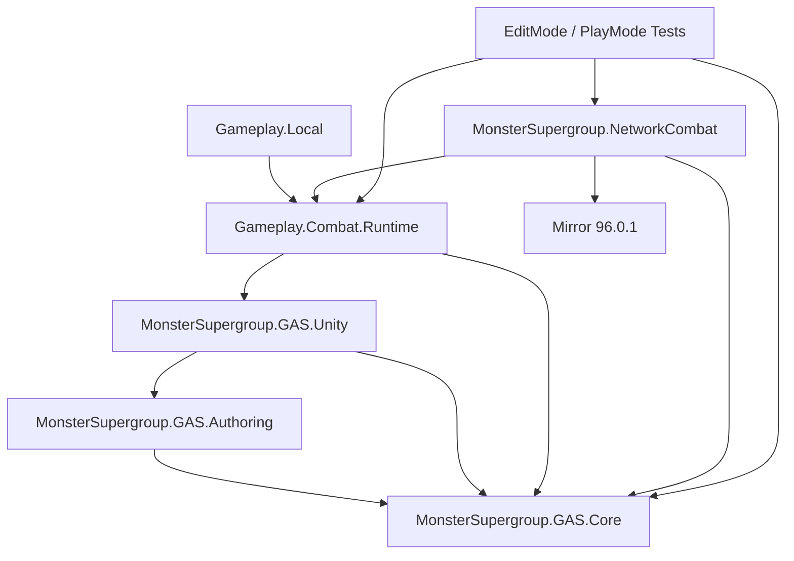
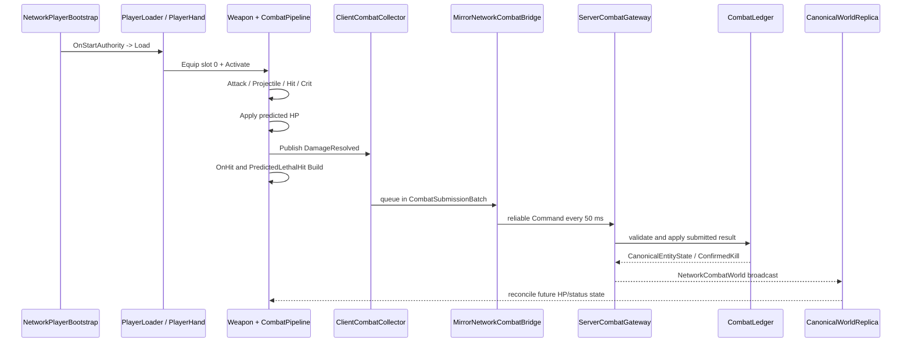

# MonsterSupergroup GAS 与联机模块总览

> 状态快照：2026-08-25
>
> Unity：6000.3.17f1
>
> Mirror：96.0.1
>
> Git HEAD：`083662f`
>
> 重要说明：本文以当日**包含未提交修改的工作树**为事实来源，而不是只描述 HEAD 提交中的内容。

## 1. 这份文档解决什么问题

MonsterSupergroup 当前已经拥有一套可运行、可测试的 GAS Core、自动攻击垂直切片，以及遵循“宽松客户端权威合作 PvE”原则的 Mirror 网络适配层。它不是空架构，也不是已经完成的正式联网游戏。

本文回答四个问题：

1. 当前究竟实现了哪些模块。
2. 各模块之间如何依赖、如何传递一次攻击结果。
3. 每种 Gameplay State 最终由谁负责。
4. 哪些能力已经测试，哪些仍只是开发沙盒，哪些还没有实现。

配套文档：

- [联机模块详细使用指南](MonsterSupergroup_联机模块详细使用指南.md)：如何配置、启动、扩展和排错。
- [HellMaiden GAS 合并方案](MonsterSupergroup_HellMaiden_GAS合并方案.md)：两套系统差异、类迁移表和推荐合并顺序。
- [HellMaiden 原战斗流程分析](HellMaiden_GAS战斗流程与MonsterSupergroup迁移指南.md)：用于查询原游戏行为；其中旧联网建议已经过时。

## 2. 状态标记

本文使用以下三种状态，避免把“代码存在”和“产品已经接入”混为一谈。

| 标记 | 含义 |
| --- | --- |
| **已实现并测试** | 有运行代码和自动测试证据，可以作为后续开发基础。 |
| **仅开发沙盒验证** | 在 `NetworkCombatSandbox` 中可运行，但尚未接入正式玩法场景、波次和奖励。 |
| **尚未实现** | 只有设计目标或迁移建议，当前不能直接使用。 |

## 3. 当前结论

### 3.1 已经成立的架构边界

- `MonsterSupergroup.GAS.Core` 是纯 C# Core，`noEngineReferences: true`，不依赖 Unity、Mirror、UI、FMOD 或 Rewired。
- `MonsterSupergroup.Gameplay.Combat.Runtime` 把纯 Core 接到 MonoBehaviour、目标搜索、武器生命周期和本地 Projectile。
- `MonsterSupergroup.NetworkCombat` 是唯一 Mirror 适配层；Command、ClientRpc、TargetRpc、Ledger 和 Canonical Replica 都在这里。
- 玩家 Owner Client 即时执行攻击、Projectile、命中、暴击、Build Chain 和预测致死逻辑。
- Server 不重新计算玩家的攻击力、暴击率、Build 或 Projectile 碰撞，只对客户端提交的结果做轻量验证并写入 Canonical World State。
- Enemy 的 Canonical HP、Alive/Dead、ConfirmedKill 和 Canonical Status Registry 由 Server 维护。
- Projectile 是本地池化对象，不使用 `NetworkIdentity`，也不逐个 Network Spawn。
- `PredictedLethalHit` 和 `ConfirmedKill` 已经分离：前者驱动即时 Build，后者驱动奖励和唯一击杀事实。
- Status 在所有客户端可查询，但其 Gameplay Tick 只能由一个 `ExecutionAuthority` 执行。

### 3.2 当前还没有成立的部分

- `Assets/Scenes/Gameplay.unity` 仍通过 `LocalGameplayBootstrap` 启动本地自动战斗，不是正式联机场景。
- 当前联网只在 `Assets/_Project/Scenes/Development/NetworkCombatSandbox.unity` 中验证。
- 沙盒中的 120 个 Enemy 由 `NetworkEnemySandboxSpawner` 生成，它不是正式波次系统。
- 正式 Roguelite 的 Wave、Loot、EXP、Gold、卡牌选择、关卡切换和复活尚未接入 Canonical Combat 事件。
- 尚未完成四个独立进程、Dedicated Server、长时间 Soak、100+ Enemy 真实美术/AI/Build 的完整压力测试。
- HellMaiden 的大部分 PlayerStats、武器形态、Modifier 和 Status 规则尚未迁入当前 Core。

## 4. 目录与程序集关系

### 4.1 主要目录

| 目录 | 状态 | 职责 |
| --- | --- | --- |
| `Assets/_Project/GAS/Core` | 已实现并测试 | 纯 C# Combat、Stats、Modifier、Status、Event Identity、Trace 和 Trigger Guard。 |
| `Assets/_Project/GAS/Authoring` | 已实现并测试 | Equipment/Perk ScriptableObject 数据和 `[SerializeReference]` 参数。 |
| `Assets/_Project/GAS/Unity` | 已实现并测试 | Unity 随机源和 Authoring 到 Runtime 的加载适配。 |
| `Assets/_Project/GAS/Editor` | 已实现并测试 | Modifier 选择、验证、生成稳定 Registry、Build 前校验。 |
| `Assets/_Project/Gameplay/Combat/Runtime` | 已实现并测试 | Combatant、PlayerHand、Weapon、自动攻击、本地 Projectile 和状态推进。 |
| `Assets/_Project/Gameplay/Local` | 已实现并测试 | 离线/本地 Player、Enemy、移动和启动适配。 |
| `Assets/_Project/NetworkCombat` | 已实现并测试 | 传输无关契约、客户端收集、服务端账本、Mirror 桥和 Replica。 |
| `Assets/_Project/Content/NetworkCombat` | 仅开发沙盒验证 | 由工具生成的 NetworkPlayer、NetworkEnemy、NetworkCombatWorld Prefab。 |
| `Assets/_Project/Scenes/Development/NetworkCombatSandbox.unity` | 仅开发沙盒验证 | Host/Client、延迟、批处理、120 Enemy 验证场景。 |
| `Assets/_Project/Gameplay/Combat`（不含 `Runtime`） | 待渐进迁移 | 从 HellMaiden 移植的旧 Gameplay 大程序集和插件耦合代码。 |

### 4.2 依赖方向



必须保持的方向：

```text
NetworkCombat -> Gameplay Runtime -> GAS Core

禁止：
GAS Core -> Mirror
Gameplay Runtime -> Mirror
GAS Core -> GameDirector / ControllerManager / FMOD / Rewired / UI
```

`AssemblyFenceTests` 已经对上述边界提供自动测试。

## 5. 已实现模块

### 5.1 GAS Core

| 模块 | 主要类型 | 已实现职责 |
| --- | --- | --- |
| Combat Context | `CombatContext`、`CombatEventId` | 保存 Event/Root/Parent、Sequence、ChainDepth、Source、Target、Ability、Build、Tags、目标版本。 |
| Combat Pipeline | `CombatPipeline`、`AttackSnapshot` | 按阶段构建攻击快照、逐目标结算、发布 Damage 和预测致死事件。 |
| Combat Events | `CombatEvent`、`ICombatEventSink` | 把战斗推演结果交给表现、Trace 或网络收集层。 |
| Trigger Guard | `CombatTriggerGuard` | 限制深度、每 Root 触发次数、自触发、同 Root/Target 重复和内部冷却。 |
| Combat Trace | `CombatTraceRecorder` | 保存有界环形 Trace，记录事件父子链、状态和 ConfirmedKill。 |
| Stats | `AttackStats`、`AttackStatsMultipliers`、`WeaponBehaviourStats` | 区分 Base、Static、Dynamic、Global、Per-target 等数值层。 |
| Modifier | `RuntimeEquipmentModifiers`、`RuntimePerkModifier` | 按执行阶段、优先级和插入顺序稳定执行，支持 Handle 和正确 Dispose。 |
| Stable Registry | `ModifierRegistry`、`GeneratedModifierRegistry` | 使用显式稳定 ID 创建 Runtime Modifier，不依赖运行时反射和类型哈希。 |
| Status | `StatusController`、`StatusInstance` | 预测状态、Canonical 状态、来源区分、Stack、Duration、Version、单执行者 Tick。 |

当前 Concrete Modifier 只覆盖第一批垂直切片，例如 Damage、Weapon Speed Perk 和 OnHit Burn；不能把它误解为已经迁完 HellMaiden 全部 Build。

### 5.2 Authoring 与 Editor

| 模块 | 使用入口 | 作用 |
| --- | --- | --- |
| Equipment Set | `Create > Monster Supergroup > GAS > Equipment Modifier Set` | 为一个武器配置 0..N 个 Equipment Modifier。 |
| Perk Set | `Create > Monster Supergroup > GAS > Perk Modifier Set` | 配置影响武器全局数值的 Perk Modifier。 |
| Registry Generator | `Tools > MonsterSupergroup > GAS > Rebuild Registry` | 按稳定 ID 生成 `GeneratedModifierRegistry.g.cs`。 |
| Asset Validator | `Tools > MonsterSupergroup > GAS > Validate All` | 检查 0 ID、未知 ID、参数类型、空引用和非法数值。 |
| Build Preprocessor | 自动执行 | 在 Build 前阻止无效 GAS 数据进入构建。 |

### 5.3 Gameplay Runtime

| 模块 | 职责 |
| --- | --- |
| `CombatantBehaviour` | 实现战斗目标、预测 HP、Canonical HP 应用、StatusController 和伤害事件。 |
| `CombatTeamBehaviour` | 标记 Player/Enemy Team，避免友军和死亡目标被选中。 |
| `NearestEnemyTargetProvider` | 在范围内选择最近的有效敌方 Combatant。 |
| `PlayerLoader` | 重置玩家、初始化 PlayerHand、在 Slot 0 装备初始武器并激活自动攻击。 |
| `PlayerHandBehaviour` / `PlayerHand` | 管理四个 Weapon Slot、生命周期和 Runtime Services。 |
| `PlayerHandSlot` | 原子地装备/卸下武器，管理每槽最多三个 Equipment Set。 |
| `WeaponDefinition` | 保存 Combat ID、基础 Stats、武器/Projectile Prefab、初始 Equipment/Perk 和发射参数。 |
| `WeaponRuntimeBehaviour` | 把 Authoring 数据加载为 Runtime Modifier，调用 CombatPipeline。 |
| `ProjectileAttackBehaviour` | 根据武器速度自动攻击，创建一次 AttackSnapshot 并发射本地 Projectile。 |
| `StraightProjectileBehaviour` / Pool | 本地运动、碰撞、HitCount、命中后 `ResolveHitDetailed`、池化复用。 |
| `StatusUpdateDriver` | 用显式 delta time 推进 Combatant 的 StatusController。 |
| `CombatRuntimeServices` | 向武器注入 Source IDs、Event IDs、Event Sink、Trigger Guard 和 Time Source。 |

### 5.4 Network Contracts 与 Client

| 模块 | 职责 |
| --- | --- |
| `CombatResult` | 传输客户端已经算出的 Damage、Tags 和完整 Event Identity。 |
| `CombatSubmissionBatch` | 一次携带多个 CombatResult、StatusMutation 和 PlayerHealthReport，保留每个事件。 |
| `StatusMutation` | 提交预测 Add/Refresh/Remove、StackDelta、来源、Duration、Tick 和版本信息。 |
| `CanonicalEntityState` | Server 的 Entity HP、Alive、Version、Owner、Killer 等共享事实。 |
| `CanonicalStatusState` | Server Status Registry 的可复制状态。 |
| `ClientCombatCollector` | 订阅现有 GAS Event/Status Change，收集并批量排队，不执行 RPC。 |
| `CanonicalWorldReplica` | 保存客户端可查询的 Canonical Entity/Status，处理晚加入快照和事件通知。 |

### 5.5 Server

| 模块 | 职责 |
| --- | --- |
| `ServerCombatGateway` | 验证 Sender、Source 所有权、Target、数值、Event ID、Sequence 和硬规则。 |
| `CombatLedger` | 保存 Entity Canonical HP/Alive/Version，应用结果并只产生一次 ConfirmedKill。 |
| `ServerStatusRegistry` | 保存 Status Add/Remove/Stack/Duration/Version，执行 Server-authority 状态。 |
| `ProcessedEventCache` | 有容量和过期时间的幂等缓存，阻止同一事件重复结算。 |

Server 明确**不做**以下事情：

- 不重算玩家 AttackDamage。
- 不验证玩家 CritChance 是否真的触发。
- 不重新运行 Build Chain。
- 不验证本地 Projectile 是否发生物理碰撞。
- 不因为 TargetStateVersion 落后一版就拒绝正常伤害。

### 5.6 Mirror Adapter

| 组件 | 所在对象 | 职责 |
| --- | --- | --- |
| `NetworkCombatWorld` | 场景唯一 World 对象 | 持有 Gateway/Replica、Server Tick、Canonical 广播和晚加入快照。 |
| `MirrorNetworkCombatBridge` | Owner Player | 分配事件 Epoch/Slot、创建 Collector、每 50ms 可靠提交 Batch。 |
| `NetworkWeaponCombatAdapter` | Owner Player | 把 Collector、Event IDs 和 Source IDs 注入现有 PlayerHand/Weapon。 |
| `NetworkCombatantAdapter` | Player 和 Enemy | 注册 Entity、绑定 StatusController、应用 Canonical State、提交 Owner-final Player HP。 |
| `NetworkPlayerBootstrap` | Player | 只在 Owner 上启用移动并调用 `PlayerLoader.Load()`。 |
| `NetworkEnemyServerDriver` | Enemy | 只在 Server 上执行追踪和 Canonical Death 后的网络销毁。 |
| `NetworkEnemySandboxSpawner` | Sandbox World | 仅开发用，Server 启动时生成 120 个 Enemy。 |

## 6. Authority Map

| 状态或操作 | 即时执行者 | 最终事实/收敛者 | 说明 |
| --- | --- | --- | --- |
| Player Movement | Owner Client | 当前由 Client→Server Transform 同步 | 强调即时响应；尚未实现严格移动校验。 |
| Attack Scheduling | Owner Client | Owner Client | Server 不重新调度普攻。 |
| Projectile Spawn/Movement | Owner Client | 无 Network Spawn | 其他客户端不需要同步每个 Projectile。 |
| Hit Detection | Owner Client | Owner Client | 命中结果通过 CombatResult 提交。 |
| Damage/Crit/Build | Owner Client | Damage 数值由 Server Ledger 合并 | Server 接受合法的已解析 Damage。 |
| Enemy Predicted HP | 发起攻击的 Owner Client | 无 | 只用于即时反馈和 Build Chain。 |
| PredictedLethalHit | 发起攻击的 Owner Client | 无 | A/B 可同时触发各自 Build。 |
| Enemy Canonical HP/Alive | 本地先预测 | Server CombatLedger | 最终通过 Canonical State 广播。 |
| ConfirmedKill | Server | Server | 同一 Enemy 只产生一次。 |
| Player HP | Owner Client | Server 保存 Owner-final Report | 其他客户端不能写该玩家 HP。 |
| SourceClient Status Gameplay/DOT | Status Source Owner | Server Registry 保存状态；Ledger 合并 Tick Damage | Observer 只查询/表现，不重复 Tick。 |
| Server Status Gameplay（如 Stun AI） | Client 可预测表现 | Server | AI 停止只能由 Server 执行。 |
| Enemy AI/Spawn/Destroy | Server | Server | Sandbox 已验证基础追踪和死亡销毁。 |
| Loot/EXP/Gold/Kill Credit | 尚未接入 | 必须由 Server | 未来只消费 ConfirmedKill。 |

## 7. 运行调用链

### 7.1 Owner 自动攻击到 Canonical HP



关键点：Collector 在 `DamageResolved` 时先收下结果，但 Bridge 之后才 Flush；同一 Root 的 OnHit 和 PredictedLethal Build 会继续在本地同步完成，不等待任何网络返回。

### 7.2 Status

```text
Owner GAS applies predicted StatusInstance
  -> StatusController.Changed(Predicted)
  -> ClientCombatCollector creates StatusMutation
  -> ServerStatusRegistry updates Canonical stack/duration/version
  -> NetworkCombatWorld broadcasts CanonicalStatusState
  -> every CanonicalWorldReplica stores it
  -> registered StatusController reconciles predicted delta
  -> only ExecutionAuthority executor runs gameplay ticks
```

### 7.3 击杀语义

```text
Predicted HP crosses zero
  -> PredictedLethalHit
  -> local death presentation / targetable=false
  -> corpse explosion / summon / cooldown reset / next build

Server Ledger applies one or more submitted results
  -> Canonical HP crosses zero exactly once
  -> ConfirmedKill exactly once
  -> future Loot / EXP / Gold / Kill Credit / Wave Progress
```

不允许再用一个语义模糊的 `OnKill` 同时驱动两条链。

## 8. 当前场景与 Prefab

### 8.1 本地 Gameplay

`Assets/Scenes/Gameplay.unity` 当前验证本地自动攻击，不依赖启动 Mirror Host。它仍然适合验证 GAS/PlayerHand/Projectile 的离线行为，但不能证明联机 Authority 正确。

### 8.2 NetworkCombatSandbox

`Assets/_Project/Scenes/Development/NetworkCombatSandbox.unity` 包含：

- `KcpTransport`，外包一层 `LatencySimulation`。
- 单向 100ms 延迟，即约 200ms RTT。
- 50ms Jitter、5% Unreliable Loss、2% Scramble。
- 最多四个连接。
- 一个 `NetworkCombatWorld`。
- 四个 `NetworkStartPosition`。
- 一个带 Mirror HUD 的 NetworkManager。
- 120 个由 Server 生成的 NetworkEnemy。

它故意不加入正式 Build Settings/Profile。详细操作见使用指南。

### 8.3 旧网络原型

`Assets/Script/NewNetworkManager.cs` 是未提供有效产品行为的旧原型子类，旧 `Assets/Prefab` 网络对象也没有构成当前正式入口。后续开发不应围绕它们继续扩展；当前事实来源是 `_Project/NetworkCombat`。

## 9. 自动测试证据

最近一次记录：

| 套件 | 结果 | 日志 |
| --- | ---: | --- |
| EditMode | 88 / 88 Passed | `Logs/codex-resume-editmode.xml` |
| PlayMode | 31 / 31 Passed | `Logs/codex-resume-playmode.xml` |

覆盖重点：

- Core 无 Unity/UI/Input/Audio/Rewired/Mirror 和旧全局服务依赖。
- AttackSnapshot、每目标结算、暴击、OnHit、预测致死和执行顺序。
- Stable Modifier ID、Registry 生成、SerializeReference 和资产验证。
- Status 多来源、预测 Delta、Canonical Reconcile 和单 Executor。
- 重复 Event 幂等、乱序 Batch、过期缓存和 Trace Ring。
- 200ms RTT/Jitter/Loss 下即时本地反馈与最终收敛。
- A/B 同时预测致死但 Server 只 ConfirmedKill 一次。
- SourceClient DOT 只执行一次，Source 断线后 Server 接管剩余 Tick。
- Host 启动 Owner Player 和 120 个 Canonical Enemy。
- 2400 Combat Events / 8 Batches 的开发压力样本。

这些测试证明当前垂直切片的规则，不证明所有 HellMaiden 武器、Status、AI 和 Roguelite 内容已经迁完。

## 10. 后续工作的正确起点

下一阶段不是重新实现 `DamageSystem2`、`StatusSystem2` 或另一套网络 GAS。正确顺序是：

1. 保持当前 Core、Runtime 和 NetworkCombat 边界不变。
2. 选一个 HellMaiden 代表性武器和最小 PlayerStats 子集。
3. 把其数值和 Modifier 转入当前 AttackSnapshot/CombatPipeline。
4. 把攻击几何接到当前 Weapon Runtime，并让所有命中走 `ResolveHitDetailed`。
5. 把状态转成当前 `StatusInstance`，声明 Source 与 ExecutionAuthority。
6. 让 `ClientCombatCollector` 自动收集最终共享结果，不在武器代码里直接写 Command。
7. 通过双客户端预测致死、Status 跨玩家查询和 ConfirmedKill 测试。
8. 代表性切片稳定后，再建立正式联机场景和产品波次系统。

详细类迁移表和阶段验收见 [HellMaiden GAS 合并方案](MonsterSupergroup_HellMaiden_GAS合并方案.md)。
