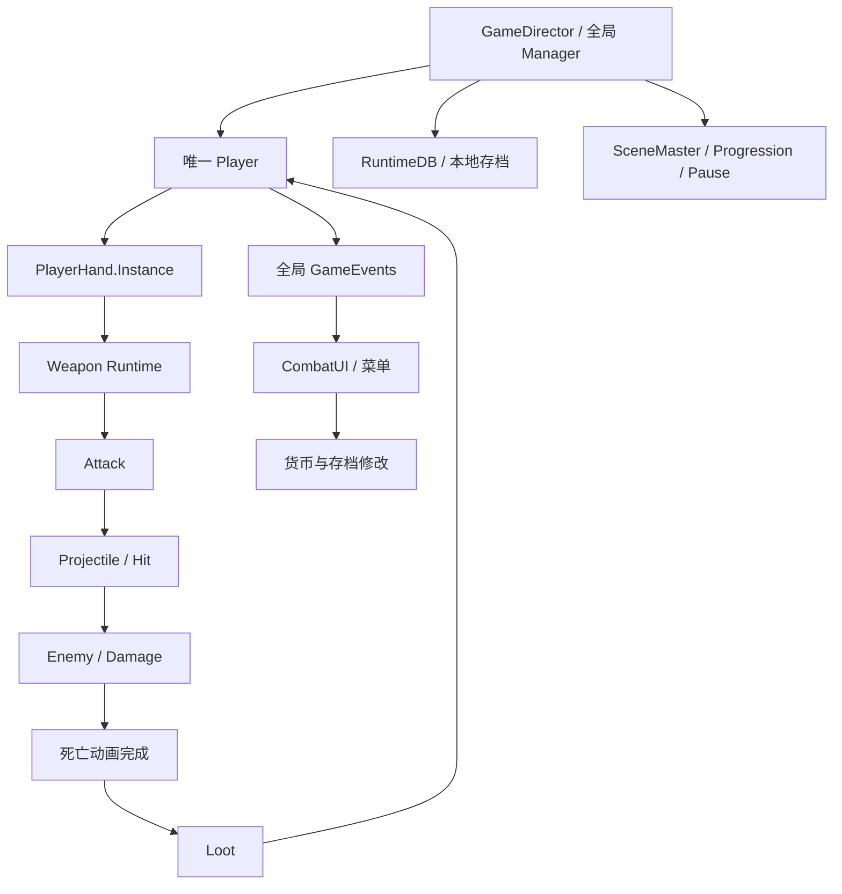
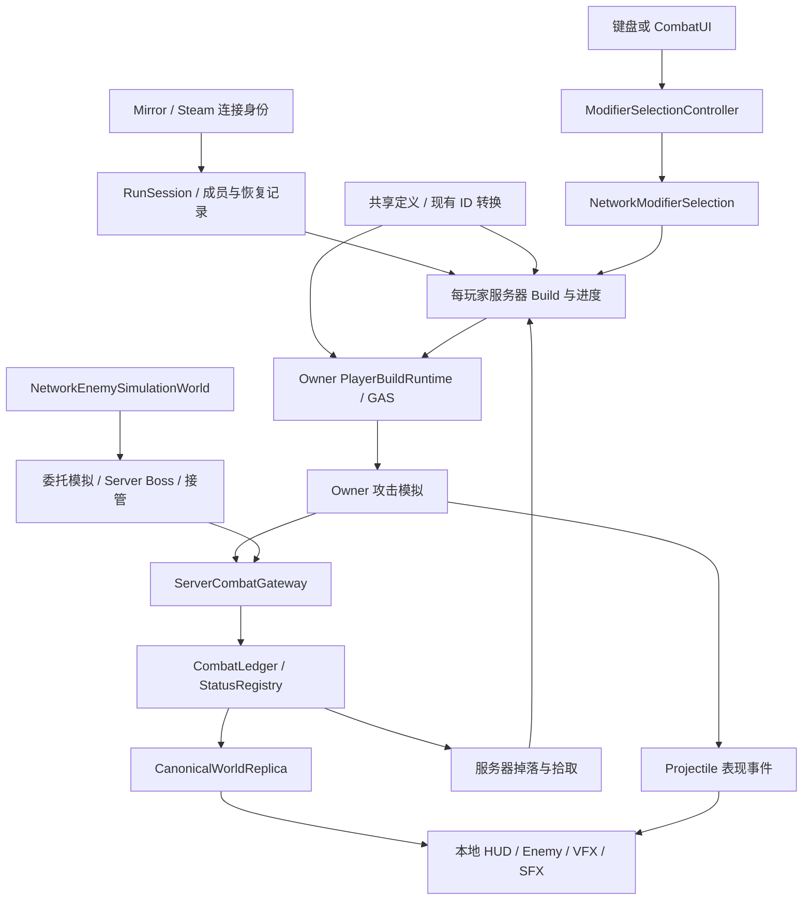

总体判断：**应以 MonsterSupergroup 当前的 GAS Runtime、Mirror 网络适配层和 Enemy Simulation 架构为迁移基础，逐个接入 HellMaiden 的玩法模块。最危险的地方，是恢复旧模块时同时恢复了其隐含的单玩家状态、初始化流程和动画回调副作用。**

本轮分析以两个项目的当前脚本、Boot/Gameplay 入口、相关 prefab 和已有测试为依据，包含工作区中尚未提交的迁移代码。**没有修改代码，也没有重新运行联机测试。**

方案采用此前确认的规则：

- 保留当前混合战斗权限模型，并加强服务器校验。
- XP 和其他世界掉落由先合法拾取的玩家获得。
- 开局固定成员，允许原成员重连。
- 个人倒地后允许队友复活，全员倒地才结算。
- 断线时移除角色、保留进度，重连后在合法位置恢复。
- 升级候选不足三个时，可以提供一至两个。

## A. 当前单机架构中与多人不兼容的核心假设

### 1. 全局入口同时承担了不同作用域的状态

HellMaiden 的 `GameDirector` 把数据库、存档、输入、场景、管理器和单个 `Player` 的初始化串在一起，最后初始化全局 `PlayerHand`。这些对象的生命周期并不相同。[源项目 GameDirector](F:/DecomplieLatest/HellMaiden/ExportedProject/Assets/Scripts/Assembly-CSharp/AstralShift/HellMaiden/GameDirector.cs:85)

MonsterSupergroup 已经停用了其中部分初始化，但 `NetworkPlayerBootstrap` 仍将 Owned Player 写入 `GameDirector.Player`，并持续维持这个注册关系。这目前是旧代码兼容入口，不能成为服务器或其他玩家的查询入口。[NetworkPlayerBootstrap](F:/UnityStore/MonsterSupergroup/Assets/_Project/NetworkCombat/Mirror/NetworkPlayerBootstrap.cs:152)

应按作用域拆分：

| 状态或服务 | 处理方式 |
|---|---|
| 只读 Equipment、Weapon、Modifier 定义与注册表 | 可以共享 |
| Steam 客户端服务、Transport 选择 | 可以保持进程级服务 |
| World、敌人注册表、局内时钟 | 每个服务器对局一份 |
| Player、Build、Stats、XP、Level、背包 | 每位玩家独立 |
| 输入、摄像机、HUD、菜单焦点、个人设置 | 本地客户端独立 |
| 账号存档、解锁数据 | 属于具体账号，不能以 Host 的存档代表所有人 |

`Singleton` 本身不是唯一问题；**真正要消除的是没有明确作用域的可变状态。**

### 2. “加载玩家”实际等于“重置整个单机游戏”

旧 `PlayerLoader.LoadAsync()` 会操作全局摄像机、重置玩家 Stats、初始化 `Leveler`、清空 `PlayerHand`、装备初始武器并订阅全局事件。[PlayerLoader](F:/UnityStore/MonsterSupergroup/Assets/_Project/Gameplay/Combat/Scenes/SceneLoaders/PlayerLoader.cs:32)

这不适用于：

- Remote Player 生成；
- Dedicated Server 创建玩家状态；
- 原成员断线恢复；
- 同一玩家跨场景保留 Build；
- Host 同时执行服务器与本地客户端回调。

应拆成“创建/恢复玩家 Runtime”“绑定本地输入与摄像机”“绑定本地 UI”三个独立步骤。

### 3. 游戏状态依赖本地输入控制器

当前 `PlayerState.IsBusy`、升级状态和部分 Ultimate 判断仍通过全局 `ControllerManager.CurrentController` 推断。[PlayerState](F:/UnityStore/MonsterSupergroup/Assets/_Project/Gameplay/Combat/Player/PlayerState.cs:11)

这会让菜单焦点影响 Gameplay 判断。未来应区分：

- Gameplay：该玩家是否倒地、眩晕、选择升级、允许移动或攻击。
- Presentation：本地当前打开哪个菜单、哪个控件获得输入。

服务器不能通过客户端 UI 控制器判断玩家能力。

### 4. “文件已迁入”不代表“运行链已经迁入”

当前真正接入 Native 路径的武器入口包括 `ProjectileAttackBehaviour.InitNative`。部分近战、Beam、Circling、Summon、Ultimate 等旧实现仍调用旧 `Init()`，而基础 `WeaponBehaviour.Init()` 已明确抛出禁用异常。[WeaponBehaviour](F:/UnityStore/MonsterSupergroup/Assets/_Project/Gameplay/Combat/Player/Attacks/WeaponBehaviour.cs:128)

因此不能批量启用旧武器 prefab，然后认为只剩网络同步工作。每个攻击族都需要先接入现有 Native Runtime，再适配其权限和表现事件。

### 5. XP 与奖励尚有两套入口

当前存在：

```text
服务器 ConfirmedKill
→ NetworkModifierSelection.ServerGrantExperience
```

以及：

```text
XPGem.Consume
→ PlayerMovement.IncreaseXP
→ 旧 Leveler
```

经验球虽然已开始通过 Collector 找玩家，但仍进入旧升级路径。[服务器击杀 XP](F:/UnityStore/MonsterSupergroup/Assets/_Project/NetworkCombat/Mirror/NetworkModifierSelection.cs:464)、[XPGem](F:/UnityStore/MonsterSupergroup/Assets/_Project/Gameplay/Combat/Items/XPGem.cs:54)

根据已确认规则，最终应统一为：

```text
服务器确认死亡
→ 创建共享世界掉落
→ 服务器接受一次合法拾取
→ 向拾取者发放 XP
→ 现有服务器升级选择流程
```

启用这条路径时，必须同时撤下直接击杀发 XP 的入口，防止重复奖励。

### 6. 死亡动画仍参与玩法结算

目前 `EnemyController` 等待死亡表现完成后才尝试生成 Loot；另一方面，`NetworkEnemyServerDriver` 收到权威死亡状态后会销毁网络对象。[EnemyController](F:/UnityStore/MonsterSupergroup/Assets/_Project/Gameplay/Combat/AI/Enemy/EnemyController.cs:1453)、[NetworkEnemyServerDriver](F:/UnityStore/MonsterSupergroup/Assets/_Project/NetworkCombat/Mirror/NetworkEnemyServerDriver.cs:45)

这存在生命周期冲突：奖励逻辑不能依赖尸体是否仍存在、动画是否播放完成。

玩家侧也存在类似问题：死亡通过全局事件通知，动画结束参与角色停用。Boss 还订阅单个玩家死亡事件来暂停状态机。这些都需要适配倒地、复活和队伍结算。

### 7. 世界围绕唯一玩家与唯一摄像机构建

`MapGenerator` 的距离和地图移动逻辑直接读取 `GameDirector.Player`；SpawnHelpers、部分敌人归位逻辑依赖全局玩家或摄像机。[MapGenerator](F:/UnityStore/MonsterSupergroup/Assets/_Project/Gameplay/Combat/MapGeneration/MapGenerator.cs:479)

多人情况下必须明确：

- 世界坐标和地图布局由谁持有；
- 敌人相对哪位玩家生成；
- 两名玩家相距很远时哪些区域保留；
- 某个客户端看不到对象，是否只隐藏表现；
- 共享敌人、掉落是否仍具有玩法意义。

不能因为离开某位玩家的镜头，就销毁其他玩家仍在使用的世界内容。

### 8. 数据库初始化混入账号和 UI

`RuntimeDB.Init()` 不只是建立定义索引，还涉及解锁池、存档刷新和卡牌表现工厂。[RuntimeDB](F:/UnityStore/MonsterSupergroup/Assets/_Project/Gameplay/Combat/Hand/Data/RuntimeDB.cs:83)

`PlayerStats` 也读取本地 `GameDataManager` 的 Meta Progression；当前 Meta 数据库赋值尚有停用代码，Boot 中 PerkDB、MetaStatsDB 仍为空。

因此应保留数据库与已有转换器，但将以下内容分开初始化：

1. 共享定义和校验；
2. 每位玩家经过确认的初始配置；
3. 本地账号与表现资源。

此外，当前 `PlayerBuildRuntime` 的 Perk 路径只支持 `WeaponStats` domain。不能把全部旧 Perk 当作已经可以应用。[PlayerBuildRuntime](F:/UnityStore/MonsterSupergroup/Assets/_Project/Gameplay/Combat/Native/PlayerBuildRuntime.cs:553)

### 9. UI 和暂停具有 Gameplay 副作用

旧 `PauseManager` 通过 `Time.timeScale` 暂停整个进程；结算 UI 的 `RunStatsPlayerPanel.CalculateCurrency()` 会直接增加存档货币。[RunStatsPlayerPanel](F:/UnityStore/MonsterSupergroup/Assets/_Project/Gameplay/Combat/UI/Menus/RunStatsPlayerPanel.cs:168)

迁移后：

- 打开个人菜单只能改变该玩家的输入和已定义的 Gameplay 限制。
- 结算奖励由服务器完成一次。
- UI 展示结算结果，重复打开不能再次发奖。

---

## B. HellMaiden → MonsterSupergroup 的目标架构

### 保留现有网络权限基础

当前 MonsterSupergroup 已经采用明确的混合模型：

- 玩家移动、攻击、弹道、命中和暴击由 Owner 执行。
- Enemy 最终 HP、死亡、ConfirmedKill 由服务器记录。
- Player HP 使用 Owner-final report。
- 状态的增删、层数、持续时间和版本由服务器管理。
- 普通/精英敌人可以委托客户端模拟。
- Boss、敌人目标分配、生成和网络销毁由服务器管理。

这与当前代码和网络架构说明一致。[NetworkCombat README](F:/UnityStore/MonsterSupergroup/Assets/_Project/NetworkCombat/README.md:16)

迁移应沿用这个基础，补齐以下三个层次。

| 层 | 主要职责 | 现有基础 |
|---|---|---|
| Gameplay simulation | Stats、武器、攻击、Modifier 执行、AI 算法 | GAS、PlayerBuildRuntime、CombatPipeline、EnemyController |
| Network authority / replication | 请求校验、权限分配、共享结果、版本、恢复 | ServerCombatGateway、CombatLedger、ServerStatusRegistry、NetworkEnemySimulationWorld |
| Local presentation | HUD、动画、音效、特效、镜头、插值、表现对象池 | LocalPlayerUIBinder、ProjectilePresentationReplica、已有 HUD 与 Enemy 表现 |

### 需要补齐的最小结构

以下名称是建议，尚未实现：

**`RunSession` / `RunPlayerRegistry`**

负责局内成员、稳定玩家身份、连接状态、生命阶段和断线保存。它们只管理生命周期及数据，不执行第二套 Build 或 Buff。

必须区分：

```text
RunParticipantId：本局中持续存在的成员身份
Avatar netId：本次生成的角色实体
ConnectionEpoch：本次连接的事件代次
```

现有 `MirrorNetworkCombatBridge` 已有连接代次和事件身份注册，应复用。[MirrorNetworkCombatBridge](F:/UnityStore/MonsterSupergroup/Assets/_Project/NetworkCombat/Mirror/MirrorNetworkCombatBridge.cs:33)

需要新增的是稳定局内身份及恢复记录，而不是另一套网络事件 ID 系统。

**每玩家 Runtime**

继续由 `PlayerBuildRuntime`、`CombatantBehaviour` 和已有 GAS Runtime 保存、执行状态。

断线时保存定义 ID、槽位、等级、进度、服务器状态及时间信息；恢复时通过现有 API 重建。保存记录是恢复数据，不是持续运行的第二份 Modifier 系统。

**本地玩家上下文**

由所有权回调绑定：

```text
Owned Player
→ 输入 / 摄像机 / HUD / 菜单
```

逐步撤下 `GameDirector.Player` 的 Gameplay 调用方。Remote Player 和 Dedicated Server 都不依赖这个本地上下文。

### 两个需要加强的权限边界

**攻击结果校验。** 当前服务器不重新执行玩家 GAS，现有校验主要覆盖身份、目标、数值和事件合法性。应逐步加入：

- 武器是否属于服务器确认的 Build；
- 根攻击对应的 Build revision；
- 攻击频率与可用状态；
- 攻击族允许的命中次数、持续时间和结果范围；
- 派生攻击与根攻击的关系。

升级发生前已经发出的合法弹道，应保留其攻击快照，不能直接用最新 Build revision 一概拒绝。当前 `CombatResult.BuildId` 也不能直接当作服务器的 Build revision 使用。

在保留 Owner 命中模拟的前提下，服务器仍无法完全证明碰撞真实性；这是该模型保留的信任边界。

**倒地与复活。** 当前 Owner HP 报告通过版本及范围检查后，可直接改变 `Alive`，没有队友复活事务的约束。[CombatLedger](F:/UnityStore/MonsterSupergroup/Assets/_Project/NetworkCombat/Server/CombatLedger.cs:257)

后续需要由服务器管理：

```text
Active → Downed → Reviving → Active
```

Owner 可以继续执行本地受伤判断，但不能通过较新的 HP 报告自行越过倒地状态。治疗、复活和恢复应建立明确的版本边界。

---

## C. 模块分类

| 分类 | 具体模块 | 迁移要求 |
|---|---|---|
| **可直接移植** | 已兼容的定义数据、纯数值算法、曲线、Sprite、材质、音效、动画资源 | 验证引用与输入输出；资源可复用不等于挂载脚本可直接启用 |
| **小幅修改** | OverflowBar、HealthBottomBar、纯 HUD 展示、伤害数字、局部 VFX/SFX 播放器、纯表现对象池 | 改为显式绑定数据与生命周期，移除全局 Player 查找 |
| **需要网络适配** | Native 武器攻击族、Projectile、敌人移动/攻击、交互物、状态表现、拾取请求 | 复用已有适配层，明确执行者、事件身份、快照与清理 |
| **必须重构职责** | PlayerLoader、PlayerHand 单例、Leveler、LootManager、ProgressionManager/Timeline、Boss 流程、地图玩家相关逻辑、死亡结算 | 拆开每玩家、每对局和本地表现状态 |
| **不应迁入新运行链** | 整体 CombatUIManager、全局 Player Gameplay 查询、无玩家身份的全局状态事件、旧 Modifier Runtime、UI 发奖、动画完成后决定掉落 | 将必要能力分别接入现有 Runtime 和服务 |

补充两点：

- 当前检索到的是 `PlayerHand`；没有确认存在独立的 `PlayerHandBehaviour`，规划不应假定该类已存在。
- `LegacyEquipmentModifierConverter` 应继续承担编辑器侧旧数据转换。已有 Equipment 卡 ID、Modifier stable ID 和 RuntimeFactory 链路继续复用，不增加运行时平行映射。

---

## D. 数据 Ownership / Authority 表

下表描述目标职责。“服务器持有”不一定意味着服务器逐帧执行全部模拟。

| State | Server | Owner Client | Remote Client | Presentation Only |
|---|---|---|---|---|
| 内容定义、Modifier 注册表 | 校验并读取同版本数据 | 读取 | 读取必要定义 | 否 |
| 玩家身份、局内成员、连接状态 | 最终管理 | 提交连接请求 | 接收必要状态 | 否 |
| Player Stats / MaxHP | 持有确认的初始配置与 Build 派生依据 | 执行镜像、展示 | 接收必要摘要 | 否 |
| 当前 HP | 校验、记录 Owner 报告和服务器修正 | 本地执行并上报 | 展示确认值 | 否 |
| 倒地、复活、队伍失败 | 最终决定 | 请求、执行确认结果 | 展示确认结果 | 否 |
| Weapon Build / Equipment / Perk | 最终确认和保存 | 维护执行镜像 | 通常只需外观及攻击参数 | 否 |
| 升级候选、待选次数 | 生成、保存、校验与消费 | 选择请求 | 通常不需要完整候选 | 菜单是 |
| XP / Level / 局内货币 | 最终管理 | 展示与反馈 | 按需求显示摘要 | 否 |
| 移动、Dash、攻击输入 | 校验能力及必要边界 | 发起并执行 | 插值、重放 | 否 |
| Cooldown | 保存/校验合法攻击时间约束 | 本地执行与倒计时 | 通常只需攻击事件 | 倒计时是 |
| 玩家 Projectile 逻辑 | 校验来源、攻击窗口和结果 | 弹道与命中模拟 | 不执行他人的伤害逻辑 | 否 |
| Projectile visual | 转发表现所需信息 | 本地播放 | 本地重放 | 是 |
| 玩家对敌 Damage / Crit | 接受合法结果，结算 Enemy HP | GAS 计算并提交 | 接收结果 | 否 |
| Gameplay Status | 增删、层数、期限、版本权威 | 按现有规则执行获授权效果 | 维护必要副本 | 图标/VFX 是 |
| 普通/精英 Enemy AI | 分配模拟者、监督、接管 | 被委托时执行 | 被委托时也可执行 | 否 |
| Boss AI、目标、阶段 | 执行并决定 | 接收 | 接收 | 否 |
| Enemy HP / Death | 最终决定 | 可预测表现 | 接收确认 | 否 |
| Loot、拾取归属、随机奖励 | 生成并原子确认一次 | 请求拾取 | 展示世界物品 | 拉取动画是 |
| 地图、Wave、局内时钟 | 最终管理 | 接收必要状态 | 接收必要状态 | 局部装饰是 |
| HUD、镜头、菜单焦点、音量 | 无需持有 | 本地管理 | 各自本地管理 | 是 |

**Host 同时承担 Server 和本地 Client 两类职责。** 它必须执行一次权威修改，并执行必要的本地表现，不能因为两个回调都发生而重复加 Modifier、发奖励或结算伤害。

敌人的 `SimulationOwner` 是独立能力，不能用某个玩家对象的 `isOwned` 代替。

---

## E. 模块依赖图

### 旧结构及危险耦合



最危险的依赖是反向副作用：

- UI 修改奖励和存档；
- 动画完成触发玩法后果；
- 输入控制器决定 Gameplay 状态；
- 摄像机和唯一玩家决定共享世界生命周期；
- 场景加载器清空全局 Build。

### 目标结构



未来 CombatUI 继续调用：

```text
ModifierSelectionController.Select(index)
ModifierSelectionController.SelectOffer(offerId)
```

订阅 `OffersChanged` 并读取等待状态。当前这个接口的成功返回表示请求已提交，菜单应等待服务器确认应用结果，不能据此自行修改 Build。[ModifierSelectionController](F:/UnityStore/MonsterSupergroup/Assets/_Project/Gameplay/Combat/Native/ModifierSelectionController.cs:83)

---

## F. 推荐迁移顺序

推荐按以下顺序推进，每阶段都包含对应联机测试：

```text
Phase 0  权限、身份与启动基础
    ↓
Phase 1  每玩家 Runtime 与恢复数据
    ↓
Phase 2  武器、攻击与结果校验
    ↓
Phase 3  Enemy、World 与死亡后果
    ↓
Phase 4  Loot、XP、升级与个人成长
    ↓
Phase 5  多人 Game Flow、复活与重连
    ↓
Phase 6  HUD、菜单及完整表现
    ↓
Phase 7  全流程、Steam 与 Dedicated Server 验证
```

Phase 0–1 先定义身份及生命周期接口；Phase 5 完成完整玩法流程。基础 HUD 和调试表现可以随前面的阶段接入，不必等到 Phase 6。

---

## G. 各阶段的修改目标、风险与验收

### Phase 0 — 权限、身份与启动基础

- **目标：** 固定权限表、局内身份、连接代次、运行阶段和客户端/服务器启动边界。
- **涉及类：** `BootGameplayNetworkManager`、`NetworkBackendBootstrap`、`SteamLobbyService`、`SteamLobbyMetadata`、`MirrorNetworkCombatBridge`、`GameplayUILoader`、`GameDirector`。
- **架构变化：** 增加轻量局内成员记录；复用现有事件代次和协议版本；将本地 UI、输入、音频初始化从服务器启动要求中分离。
- **风险：** 当前 UI Loader 会直接创建 UI，GameDirector 仍初始化 ControllerManager。Transport 中有 Dedicated Server 分支，不代表项目启动链已适配。[GameplayUILoader](F:/UnityStore/MonsterSupergroup/Assets/_Project/Gameplay/Combat/UI/GameplayUILoader.cs:15)
- **验收：** 无图形 KCP Server 能启动并接入两个 Client；服务器不要求本地输入、摄像机或个人账号 UI；成员身份不能由客户端任意声明。
- **前置依赖：** 无。完成本阶段决策后再扩大迁移范围。

Steam 路径应使用 Transport 提供的对端身份建立成员映射。KCP 测试身份可以单独注入，但不能把测试身份声明直接当作生产认证。

### Phase 1 — 每玩家 Runtime 与恢复数据

- **目标：** 分离玩家状态、账号配置、本地控制和角色实体生命周期。
- **涉及类：** `NetworkPlayerBootstrap`、`PlayerLoader`、`PlayerMovement`、`PlayerStats`、`PlayerState`、`PlayerBuildRuntime`、`RuntimeDB`、`LocalPlayerUIBinder`。
- **架构变化：** 服务器确认每玩家初始配置；本地输入与 HUD 按 Owned Player 绑定；清空、恢复 Build 通过现有 API；准备断线恢复记录。
- **风险：** Host 存档被用来初始化其他玩家；Awake 早于 Owner 配置执行；跨场景重新初始化误清空 Build；恢复时重复应用 Modifier。
- **验收：** 两名玩家使用不同配置时互不影响；Remote 不接本地输入；Host 与独立 Owner 的同一 Build 结果一致；重复 Bind/Unbind 不残留事件。
- **前置依赖：** Phase 0 身份和作用域约定。

恢复记录至少包含：武器与槽位、Equipment/Perk ID 和等级、XP/Level、待选次数与候选内容、服务器状态期限、生命阶段及局内货币。冷却通过合法时间信息恢复，不能因重连免费重置。

### Phase 2 — 武器、攻击与结果校验

- **目标：** 将旧攻击族逐一接入 Native GAS，并增加与其语义相符的网络校验。
- **涉及类：** `WeaponBehaviour`、`ProjectileAttackBehaviour`、近战/Beam/Circling/Summon/Dash/Ultimate 实现、`NetworkWeaponCombatAdapter`、`ServerCombatGateway`、`CombatLedger`。
- **架构变化：** 保持 `EquipmentDataModifier → RuntimeModifierFactory → RuntimeEquipmentModifier → PlayerBuildRuntime → CombatPipeline`；为攻击根事件增加必要的 Build 与执行约束。
- **风险：** 旧 Init 路径被重新启用；多段、反弹、派生攻击被错误去重；升级导致在途弹道失效；Remote 重放时再次执行伤害。
- **验收：** 每个攻击族独立通过 Owner 执行、Remote 重放和服务器结果校验；拒绝非本人武器与明显非法攻击频率；合法多段命中不丢失。
- **前置依赖：** Phase 1 玩家上下文、Build 生命周期。

迁移粒度建议是“一种武器完整闭环”，包括生成、攻击、命中、表现、断线清理，再迁移下一种。

### Phase 3 — Enemy、World 与死亡后果

- **目标：** 复用现有 Enemy Simulation 架构，接入完整生成、AI、攻击、死亡与世界位置规则。
- **涉及类：** `NetworkEnemySimulationWorld`、`ServerEnemySimulationRegistry`、`NetworkEnemySimulationAgent`、`EnemySimulationAuthority`、`NetworkGameplayEnemySpawner`、`EnemyController`、`BossController`、`MapGenerator`、SpawnHelpers。
- **架构变化：** 服务器负责生成、目标、模拟分配和死亡后果；普通敌人保留委托模拟；Boss 服务器执行；地图和刷怪查询使用玩家集合及世界上下文。
- **风险：** 当前部分 Enemy prefab 仅启用 movement-only；现有 spawner 不是完整 Wave 系统；BossServer 能力存在不代表 Boss 已迁完；死亡销毁与掉落时序冲突。
- **验收：** 模拟者离开后正确转移或接管；旧 assignment epoch 的消息失效；每次权威死亡只产生一次奖励记录；关闭死亡动画不影响掉落。
- **前置依赖：** Phase 0 权限分配、Phase 2 攻击契约。

特别需要拆清 `NetworkEnemyMeleeReplica`：它当前不仅播放预警，还重建本地 Player 受伤窗口。[NetworkEnemyMeleeReplica](F:/UnityStore/MonsterSupergroup/Assets/_Project/NetworkCombat/Mirror/NetworkEnemyMeleeReplica.cs:11)

应把“攻击阶段展示”和“本地玩家受伤接收”分开，由同一个获确认的攻击身份和时间窗口驱动，避免纯表现组件持有隐蔽的伤害职责。

### Phase 4 — Loot、XP、升级与个人成长

- **目标：** 建立唯一奖励入口，完成共享掉落、个人成长和现有 Selection 的衔接。
- **涉及类：** `LootManager`、`WorldItem`、`XPGem`、`HealthItem`、`UltimateItem`、`MagnetItem`、`Leveler`、`NetworkModifierSelection`、`EquipmentModifierOfferProvider`、`PlayerBuildRuntime`。
- **架构变化：** 服务器保存 Drop ID、位置、奖励定义和消费状态；合法拾取一次性消费；升级候选由服务器生成，客户端通过既有 Selection API 提交。
- **风险：** 两客户端同时获得同一物品；拉取动画完成再次发奖；经验球和击杀重复加 XP；关闭菜单或重连导致重新抽卡；把未支持的 Perk/Shrine 强行接入。
- **验收：** 两人争抢同一 XP 球只能一人获得；重发请求不会重复发奖；取消动画不改变已确认归属；一至三个候选正常工作；断线恢复原候选。
- **前置依赖：** Phase 1 稳定身份、Phase 3 权威死亡与掉落位置。

随机数分工应明确：

| 随机用途 | 执行方 |
|---|---|
| 地图布局、刷怪、掉落、升级候选、影响共享结果的 Boss 分支 | 服务器 |
| 当前模型下玩家暴击与本地攻击 proc | Owner 执行，服务器按已支持的规则校验 |
| 粒子偏移、音效变体、无玩法意义的动画差异 | 客户端本地 |

不应让客户端提交“我抽到了什么”作为候选生成结果。

### Phase 5 — 多人 Game Flow、复活与重连

- **目标：** 完成固定成员局、倒地复活、断线恢复、场景切换和结算。
- **涉及类：** `BootGameplayNetworkManager`、建议的 `RunSession/RunPlayerRegistry`、`ProgressionManager`、`ProgressionTimeline`、`BossController`、`PlayerMovement`、`NetworkCombatantAdapter`、`NetworkModifierSelection`。
- **架构变化：** 局内阶段与玩家生命阶段由服务器推进；断线前保存进度、移除实体；重连重新认证原成员并恢复；结算结果由服务器生成一次。
- **风险：** 新 netId 被当作新成员；断线清理先清空 Build 后才保存；旧请求命中新角色；全员倒地判断混入断线状态；重复创建初始敌人。
- **验收：** 开局后拒绝新成员但允许原成员恢复；Build、进度、状态和候选不丢失；队友复活一次生效；全员倒地只结算一次；Restart 不接收上一局消息。
- **前置依赖：** Phase 1 恢复结构、Phase 3 世界与敌人、Phase 4 奖励和成长。

当前重连测试明确断言重连后的 Equipment 数量为零，验证的是新建 Build，不能作为进度恢复已实现的证据。[现有重连测试](F:/UnityStore/MonsterSupergroup/Assets/_Project/Tests/PlayMode/Gameplay/ModifierSelectionProcessProbe.cs:209)

恢复位置由服务器从有效世界位置中选择，客户端不能用重连请求指定任意落点。

### Phase 6 — HUD、菜单与表现

- **目标：** 迁移完整玩家反馈，同时保持表现与 Gameplay 修改分离。
- **涉及类：** `CombatHUDController`、各 Player HUD、`LocalPlayerUIBinder`、`CardPickMenu`、后续 Perk/Stats/EndScreen、`ProjectilePresentationReplica`、Enemy 表现与音效组件。
- **架构变化：** HP/XP/Dash/Ultimate 绑定该玩家的 Runtime 或复制状态；Minimap 绑定 World/Session；菜单只发请求和展示结果。
- **风险：** HUD 重新读取全局 Player；Remote VFX 执行碰撞；Host 特效播放两次；场景切换残留动画和事件；UI 重复发放货币。
- **验收：** 每端只显示自己的个人 HUD；远端攻击只有一次表现；关闭声音、动画、伤害数字不改变 Gameplay 结果；解绑停止旧玩家动画。
- **前置依赖：** 对应模块已有稳定状态和通知接口。

同步策略：

- Projectile：复用生成、阶段、终止事件和本地池。
- Enemy attack：同步攻击身份、阶段和网络时间。
- VFX/SFX、伤害数字：从事件本地播放。
- Weapon animation：由攻击阶段重放。
- HUD 补间、镜头震动、菜单动画：完全本地。

无需给每颗弹丸、每个特效和每个伤害数字增加 `NetworkIdentity`。

### Phase 7 — 集成与验证

- **目标：** 验证真实入口、四种运行角色和完整生命周期。
- **涉及范围：** 现有 NetworkCombat EditMode/PlayMode 测试、Boot→Gameplay 进程测试、Steam 连接路径、构建配置。
- **架构变化：** 不新增玩法框架，补足测试和可观察的身份、版本、拒绝原因及奖励记录。
- **风险：** Host 测试掩盖远端问题；直接实例化 prefab 绕过场景入口；KCP 测试通过被当作 Steam Dedicated Server 已通过。
- **验收：** 完成下面的角色和场景矩阵；多轮进入、退出、重连后，无重复 Runtime、事件订阅、奖励或孤立表现对象。
- **前置依赖：** 各阶段闭环通过。

| 环境 | 必须验证 |
|---|---|
| Dedicated Server + 两个 Client | 无 UI/输入依赖；委托模拟、接管、权威奖励和复活正常 |
| Host + 独立 Client | Host 的双重角色不产生重复执行 |
| Owner Client | 输入、攻击、选择、拾取、断线恢复正确 |
| Remote Client | 不执行他人玩家伤害；正确重放表现；被委托时才执行 Enemy Simulation |
| Steam 两账号实际连接 | 身份、加入限制、断线重连和 Transport 行为 |
| 延迟、乱序、重复消息 | 去重、版本、旧连接代次与恢复屏障有效 |
| 场景卸载和重新开局 | 上一局状态、回调和消息不进入下一局 |

### 各阶段共同遵守的生命周期约定

| 入口 | 允许承担的职责 |
|---|---|
| `Awake` | 缓存组件、建立无角色假设的本地结构；不假定已获得所有权 |
| `Start` | 非权威的局部初始化；不无条件创建 Build、发奖励或启用输入 |
| `OnEnable / OnDisable` | 成对绑定/解绑；可重复执行；不能等同于新开局 |
| `OnStartServer` | 建立权威实体、注册表和服务器订阅 |
| `OnStartClient` | 建立复制与表现，不自动获得 Gameplay 执行权 |
| `OnStartAuthority` | 绑定本地输入、摄像机、HUD 和 Owner 执行能力 |
| `OnStopAuthority / OnStopClient` | 撤销本地能力、解除订阅、停止本地表现 |
| `OnStopServer` | 保存所需进度后释放权威实体，撤销委托和注册 |
| 场景切换/异步加载完成 | 检查当前局、实体、连接是否仍有效，再应用结果 |

仅在 `OnStartAuthority` 中禁用某些组件，不足以消除这些组件在 `Awake` 中已经产生的副作用。

---

## H. 哪些应全局设计一次，哪些逐模块解决

| 应先统一设计 | 应在迁移具体模块时落实 |
|---|---|
| 权限表及混合模型的信任边界 | 每种攻击族的合法命中窗口和次数 |
| Run、Participant、Avatar、Connection 的身份关系 | 某种武器的动画、弹道、反弹、召唤细节 |
| Build revision、恢复和旧消息隔离规则 | 某个 Modifier/Perk 的 Native 接入 |
| 掉落归属、奖励幂等、随机源分工 | 某种物品的拾取距离、展示和音效 |
| 倒地、复活、断线、队伍结算状态关系 | 某个 Boss 的阶段和攻击表现 |
| 场景加载与服务器/客户端初始化边界 | 某张地图的生成、裁剪与装饰策略 |
| 世界坐标和多玩家区域保留原则 | HUD 布局、动画和绑定组件 |
| 定义版本与账号配置的接受规则 | 存量 prefab、材质、动画引用修复 |

还有几项无法从代码确认，应作为后续阶段的明确决策点：

1. **断线与失败判定：** 断线不自动等于倒地；全员离线，或仅剩倒地成员在线时，等待多久、如何结束，需要在 Phase 0 定义。
2. **复活参数：** 复活距离、耗时、中断条件、恢复 HP 和保护时间尚未确定。
3. **恢复时间语义：** 限时效果与冷却在断线期间是否继续计时，应统一规则；现有 DOT 断线接管机制应保留。
4. **长期存档可信度：** 本地存档存在，但未确认有服务器可信的账号成长后端，不能把本地解锁视作已验证数据。
5. **Steam Dedicated Server 产品入口：** FizzySteamworks 有服务器分支，但当前项目的 GameServer 初始化、登录和发现流程尚未确认完整。
6. **Host 迁移：** 当前 Steam Lobby 代码明确不支持。原成员恢复不等于 Host 丢失后恢复整局。[SteamLobbyService](F:/UnityStore/MonsterSupergroup/Assets/_Project/NetworkCombat/Steam/SteamLobbyService.cs:741)

**下一步应先完成 Phase 0–1：固定身份、生命周期和每玩家状态边界，然后以一把武器、一种敌人、一种共享掉落串成完整迁移闭环。** 这样后续迁入的模块有明确接入点，也能及时发现旧全局状态重新进入运行链的问题。