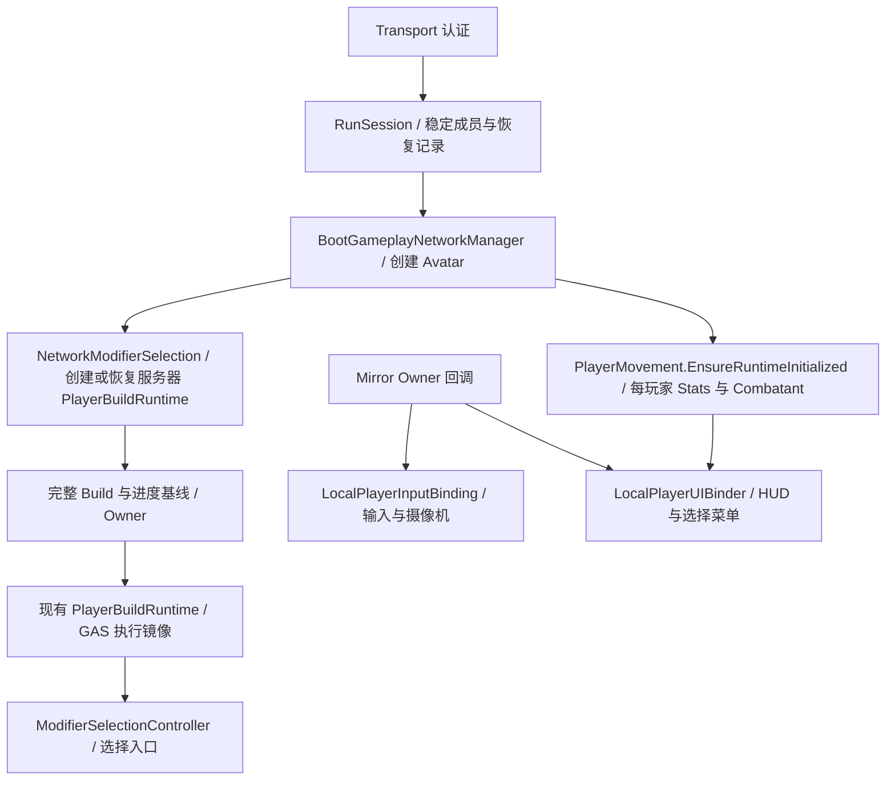

# Phase 0–1 实施与验收报告

更新日期：2026-09-08。

本报告对应 [Phase 0–1 目标](C:/Users/ADMIN/.codex/attachments/4713bb24-2cb3-4d01-af26-5005843904fc/goal-objective.md) 和 [总体迁移规划](F:/UnityStore/MonsterSupergroup/docs/plans/hellmaiden_multiplayer_migration.md)。描述的是当前 Boot → Mirror 玩家生成 → Runtime 初始化 → Owner 绑定 → 断线保存与恢复的实现，不代表 HellMaiden 全部玩法已迁移。

**Phase 0–1 实施与验收已完成。** Network EditMode 97/97、Gameplay PlayMode 61/61、Boot/场景生命周期 5/5、既有网络 Sandbox 6/6 通过；Host + 独立 Client、server-only + 两个 Client，以及升级选择/实际命中/重连进程回归均通过。正式开局调用、完整复活结算与 Steam 实机范围仍按下文所列边界处理。

## 1. 建立的架构边界

### 身份与对局

`RunSession` 是服务器每局一份的成员与恢复记录，不执行 GAS、Modifier 或状态效果。

| 标识 | 实现与职责 | 生命周期 |
|---|---|---|
| `RunId` | `RunSession` 创建的局 ID | 每次服务器启动新建 |
| `RunParticipantId` | `RunParticipant.Id`，经认证后由服务器分配 | 同一局内稳定，断线后保留 |
| Avatar `netId` | 当前 Mirror 玩家实体，记录到 `RunParticipant.AvatarId` | 移除角色后失效，重连创建新实体 |
| `ConnectionEpoch` | 复用 `MirrorNetworkCombatBridge` 的现有事件代次 | 新连接获得新代次；同一连接的回调重绑不重置事件序列 |

`NetworkRunParticipant` 将局 ID 和成员 ID 复制到角色上，提供角色与稳定成员的明确关联；没有建立第二套战斗事件 ID。

`RunSessionAuthenticator` 在 Mirror 接受连接前建立成员身份。Steam 路径使用 Transport 提供的对端 Steam ID，Host 本地连接使用 Steam 本地账号；KCP 开发路径使用服务器生成的 32 字节随机恢复令牌。客户端不能直接声明自己是某个 `RunParticipantId`。KCP 令牌只在客户端进程内按地址及端口缓存，不是持久账号系统，也不应被当作生产 KCP 安全传输的证明。

服务器的 `BeginRun()` 锁定已经加入的成员表。锁定后新身份被拒绝，原成员可以重连，同一成员不能同时占有两个连接。**当前产品 Boot 流程尚无正式准备完成/开局按钮调用该 API；进程验收在两名参与者加入后调用。** Phase 5 必须把它接到正式开局事务，不能在 Host 首次生成时锁定，否则独立 Client 无法加入。

### 三种初始化职责



1. **Gameplay Runtime 创建与恢复：** 每个玩家拥有自己的 `PlayerMovement`、`PlayerStats`、`CombatantBehaviour` 和 `PlayerBuildRuntime`。初始化显式执行且幂等，不依赖当前本地控制器、摄像机或 `GameDirector.Player`。`PlayerStats.Init()` 读取配置的基础属性定义，未读取 Host 的账号存档。
2. **Owner 输入与摄像机：** `LocalPlayerInputBinding` 接受明确的玩家引用。它只管理控制器、摄像机目标和 Owner 能力，释放时解除绑定，不重置 HP、Build 或进度。普通 Camera 可用；ProCamera2D 是可选配置。
3. **Owner HUD：** `LocalPlayerUIBinder` 在展示组件初始化后，通过 `NetworkClient.localPlayer` 和 `isOwned` 绑定具体玩家的 `CombatantBehaviour` 与 Selection。UI 不创建 Gameplay Runtime，也不以全局 Player 查找数据。

Host 的服务器 Build 与本地 Owner 使用同一组对象：Owner 回调发现有效 Build 后复用它，收到服务器基线时不再次应用 Modifier。独立 Owner 在收到服务器 Build 基线前不开启武器执行；Remote Client 不创建可执行的其他玩家 Build。

## 2. 真实入口与恢复顺序

当前入口使用以下顺序：

```text
Boot / NetworkManager.Awake
  → 安装认证入口
StartServer / StartHost
  → 创建本局 RunSession
  → 加载 Gameplay
连接认证成功 + Gameplay 就绪
  → 服务器选择既有 NetworkStartPosition
  → 实例化 NetworkPlayer
  → Prepare 稳定成员信息及恢复数据
  → AddPlayerForConnection
      → 初始化每玩家 Stats / Combatant
      → 创建或恢复服务器 Build / XP / 待选状态
      → 注册并恢复服务器 HP / Gameplay Status
      → Client 建立复制，Owner 请求完整基线并绑定输入和 HUD
  → 保存本次 Avatar netId 与 ConnectionEpoch
```

断线时，`BootGameplayNetworkManager.OnServerDisconnect()` 在 Mirror 销毁角色和清理 Build 之前提取 checkpoint，随后清除成员的连接与 Avatar 关联。服务器继续保留该成员及其恢复记录。重连重新认证同一成员，使用新的 Avatar 和 epoch，从服务器选择的出生位置恢复；客户端没有提交任意恢复坐标的接口。当前合法位置来源是已配置的 `NetworkStartPosition`，复杂世界的阻挡、危险区和队友附近落点规则仍属于后续世界/流程迁移。

场景异步加载期间的停止与再次启动按当前运行代次处理过期回调，等待旧 Unity 操作及卸载完成后再进入新 Gameplay。独立 Client 的 Mirror 加载句柄也纳入清理，新连接 Ready 等待旧清理；四个加载/卸载中断和重启用例已通过。

### 恢复记录覆盖范围

| 数据 | 记录与恢复方式 | 边界 |
|---|---|---|
| 武器 | `PlayerBuildSnapshot` 保存初始武器 ID/槽位及全部武器槽位/定义 ID | 经现有 `EquipWeapon` 等 Build API 重建 |
| Equipment | 来源槽位、卡 ID、`LevelIndex`，保留重复卡的每次应用 | 使用既有定义及 Runtime Factory；不存运行时 Handle |
| Perk | Perk ID 与现有 `PerkRarity` | 只覆盖当前 Native GAS 支持的 Perk domain，不启用旧 Perk Runtime |
| XP / Level | `PlayerProgressionSnapshot` 保存 Level、Experience | 每玩家独立，由现有 `NetworkModifierSelection` 服务器状态管理 |
| 待选升级 | 待选次数、Build revision、候选序列、候选卡/等级/槽位/是否升级已有卡 | 恢复候选内容与顺序，不重新抽卡；映射新的 Equipment Handle，生成新 Offer 身份使旧请求失效 |
| HP / MaxHP / Alive | `ServerEntityCheckpoint` 保存 canonical 状态及真正的绝对无敌标志 | 提高恢复后的版本基线；升级选择保护与永久/其他绝对保护分开 |
| Gameplay Status | `CanonicalStatusState[]` 保存实例身份、来源、层数、绝对起止时间、tick 进度、执行权限与版本 | 恢复到原有 `ServerStatusRegistry`，解绑旧 Avatar 后再关联新 Avatar |
| Native 武器冷却 | `PlayerWeaponCooldownSnapshot[]` 保存槽位、武器定义、原 Attack Event ID、服务器接收时间及 ReadyAt | 服务器验证后的独立 Gameplay 时间记录；Owner 重建后按剩余时间恢复，同一实例重复基线不重置 |
| 生命阶段 | `RunPlayerLifeState.Active / Downed` | 记录当前 canonical Alive 对应阶段；未实现复活事务或全员倒地结算 |
| 局内货币 | 当前 Native 玩家成长链没有对应受支持的权威货币 Runtime | 未虚构字段或启用旧结算 UI 发钱逻辑，留待 Phase 4–5 |

状态恢复采用明确的时间规则：角色不存在的时间继续消耗状态持续时间，已过期状态不恢复，缺席期间错过的伤害 tick 不在重连后补打。原 Source Client 已离开时保留已有服务器接管规则，不能因新连接出现而重新夺回旧攻击的执行权；Target Owner 执行策略仍沿用现有体系。此规则只覆盖已接入的 Gameplay Status；尚未迁移的武器冷却、Dash、Ultimate 等完整恢复契约不能据此视为已实现。

`RestoreState()` 用于重建；`ReconcileState()` 用于更新 Owner 基线，保留未变化的武器，按来源和重复次数增减卡与 Perk，避免每次同步都清空在途攻击或叠加一次 Modifier。定义、槽位及当前支持范围的校验先于破坏已有 Build 的修改。

## 3. 权限与生命周期约定

保留既有混合战斗权限：Owner 执行玩家攻击与本地命中逻辑；服务器继续确认 Enemy HP、死亡、Build/升级以及 canonical 状态；Player HP 继续使用现有 Owner-final report。没有重写 CombatPipeline，也没有把“服务器持有 Build”扩张为“服务器重新模拟每次玩家攻击”。

| 执行角色 | Gameplay / 网络职责 | 本地表现能力 |
|---|---|---|
| Dedicated Server | 创建各玩家 Runtime、服务器 Build/进度、成员与 checkpoint、HP/Status 注册表 | 不绑定个人输入、摄像机、HUD，不使用 Host 本地存档 |
| Host | 执行服务器职责，同时执行本人 Owner 能力；同一 Build 不因双角色重复应用 | 本人的输入、摄像机、HUD |
| 独立 Owner Client | 接受本人完整基线并执行既有 Owner Gameplay，提交既有网络请求/报告 | 本人的输入、摄像机、HUD |
| Remote Client | 接收其他玩家所需的实体/状态副本 | 不绑定他人输入或个人 HUD，不执行他人 Build；既有敌人委托模拟权限另行管理 |

| 入口 | 本轮职责 |
|---|---|
| `Awake` | 缓存组件、建立局部 FSM/服务引用、接入实例事件；网络 Bootstrap 先撤销本地能力。不无条件创建初始 Build |
| `Start` | `PlayerMovement.Start()` 不再重置玩家 Runtime；UI Loader 只在客户端角色创建展示 |
| `OnStartServer` | 显式初始化玩家、注册服务器实体；消费已准备的恢复数据或创建初始 Build |
| `OnStartClient` | 初始化独立玩家容器，注册 canonical 副本与表现；不等同于拥有该玩家 |
| `OnStartAuthority` | 幂等绑定 Owner 输入、Collector、Health 报告与选择接口；等待必要服务器基线 |
| `OnStopAuthority` | 解除 Owner 能力与订阅；独立 Client 清理执行 Build，Host 保留服务器 Build |
| `OnStopClient` | 显式执行 Owner 清理，因为不能假设 Mirror 一定先调用 `OnStopAuthority`；清除实体副本、状态观察和事件源 |
| `OnStopServer` | 解除服务器订阅、移除实体和状态；断线 checkpoint 已由外层提前保存 |
| UI `OnDisable` / 对象销毁 | 解绑 HUD/菜单与局部事件；不让旧玩家引用留到下次绑定 |

Bridge 重复启用时复用现有 Collector；停止 Owner 能力时释放 Collector，但同一连接 epoch 内保留事件序列。Weapon Adapter 绑定前解除同一个监听器，再重新添加；Combatant Adapter 明确跟踪 HP 与状态观察订阅，并在本地 Collector 改变时切换观察者。

Dedicated Server 判定使用 `UNITY_SERVER` 或明确的 `--dedicated-server` 参数，不把 `-batchmode` 等同于服务器。`ClientOnlySceneObjects` 在 Boot/Gameplay 中提前禁用客户端服务对象，`GameDirector` 与 `GameplayUILoader` 也设有服务器角色边界。因此进程级无图形 Host/Client 测试仍能保留各自的 Owner 能力。

## 4. 涉及文件

以下清单覆盖本次目标实现，包括执行期间已被用户提交的文件；不只依赖当前 `git diff HEAD`。新 Unity 脚本均配套 `.meta`。

| 模块 | 文件 | 修改目的 |
|---|---|---|
| 成员与认证 | [RunSession.cs](F:/UnityStore/MonsterSupergroup/Assets/_Project/NetworkCombat/Server/RunSession.cs)、[RunSessionAuthenticator.cs](F:/UnityStore/MonsterSupergroup/Assets/_Project/NetworkCombat/Mirror/RunSessionAuthenticator.cs)、[NetworkRunParticipant.cs](F:/UnityStore/MonsterSupergroup/Assets/_Project/NetworkCombat/Mirror/NetworkRunParticipant.cs) | 稳定成员、固定名单、连接恢复与 Avatar 关联 |
| Boot 与连接生命周期 | [BootGameplayNetworkManager.cs](F:/UnityStore/MonsterSupergroup/Assets/_Project/NetworkCombat/Mirror/BootGameplayNetworkManager.cs)、[MirrorNetworkCombatBridge.cs](F:/UnityStore/MonsterSupergroup/Assets/_Project/NetworkCombat/Mirror/MirrorNetworkCombatBridge.cs)、[NetworkGameplayEnemySpawner.cs](F:/UnityStore/MonsterSupergroup/Assets/_Project/NetworkCombat/Mirror/NetworkGameplayEnemySpawner.cs) | 保存后销毁、恢复后绑定、复用 epoch；初始刷怪按成员去重 |
| Build 与成长 | [PlayerBuildSnapshot.cs](F:/UnityStore/MonsterSupergroup/Assets/_Project/Gameplay/Combat/Native/PlayerBuildSnapshot.cs)、[PlayerBuildRuntime.cs](F:/UnityStore/MonsterSupergroup/Assets/_Project/Gameplay/Combat/Native/PlayerBuildRuntime.cs)、[PlayerProgressionSnapshot.cs](F:/UnityStore/MonsterSupergroup/Assets/_Project/NetworkCombat/Mirror/PlayerProgressionSnapshot.cs)、[NetworkModifierSelection.cs](F:/UnityStore/MonsterSupergroup/Assets/_Project/NetworkCombat/Mirror/NetworkModifierSelection.cs) | 现有 GAS Build 重建/差量同步、进度与候选恢复、基线前执行限制 |
| 玩家 Gameplay 初始化 | [NetworkPlayerBootstrap.cs](F:/UnityStore/MonsterSupergroup/Assets/_Project/NetworkCombat/Mirror/NetworkPlayerBootstrap.cs)、[PlayerMovement.cs](F:/UnityStore/MonsterSupergroup/Assets/_Project/Gameplay/Combat/Player/PlayerMovement.cs)、[PlayerStats.cs](F:/UnityStore/MonsterSupergroup/Assets/_Project/Gameplay/Combat/Player/PlayerStats.cs)、[PlayerCombatantBinding.cs](F:/UnityStore/MonsterSupergroup/Assets/_Project/Gameplay/Combat/Player/PlayerCombatantBinding.cs)、[PlayerState.cs](F:/UnityStore/MonsterSupergroup/Assets/_Project/Gameplay/Combat/Player/PlayerState.cs) | 显式每玩家初始化、实例事件、权限明确的本地旧属性镜像 |
| Owner 输入与武器能力 | [LocalPlayerInputBinding.cs](F:/UnityStore/MonsterSupergroup/Assets/_Project/Gameplay/Combat/Player/LocalPlayerInputBinding.cs)、[PlayerController_HMD.cs](F:/UnityStore/MonsterSupergroup/Assets/_Project/Gameplay/Combat/Controllers/PlayerController_HMD.cs)、[WeaponBehaviour.cs](F:/UnityStore/MonsterSupergroup/Assets/_Project/Gameplay/Combat/Player/Attacks/WeaponBehaviour.cs)、[PlayerAttacksPauser.cs](F:/UnityStore/MonsterSupergroup/Assets/_Project/Gameplay/Combat/Player/Attacks/PlayerAttacksPauser.cs)、[NetworkWeaponCombatAdapter.cs](F:/UnityStore/MonsterSupergroup/Assets/_Project/NetworkCombat/Mirror/NetworkWeaponCombatAdapter.cs) | 显式玩家输入、可选摄像机、退出旧全局暂停路径、订阅成对清理 |
| 健康与状态恢复 | [ServerEntityCheckpoint.cs](F:/UnityStore/MonsterSupergroup/Assets/_Project/NetworkCombat/Server/ServerEntityCheckpoint.cs)、[CombatLedger.cs](F:/UnityStore/MonsterSupergroup/Assets/_Project/NetworkCombat/Server/CombatLedger.cs)、[ServerStatusRegistry.cs](F:/UnityStore/MonsterSupergroup/Assets/_Project/NetworkCombat/Server/ServerStatusRegistry.cs)、[ServerCombatGateway.cs](F:/UnityStore/MonsterSupergroup/Assets/_Project/NetworkCombat/Server/ServerCombatGateway.cs)、[NetworkCombatWorld.cs](F:/UnityStore/MonsterSupergroup/Assets/_Project/NetworkCombat/Mirror/NetworkCombatWorld.cs)、[NetworkCombatantAdapter.cs](F:/UnityStore/MonsterSupergroup/Assets/_Project/NetworkCombat/Mirror/NetworkCombatantAdapter.cs)、[CanonicalWorldReplica.cs](F:/UnityStore/MonsterSupergroup/Assets/_Project/NetworkCombat/Client/CanonicalWorldReplica.cs) | 旧实体移除、版本抬升、Status 时间/权限恢复、客户端缓存清理 |
| Native 冷却恢复 | [PlayerWeaponCooldownSnapshot.cs](F:/UnityStore/MonsterSupergroup/Assets/_Project/NetworkCombat/Contracts/PlayerWeaponCooldownSnapshot.cs)、上述 WeaponBehaviour/PBR/NetworkWeaponCombatAdapter/Selection | 攻击实例事件、服务器时间记录、Owner 恢复；与弹道表现消息分离 |
| 真实场景回归修复 | [EnemyController.cs](F:/UnityStore/MonsterSupergroup/Assets/_Project/Gameplay/Combat/AI/Enemy/EnemyController.cs)、[BootGameplaySceneLifecycleTests.cs](F:/UnityStore/MonsterSupergroup/Assets/_Project/Tests/PlayMode/Gameplay/BootGameplaySceneLifecycleTests.cs)、[BootGameplayNetworkCombatPlayModeTests.cs](F:/UnityStore/MonsterSupergroup/Assets/_Project/Tests/PlayMode/Gameplay/BootGameplayNetworkCombatPlayModeTests.cs)、[NetworkCombatSandboxPlayModeTests.cs](F:/UnityStore/MonsterSupergroup/Assets/_Project/Tests/PlayMode/Gameplay/NetworkCombatSandboxPlayModeTests.cs) | 保护未启动的旧 FSM、场景加载中断/重启、fixture 持久对象清理与过时期望修正 |
| 冷却测试 | [PlayerWeaponCooldownTests.cs](F:/UnityStore/MonsterSupergroup/Assets/_Project/Tests/EditMode/NetworkCombat/PlayerWeaponCooldownTests.cs)、[PlayerWeaponCooldownRuntimeTests.cs](F:/UnityStore/MonsterSupergroup/Assets/_Project/Tests/PlayMode/Gameplay/PlayerWeaponCooldownRuntimeTests.cs) | 当前身份/epoch、时间边界、双槽位、重复基线与事件订阅 |
| UI 与无图形启动 | [GameplayRuntimeEnvironment.cs](F:/UnityStore/MonsterSupergroup/Assets/_Project/Gameplay/Combat/GameplayRuntimeEnvironment.cs)、[ClientOnlySceneObjects.cs](F:/UnityStore/MonsterSupergroup/Assets/_Project/Gameplay/Combat/ClientOnlySceneObjects.cs)、[GameDirector.cs](F:/UnityStore/MonsterSupergroup/Assets/_Project/Gameplay/Combat/GameDirector.cs)、[GameplayUILoader.cs](F:/UnityStore/MonsterSupergroup/Assets/_Project/Gameplay/Combat/UI/GameplayUILoader.cs)、[LocalPlayerUIBinder.cs](F:/UnityStore/MonsterSupergroup/Assets/_Project/NetworkCombat/Mirror/LocalPlayerUIBinder.cs) | 区分 batch 与 server-only，隔离输入/摄像机/HUD |
| 真实资产入口 | [NetworkPlayer.prefab](F:/UnityStore/MonsterSupergroup/Assets/_Project/Content/NetworkCombat/NetworkPlayer.prefab)、[Boot.unity](F:/UnityStore/MonsterSupergroup/Assets/_Project/Scenes/Boot.unity)、[Gameplay.unity](F:/UnityStore/MonsterSupergroup/Assets/_Project/Scenes/Gameplay.unity) | 配置成员组件与客户端场景对象边界 |
| 聚焦测试 | [RunSessionTests.cs](F:/UnityStore/MonsterSupergroup/Assets/_Project/Tests/EditMode/NetworkCombat/RunSessionTests.cs)、[PlayerCombatRestorationTests.cs](F:/UnityStore/MonsterSupergroup/Assets/_Project/Tests/EditMode/NetworkCombat/PlayerCombatRestorationTests.cs)、[PlayerBuildRestorationTests.cs](F:/UnityStore/MonsterSupergroup/Assets/_Project/Tests/PlayMode/Gameplay/PlayerBuildRestorationTests.cs)、[PlayerRuntimeBoundaryTests.cs](F:/UnityStore/MonsterSupergroup/Assets/_Project/Tests/PlayMode/Gameplay/PlayerRuntimeBoundaryTests.cs) | 身份、恢复语义、重复同步和初始化隔离 |
| 独立进程验收 | [RuntimeBoundaryProcessProbe.cs](F:/UnityStore/MonsterSupergroup/Assets/_Project/Tests/PlayMode/Gameplay/RuntimeBoundaryProcessProbe.cs)、[Run-RuntimeBoundaryProcessValidation.ps1](F:/UnityStore/MonsterSupergroup/Tools/Run-RuntimeBoundaryProcessValidation.ps1)、[ModifierSelectionProcessProbe.cs](F:/UnityStore/MonsterSupergroup/Assets/_Project/Tests/PlayMode/Gameplay/ModifierSelectionProcessProbe.cs) | 从 Boot 启动多进程、角色差异与重连；修正旧测试“重连装备为零”的过时断言 |

既有 GAS Core、CombatPipeline、RuntimeModifierFactory/GeneratedModifierRegistry 执行路径、Enemy Simulation 权限模式保持不变。没有新增第二套 Buff/Build Runtime，也没有给 Projectile/VFX 增加 `NetworkIdentity`。

## 5. 目标逐项映射

| 目标要求 | 实现落点 | 可核对的证据与限制 |
|---|---|---|
| 1. 区分成员、Avatar、连接代次 | `RunSession` / `NetworkRunParticipant` / 既有 Bridge | 身份测试与两种服务器角色的进程回归均验证：重连保留成员、替换 Avatar/epoch |
| 2. 最小固定成员与恢复登记 | 认证前准入、`BeginRun`、连接映射、checkpoint | 锁定后拒绝陌生身份、拒绝重复连接；正式开局调用待 Phase 5 |
| 3. 拆分 Runtime / Input-Camera / HUD | Bootstrap、InputBinding、UIBinder | Runtime 初始化不要求本地绑定；Remote 与 server-only 路径分别验证 |
| 4. 每玩家状态 | PBR、Combatant、Stats、Selection 与 Status checkpoint | 多槽位/重复卡/Perk 测试通过；两个玩家不同伤害、HP、XP、候选、Status 和冷却的进程恢复通过 |
| 5. Remote/DS 不依赖本地单机上下文 | 显式 Stats 定义、Owner 能力入口、场景客户端对象门控 | 聚焦测试可无 GameDirector Player 初始化；独立 server-only 实机范围见下表 |
| 6. 全局 Player 只保留兼容 | Bootstrap 只注册本地 Owner；本轮 Native 初始化不反向读取 | 仍存在的旧调用方列于第 7 节，未声称仓库已无全局 Player |
| 7. 回调可重复且能清理 | 幂等初始化、成对事件、StopClient 补充清理、事件序列保留 | 订阅计数聚焦测试；进程内手工调用真实组件回调循环，不等同于实际 Mirror 所有权转移 |
| 8. 恢复表示复用现有 Runtime | Build/Progression/Health/Status/Cooldown DTO 与原 API | 当前 Native 武器冷却单独记录时间并在启用 Owner 执行前恢复；货币和未迁入 Perk 仍需对应模块支持 |

## 6. 验证结果与范围

### 已完成的自动化测试

| 验证 | 结果 | 证据 |
|---|---|---|
| NetworkCombat EditMode | **97/97 通过** | [Final-Network-EditMode-3.xml](F:/UnityStore/MonsterSupergroup/Logs/Phase01/Final-Network-EditMode-3.xml) |
| Gameplay PlayMode | **61/61 通过** | [Final-PlayMode-2.xml](F:/UnityStore/MonsterSupergroup/Logs/Phase01/Final-PlayMode-2.xml) |
| Boot 战斗与场景生命周期 | **5/5 通过** | [Scene-Network-PlayMode-3.xml](F:/UnityStore/MonsterSupergroup/Logs/Phase01/Scene-Network-PlayMode-3.xml) |
| 既有 NetworkCombat Sandbox | **6/6 通过**；该 XML 中另 3 个失败属于随后在上行修复并通过的 Boot fixture | [Scene-Network-PlayMode-2.xml](F:/UnityStore/MonsterSupergroup/Logs/Phase01/Scene-Network-PlayMode-2.xml) |
| 最新可执行文件构建 | **成功**，Unity 退出码 0 | [Final-Build-2.log](F:/UnityStore/MonsterSupergroup/Logs/Phase01/Final-Build-2.log) |
| Host + 独立 Client | **两端 PASS，进程退出码 0** | [Host](F:/UnityStore/MonsterSupergroup/Logs/Phase01/Process-Host-7896-20260908-182047-488/host.log)、[Client](F:/UnityStore/MonsterSupergroup/Logs/Phase01/Process-Host-7896-20260908-182047-488/client.log) |
| server-only + 两个 Client | **三端 PASS，进程退出码 0** | [Server](F:/UnityStore/MonsterSupergroup/Logs/Phase01/Process-Dedicated-7897-20260908-182047-488/server.log)、[Client 1](F:/UnityStore/MonsterSupergroup/Logs/Phase01/Process-Dedicated-7897-20260908-182047-488/client.log)、[Client 2](F:/UnityStore/MonsterSupergroup/Logs/Phase01/Process-Dedicated-7897-20260908-182047-488/client2.log) |
| 既有 Modifier Selection 独立进程回归 | **两端 PASS，进程退出码 0**；选择、敌人击杀 XP、2/1/0 候选池、实际命中、组件中断、装备保留重连 | [Host](F:/UnityStore/MonsterSupergroup/Logs/ModifierSelectionProcess/20260908-224914/host.log)、[Client](F:/UnityStore/MonsterSupergroup/Logs/ModifierSelectionProcess/20260908-224914/client.log) |

NetworkCombat 新增覆盖：固定成员、重复/陈旧连接、HP 恢复基线、选择保护分离、Status 过期/离线 tick/来源权限/重复恢复/非法数据。Gameplay 新增覆盖：多武器槽与 Equipment/Perk 恢复、同卡多份准确增减、无效定义不先破坏 Build、原候选映射到新 Handle、无 Owner 的初始化、可选输入摄像机和事件订阅计数。

上述两组 RuntimeBoundary 进程使用 Final-Build；之后 Final-Build-2 仅调整旧 ModifierSelection 测试的等待阶段角色保护，生产代码与 RuntimeBoundary 探针未变。全部验证通过真实 Boot 资产与独立 Player 进程完成。日志仍有原 Dante 缺失 FMOD event/bank 的已知内容问题，不能将本次 Gameplay 验收解释为音频资源完整性验收。

### 独立进程探针实际检查的内容

- 真实 Boot 场景启动 Host/Server，再由独立可执行进程连接；不是只实例化 prefab。
- 两名参与者使用不同 Equipment 等级，伤害分别为 20 和 23；HP 分别为 60 和 70，XP 各为 1，具有 canonical Poison 状态和两次待选升级。
- Owner 绑定自己的输入和 HUD；Remote 不绑定本地输入、不执行对方 Build；Host 不重复加卡。
- 反复调用组件的 authority 绑定/解绑回调，检查能力释放、Collector、事件序列、HP 和 Modifier 不重复；另有聚焦测试直接检查实例事件数量。
- 原 Client 断线：旧 Avatar 被移除，成员、进度和候选保留；重连得到新 Avatar/epoch，候选内容不重新随机且旧 Offer 身份失效。
- 使用仅在测试内存中克隆的 90 秒武器冷却，等待服务器收到真实 Native 攻击报告再断线；验证服务器 ReadyAt 不变、Owner 恢复时剩余冷却仍大于零。
- 停止并卸载后，不留下 NetworkPlayer 对象。

探针为稳定验证生命周期会停用产品敌人 spawner，并由服务器设置待验证的 Build/HP/Status 数据；它证明这些数据的隔离、复制和恢复，不单独证明完整敌人、掉落或战斗流程。既有 Modifier Selection 进程回归负责补充原升级/战斗链的兼容证据。

本轮 server-only 使用 **Windows 普通 Development Player + `--dedicated-server -nographics`，调用真实 `StartServer()`**；服务器无本地 Client、无活动 Camera、无个人 HUD、无活动 Rewired 输入对象。不把该验证解释为 `UNITY_SERVER` 专用平台构建、SteamGameServer 登录/发现流程或 Steam 两账号联机已经通过。

尚未验证的范围：真实 Mirror ownership 从一个连接迁给另一个连接、Steam 两账号连接与恢复、Steam Dedicated Server、异常断电后的持久恢复、Host 迁移、完整 Wave/Boss/复活/掉落结算。回调循环是生命周期回归手段，不等同于上述集成验收。

## 7. 保留的临时兼容路径与后续工作

| 保留项 | 当前边界 | 后续迁移位置 |
|---|---|---|
| `GameDirector.Player` | 只由本地 Owner 注册和清理；Native Runtime 创建/恢复不从这里找玩家 | 逐个撤下旧本地 UI、地图、Ultimate 等调用方 |
| `LootManager` 本地 Collector 登记 | 保持旧本地物品显示/交互兼容，不代表共享掉落权威已完成 | Phase 3–4 建立服务器 Drop ID 与一次合法领取 |
| `PlayerStats` 旧 HP 字段与 `GameEvents` 健康通知 | `CombatantBehaviour` 驱动该玩家的镜像；只对允许本地修改的路径发兼容事件；新 HUD 订阅实例健康事件 | 迁移剩余 HUD/反馈时撤下旧全局事件 |
| 无参数 `PlayerState` 与 Ultimate/设置旧逻辑 | 显式玩家判断已供 Native 路径使用，旧兼容入口仍在 | Dash/Ultimate/菜单对应阶段逐个替换 |
| 旧 `PlayerLoader`、`PlayerHand`、`Leveler`、完整 `RuntimeDB.Init()` | 没有重新加入新网络玩家创建链；新网络 XP 仍进入现有 Selection 服务器流程 | 对应能力迁入既有 Runtime，不重新启用平行状态 |
| 直接 ConfirmedKill 发 XP | 维持现有工作链，尚未迁移共享世界拾取奖励 | Phase 4 接世界掉落时同时撤下，防止双重发奖 |
| `Active / Downed` | 服务器登记生命状态、checkpoint 保存恢复；不是完整可复活状态机 | Phase 5 实现复活请求、距离/时间校验、全员倒地结算 |
| 内存 checkpoint 与开局 API | 仅同一个仍在运行的服务器保留；固定名单由显式 `BeginRun` 生效 | Phase 5 接开局/重启/超时规则；不包含 Host 迁移 |

旧玩家死亡动画在网络生命周期下不再直接停用角色并触发全局单人结算；真正的倒地/复活/队伍失败事务仍待实现。此前确认的“队友可复活、全员倒地才结算”和“断线移除角色、保留进度”仍是总体规则，不能把本轮的生命状态枚举当成这些玩法全部落地。

## 8. 仓库证据修正的原假设

1. **Gameplay 不保证存在 ProCamera2D。** 当前场景使用普通 Camera；直接读取该插件的 `Instance` 会抛错。Owner 绑定已把插件摄像机改成可选查找，普通 Camera 可承担输入坐标转换。
2. **初始最大 HP 不是 prefab 中旧序列化的 100。** 当前生产基础 Stats 定义为 500。初始化和测试以定义为准；重连 HP 由 checkpoint 恢复，不再因 Owner 回调回满。
3. **已有 Boot 自动进 Gameplay 不等于已有正式开局事务。** 因而不能擅自在首个玩家生成时锁定名单；本轮提供服务器 `BeginRun`，正式调用位置留给 Phase 5。
4. **现有 Perk 的进阶标识是 `PerkRarity`。** 恢复记录保留其真实语义，没有发明第二种数字等级。
5. **当前 Native 成长没有受支持的局内货币状态。** 旧结算 UI/存档发奖不能直接作为服务器货币 Runtime 使用，本轮没有假装已恢复货币。
6. **旧重连测试要求装备清空并隐含回满血。** 那证明的是新建 Build；现已调整为校验原装备仍在，并添加新身份/基线及候选恢复测试。旧测试的 Client 在等待 Host 检查菜单时可能被敌人打死；现在需在该测试等待阶段保护角色，不能通过重连偷偷复活后继续发放升级。
7. **batchmode 不等于 Dedicated Server。** 独立 Host/Client 也使用无图形批处理做验证；服务器专属边界必须依赖明确角色标识。

后续模块应继续使用稳定成员身份、显式 Runtime/Owner 绑定和现有 GAS/网络执行链。Phase 2–5 需要将其余攻击族接入现有冷却时间入口，并补齐共享掉落、正式开局、复活和结算事务；这些职责不能重新落入 UI、动画结束回调或全局唯一 Player。

## 9. 最终审计补充

- 场景操作按会话代次处理，并串行完成旧 load/unload。独立 Client 断线时接管 Mirror 尚未完成的 scene operation，重连 Ready 等待旧场景清理；旧回调不能完成新连接的场景切换。
- Native 武器 `BeginNativeGasAttack` 发出实例 Gameplay 事件，PBR 转发槽位、定义 ID 和既有 Attack Event ID，网络 Adapter 用可靠请求报告攻击时间。服务器复用现有身份/epoch 校验，并用当前武器冷却和服务器时间限制记录。`PlayerWeaponCooldownSnapshot` 只保存 `ReadyAt` 等时间数据，不执行攻击、不参与表现重放、不替代现有 GAS。
- Owner 基线在 Build 重建后、启用执行前恢复剩余冷却；同一武器实例的普通重复基线不重置计时。断线期间按网络时钟消耗冷却。该入口不是完整攻击频率裁判，进一步校验仍属于 Phase 2。
- 真实 Boot 回归暴露网络 movement-only Enemy 没有旧战斗 FSM，却仍从命中反馈进入其 Knockback 状态。已阻止这条无效表现路径；没有为联网敌人启动另一套旧模拟。旧测试同时移除了“缺少本地 ControllerManager 必须报错”的过时期望。
- 新增场景生命周期测试隔离自己加载的 Boot 持久对象，避免多次 fixture 加载造成 Controller 类型重复注册。原 Skeleton 战斗 fixture 显式选用现有 Skeleton prefab；产品 Gameplay 当前配置的是 NetworkEnemyBase，未为测试修改产品场景选择。
