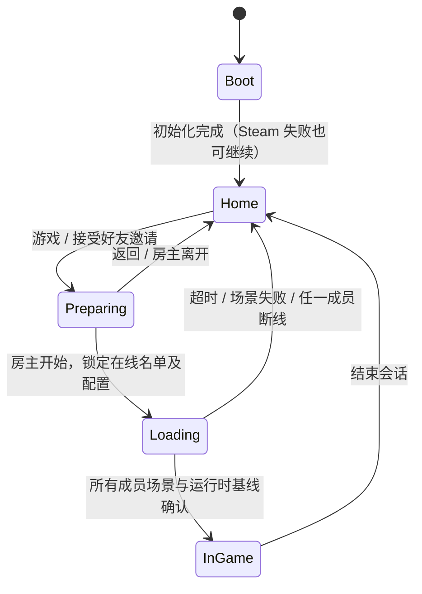

# 开始菜单与联机准备房间

## 使用入口

正常构建从 `Boot` 启动，初始化公共服务后停留在 MainMenu 首页。点击“游戏”进入准备房间，不会提前生成战斗角色或加载 Gameplay。Steam 可用时创建私密四人房间；Steam 未启动、初始化失败或建房失败时，可使用本地 Host 单人开局。本地单人设置 `NetworkServer.listen=false`，没有对外监听端口。

首页的“反馈意见”和“选项”本期仅保留按钮；“退出”先清理会话再退出程序，Editor 中停止运行。

准备页显示四个席位、名字、P + ParticipantId、房主/自己标记、角色、武器与准备状态。点击自己席位的武器进入选择页；当前唯一角色为 Dante。地图唯一、难度中等，没有额外难度倍率。多人必须全员准备，且只有房主能开始；单人可直接开始。方向键与提交键使用 UGUI 导航，Esc 从选择页返回房间、从房间退出到首页。

## 模块及数据流

参考 The Spell Brigade 的服务常驻、首页/组队页分离、四席位、个人准备与公共开局配置划分，继续使用本项目 Mirror、Steam Lobby、FizzySteamworks 和 KCP。没有迁入参考项目的空桩程序集或战斗实现。

| 文件 | 职责 |
| --- | --- |
| `Assets/_Project/NetworkCombat/Mirror/BootGameplayNetworkManager.Preparation.cs` | 准备阶段网络消息、场景加载屏障、失败清理、首页生命周期 |
| `Assets/_Project/NetworkCombat/Server/PreparationRoom.cs` | 四席位、个人选择、准备版本、房主权限、一次性开局配置 |
| `Assets/_Project/NetworkCombat/Contracts/PreparationRoomContracts.cs` | 可靠消息、房间快照、不可变 RunLaunchConfig |
| `Assets/_Project/NetworkCombat/Mirror/PreparationMenuView.cs` | MainMenu 场景内的 UGUI 首页、准备房间、武器选择页 |
| `Assets/Resources/PreparationMenuCatalog.asset` | 可选武器、预览图片、说明和地图显示文本 |
| `Assets/_Project/NetworkCombat/Steam/SteamLobbyService.cs` | 私密房间、好友邀请、启动邀请参数、阶段元数据与清理 |



房间不生成可战斗 Avatar。身份仍由 `RunSessionAuthenticator` 和 `RunSession` 分配；发送连接决定操作人，消息不能替其他玩家修改选择。准备版本与 Mirror 的 `connection.isReady` 分开。修改个人选择取消自己的准备；旧版本准备请求被拒绝。重复开始不会再次锁定或加载。

`RunSession.SealRoster` 锁定当前在线成员，排除之前已离开的准备成员；`IsRunStarted` 独立表示战斗真正开始。拒绝的第五人不进入 RunSession。房间最多四人，底层临时容纳额外的未认证连接，只用于发送明确的拒绝原因。

加载时先冻结移动、Dash、大招和攻击，并停止刷怪。生成 Avatar 前由 `NetworkRunParticipant.PrepareInitialWeapon` 把锁定武器传入服务端 Build；Owner 在建立执行 Build 前读取同一 SyncVar。Owner 确认场景、身份、Build、HP、Dash、大招及选卡初始同步完成后发送 `GameplayReady`。服务端核对连接、Avatar 和武器配置，收齐后启动战斗。默认加载期限为 120 秒；测试通过受控截止时间注入覆盖超时。

准备离开释放席位，重新加入需要重新准备。加载期间断线取消整次开局；战斗开始后沿用既有 checkpoint 恢复，ParticipantId 保持不变，Avatar netId 更新，Downed 角色保持禁止移动。房主离开没有迁移，所有人返回首页。

Steam 元数据区分 `preparing`、`loading`、`in_game` 与 `closed`。战斗期间保持原成员可到达房间，由锁定名单拒绝新玩家，避免把重连入口一起关闭。重复邀请不重复加入；已有会话时收到另一邀请只提示先离开。支持 Steam 的 `+connect_lobby <id>` 启动参数。

## 展示资源与扩展点

- 可选初始武器由 `PreparationMenuCatalog.asset` 维护，首版 ID 为 `1、2、3、6、8、402`，默认 `2`。名称来自现有 WeaponData，中文说明和图片引用可在目录资产中配置。
- 当前 NetworkPlayer 只有圆形占位外观，部分迁移武器没有可用的正式卡面图标；菜单采用 D 徽记与“斩、焰、息、环、径、召”占位标识。设置 `CharacterPortrait` / `WeaponOption.Icon` 即可替换；正式角色图配好后关闭 `UseCharacterMonogram`。预览不启用任何 NetworkPlayer 战斗组件。
- 新 UI 在 MainMenu 加载时安装，替代旧 Canvas 和直进 Gameplay 的按钮；沿用场景现有 URP Camera。加载页覆盖 HP/XP HUD，战斗调试面板开战后显示。Gameplay 开始后关闭菜单画布、射线交互、输入和相机，仅保留战斗 EventSystem / Camera / AudioListener。
- 不包含反馈页面、选项页面、多角色、解锁、其他地图、实际难度、自动匹配、自动补位、房主迁移或结算后保留队伍。

## 重复验证

使用 Unity 6000.3.17f1。运行批处理的项目目录不能同时被另一个 Unity Editor 打开。本次在 `F:/UnityStore/MonsterSupergroup_validation_downed` 隔离副本执行，日志写入主项目 `Logs`；没有更改系统网络设置。

构建方法为 `MonsterSupergroup.Gameplay.Tests.PreparationMenuValidationBuild.Build`。默认生成 Development 验收包；环境变量 `MENU_RELEASE=1` 生成非 Development 验收包。两者都包含本次测试探针，只有显式传入 `--menu-role` 才启用探针；直接双击始终停留正常首页。正常发布构建不包含测试探针。

```powershell
# 在项目未被 Unity 打开时运行。Unity 路径按本机安装位置调整。
$unity = 'D:/RealSoftware/6000.3.17f1/Editor/Unity.exe'
$project = 'F:/UnityStore/MonsterSupergroup'
Start-Process -FilePath $unity -WindowStyle Hidden -Wait -ArgumentList @(
  '-batchmode', '-nographics', '-quit', '-projectPath', $project,
  '-executeMethod', 'MonsterSupergroup.Gameplay.Tests.PreparationMenuValidationBuild.Build',
  '-logFile', "$project/Logs/Menu-build.log")

# 非 Development 验收包：在构建命令前设置，完成后清除。
$env:MENU_RELEASE = '1'
# 再执行上面的构建命令，输出 Builds/MenuRelease。
# Remove-Item Env:MENU_RELEASE

# 默认后台无图形：Host + A + B + C，另开第五进程验证满员拒绝。
./Tools/Run-PreparationMenuValidation.ps1 -Profile party

# 可见窗口：同时生成首页、四席位、武器选择及加载页截图。
./Tools/Run-PreparationMenuValidation.ps1 -Profile party -Visible -Width 1280 -Height 720
./Tools/Run-PreparationMenuValidation.ps1 -Executable Builds/MenuRelease/MonsterSupergroup.exe -Profile party -Visible -Width 1920 -Height 1080

# 离线单人及无外部监听。
./Tools/Run-PreparationMenuValidation.ps1 -Profile offline -Visible
```

旧 `--boot-gameplay-role=...` 自动化入口和 Unity Test Runner 仍默认直接进入 Gameplay 验证流程；本次准备测试显式启用 `ConfigurePreparationFlow(true)`。正式交互入口默认经过 MainMenu，旧 Steam/KCP 调试 HUD 在该入口隐藏。

测试入口：

| 层级 | 测试 / 验证内容 |
| --- | --- |
| EditMode | `PreparationRoomTests;RunSessionTests;NetworkBackendTests;SteamLobbyTests`：席位、权限、准备版本、六种武器配置、名单与战斗阶段、重连资格、后端选择与 Steam 元数据 |
| PlayMode | `PreparationRoomGameplayTests`：真实 Boot/Gameplay、六种初始武器无默认残留、加载屏障、旧准备请求、超时、场景缺失与清理 |
| 相关回归 | `BootGameplaySceneLifecycleTests;SteamLobbyCleanupPlayModeTests;PlayerDashMovementTests;PlayerWeaponCooldownRuntimeTests` |
| 独立进程 | 四席位与第五人拒绝、客户端越权开始、各端及服务端实际 Build、ParticipantId、Downed 断线重连后移动禁止、房主退出、第二次加载断线取消、清理后转离线单人 |

独立进程成功必须出现每个角色的 `[MenuProcess] result=PASS`。仅有房间字段正确不算成功：探针检查真实 Owner 与服务端 Avatar 的 Build、初始武器、基线及 Downed 物理位置。脚本发现异常或超时会返回失败并关闭本次启动的进程。

## 本次结果

执行日期：2026-09-11。构建已复制回主项目 `Builds/MenuDevelopment` 和 `Builds/MenuRelease`，直接双击 `MonsterSupergroup.exe` 进入正常首页。

| 验证 | 结果与记录 |
| --- | --- |
| EditMode 最终相关测试 | **31/31 通过**，`Logs/Menu-edit-verified.xml` |
| PlayMode 相关测试 | **55/55 通过**，`Logs/Menu-play-final.xml`；名单调整后再次执行准备/Boot/Steam 清理测试，**13/13 通过**，`Logs/Menu-play-verified.xml` |
| Development，1280×720 | **Host、A、B、C、第五人全部 PASS**，`Logs/PreparationMenu/20260911-174636-party` |
| 非 Development，1920×1080，最终代码 | **Host、A、B、C、第五人全部 PASS**，`Logs/PreparationMenu/20260911-174953-party`；包含最终加载页覆盖、隐藏菜单不拦截战斗点击的检查 |
| 离线单人 | 可见窗口独立路径通过，`Logs/PreparationMenu/20260911-172903-offline`；最终四人脚本也验证退出后转离线单人并实际进入战斗。无监听另由 PlayMode 验证 |
| 最终两种构建 | 成功，`Logs/Menu-build-delivery.log` / `Logs/Menu-release-delivery.log` |

Development 的 1280×720 截图验证后又调整了加载页层级与菜单射线关闭；这两处最终修改已在非 Development 的 1920×1080 包验证，并包含在最终 Development 构建中。桌面控制随后被用户按 Esc 停止，未继续手动操作最终包，也未重复最终 Development 的窗口验收。

非 Development 实际进程结果包含：四人各自 Build 与锁定武器一致、ParticipantId 跨场景不变、服务端真实 Avatar/Build 对应、第五人中文拒绝且无残留参与者、A 倒地后重连保持身份并禁止移动、房主离开所有客户端回首页、再次开局中成员断线取消、之后可重新单人开局。

最终截图：

- [四席位准备页](/F:/UnityStore/MonsterSupergroup/Logs/PreparationMenu/20260911-174953-party/party-room.png)
- [六武器选择页](/F:/UnityStore/MonsterSupergroup/Logs/PreparationMenu/20260911-174953-party/weapon-selection.png)
- [加载页](/F:/UnityStore/MonsterSupergroup/Logs/PreparationMenu/20260911-174953-party/loading.png)

1280×720 和 1920×1080 的文字、按钮、地图区与六武器网格均经过截图检查。鼠标进入首页/房间/武器页及 Esc 返回已在此前的 Development 可见窗口操作验证；方向键导航与提交通过脚本实际调用 EventSystem 检查。Steam 真实好友邀请仍按下一节人工验收，未标记为通过。

## Steam 真实账号人工验收

以下路径需要不同 Steam 账号，尚未用真实账号完成；KCP 多进程通过不能替代它们。正式邀请已改为游戏内好友列表直接调用官方大厅邀请接口，不依赖游戏内叠加界面。具体步骤、验收包和日志见 [Steam 直接邀请验收](../steam-invite-debugging.md)。

1. 同版本启动两个账号，房主点“游戏”建私密房间，空席位点“邀请朋友”。受邀端进入同一准备页；第三、第四个账号加入后四席位唯一，第五人获得满员提示。
2. 本期两端都先启动本项目，再接受邀请。保留 `+connect_lobby` 解析，但 AppID 480 下不将自动启动本项目纳入验收。再次接受相同邀请不重复连接；已有另一个房间时接受邀请，当前会话保持并提示先离开。
3. 每人选择不同武器，准备后再次改武器，只有该成员取消准备。非房主不能开始，房主等待全员准备后点击一次；双方加载完成才允许行动和刷怪。
4. 开局前后核对 P 编号和 Player Debug 的 ParticipantId。战斗中成员倒地后断线，以原账号重新加入同一 Steam 房间，ParticipantId 不变、Avatar 更新、仍 Downed 且不能移动；陌生账号在战斗中加入被拒绝。
5. 加载期间中断一名成员连接，所有人返回首页并显示取消原因；重新建房正常。准备或战斗中房主离开，其他成员返回首页并显示房主结束会话。
6. 使用不兼容版本、关闭房间，检查中文提示。停用 Steam 叠加界面后直接邀请应仍可提交，并通过游戏外 Steam 通知接受。Steam 未运行时点“游戏”，可单人完整开局，无需 Steam 登录。
7. 分别以 1280×720、1920×1080 检查首页、四席位、六武器页、加载状态与键盘导航；反馈/选项不执行操作，退出清理后关闭程序。
